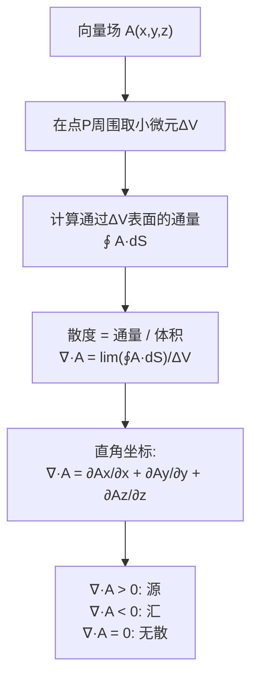

# 通量与散度

## 📌 一句话本质
散度描述"这个点是不是源头"——正散度是泉水涌出（源），负散度是水流消失（汇），零散度是水在流动但没有增减。

## 🏷️ 重要度
🔴核心 | 考试：★★★ | 题型：计算题（必出）+ 简答题

## 🔧 工程/实际场景
设计手机天线时，电流分布的散度不为零意味着电荷在堆积——这会产生不需要的静电场，影响天线辐射效率。搞错了散度的符号，天线的辐射方向图会变形，信号覆盖出现盲区。

## 🧠 口诀/类比
**类比**：想象一个水龙头（源）——水从龙头里"涌出来"，龙头处的散度为正。想象一个下水口（汇）——水"消失进去"，下水口处的散度为负。如果是一段笔直的管道，水在流动但不增不减——散度为零。
**口诀**："散度正处源发散，负处汇点来吞咽，零散度处无增减"

## 📖 课程定位
章节：§1-5（第一章 矢量分析）
前置概念：[[通量]] → 散度 → 后续概念：[[高斯散度定理]]
关联：[[梯度]]（对标量场）、[[旋度]]（旋度场恒无散：∇·(∇×A) = 0）

## ⚠️ 常见误区
1. **散度是标量，不是向量** — 散度输出一个数（正/负/零），不输出方向
2. **散度不等于通量** — 通量是对整个闭合曲面积分，散度是每单位体积的通量（密度）
3. **散度为零 ≠ 场为零** — 均匀场散度为零（如均匀水流），但场不为零
4. **忘记坐标系的散度公式不同** — 直角坐标和柱坐标的散度公式不一样

## ❓ 费曼检验
1. "用一个水流的比喻解释：正散度、负散度、零散度分别对应什么情况？"
2. "$A = (x, 0, 0)$ 的散度是多少？$A = (x, -y, 0)$ 呢？哪个有源/汇？"
3. "为什么说 ∇·(∇×A) = 0 是数学上的恒等式，而不是物理定律？"

## ✂️ 可跳过
- 散度在一般正交曲线坐标系中的完整推导（考试只考直角坐标）
- 散度定理的严格数学证明（知道会用就行）

## 💻 验证/练习
- **MATLAB仿真**: 绘制 $A = (x, 0)$ 和 $A = (x, -y)$ 的向量场，标记散度正/负/零区域
- **费曼法**: 解释"为什么打开水龙头时，水龙头处的速度场散度为正"

## 🔗 关联概念
- 前置：[[通量]] — 通量是散度在整个体积上的积分
- 横向：[[梯度]] — 对标量场求梯度得向量场，对向量场求散度得标量场
- 横向：[[旋度]] — 散度和旋度是向量场的两个独立特征（Helmholtz分解）
- 后续：[[高斯散度定理]] — 体积内的散度积分 = 表面上的通量

## 推导流程

