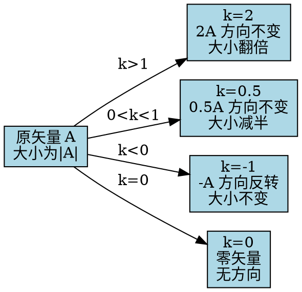

# 矢量与标量的乘法
**关键词**：矢量的代数运算

📌 **一句话本质**：矢量乘以标量 = 箭头被"拉长或缩短"k倍——k>1变长，0<k<1变短，k负数反转方向。

🏷️ **重要度**：🟡 | 考试：★★ | 题型：选

🔧 **工程/实际场景**：欧姆定律的场形式 J = σE——导体中电流密度矢量就是电场矢量乘以电导率（标量系数）。如果电导率取值错误（比如把铜的σ取成铝的），PCB走线的电流承载能力计算错误，走线会过热烧断。

## 🧠 类比与直觉

矢量乘以标量就是"拉伸或压缩箭头"——乘以2箭头变长一倍方向不变，乘以0.5箭头减半，乘以-1箭头调头。物理上，J=σE 就是电流密度继承了电场的方向，只是大小按导电能力缩放。各向同性材料中缩放系数是标量，各向异性材料中缩放系数变成3x3矩阵（张量）。

**口诀**："标量乘矢只缩放，正拉长来负反向"

## 教科书原文

> 📖 参见：[[§1-2 矢量的代数运算]]

## 数乘的几何效果

> 📖 参见：[[§1-2 矢量的代数运算]]

## ✂️ 可跳过
- 费曼深度讲解中各向异性介质（张量电导率）的讨论为高阶内容，考试只考各向同性标量乘法
- 复数数乘（复介电常数 ε_c = ε - jσ/ω）的物理意义在后续章节详述，初学可跳过

## ❓ 费曼深度讲解

矢量与标量的乘法（数乘）$kA$是向量最基础的运算，但它承载的物理意义在电磁场中随处可见。在导体中，欧姆定律的微分形式$J=\sigma E$就是数乘——电流密度向量J与电场向量E方向相同（在各向同性导体中），大小由电导率σ确定（标量系数缩放）。在各向异性材料中，σ变成3×3张量，J的方向不再简单地同向于E——"标量=各向同性，张量=各向异性"的深层道理在此体现。

为什么D=εE只对线性各向同性介质成立？因为P（极化强度）和E的关系在线性条件下是$P=\epsilon_0\chi_e E$→$D=\epsilon_0 E+P=\epsilon_0(1+\chi_e)E=\epsilon_r\epsilon_0 E=\epsilon E$。但在各向异性材料（如方解石晶体）中，沿不同晶体轴方向的极化率不同，P=ε₀χ_e·E（χ_e为张量），D=ε·E（ε为介电张量，3×3矩阵）。这不再是简单的"数乘"而是"矩阵乘法"——各向异性将简单数乘升级为线性变换。

标量系数可以为负数——$k=-1$给出反向向量。这在物理中对应什么？电荷符号的改变——正电荷受到的电场力$F=qE$（数乘），负电荷受到的力方向与E相反（q<0→F与E反向）。电势φ乘以(-1)再取梯度得到电场$E=-\nabla\varphi$——负号意味着电场指向电位降低的方向（正电荷自发向下坡运动）。这些"负号"在电磁场中承载着深刻的物理方向信息——不是数学符号的随意选择。

## ❓ 更多费曼检验

1. 在各向同性线性介质中，D=εE。如果ε不是常数而是空间位置的函数（非均匀介质），D和E的方向是否仍然相同？∇·D和∇·E的关系如何表达？

2. "标量缩放"只在实数域中成立。如果k是复数（如ε_c=ε−jσ/ω是复介电常数，导电介质等效于复数ε），复数数乘对应什么物理效应？

