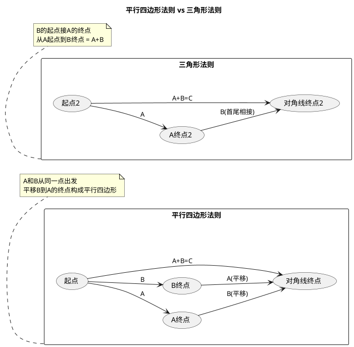

# 矢量加减法与平行四边形法则
**关键词**：矢量的代数运算

📌 **一句话本质**：矢量加法就是"先朝一个方向走一段，再朝另一个方向走一段"——从起点到终点的直线就是和矢量，平行四边形画出来就是它的几何证明。

🏷️ **重要度**：🟡 | 考试：★★ | 题型：选

🔧 **工程/实际场景**：结构力学中的力合成——桥梁设计时把各方向的风力、重力、车辆载荷矢量相加得到合力和力矩。如果平行四边形法则画反（比如力的方向取反），合弯矩计算错误，桥梁的钢筋配置数量会严重不足。

## 🧠 类比与直觉

矢量加法就是"你先往东走3步，再往北走4步"——从起点到终点的直线是5步，方向东北。三角形法则（首尾相接）和平行四边形法则（从同一点出发）给出同样的结果。矢量减法 A-B 就是 A+(-B)，先把 B 掉个头，再加。

**口诀**："首尾相接三角形，平移对角四边形"

## 教科书原文

> 📖 参见：[[§1-2 矢量的代数运算]]

## 平行四边形法则直观

## ✂️ 可跳过
- plantuml 平行四边形/三角形法则对比图为理解辅助，考试只需知道两种法则等价
- 矢量减法的几何作图考试通常不单独命题

> 📖 参见：[[§1-2 矢量的代数运算]]
