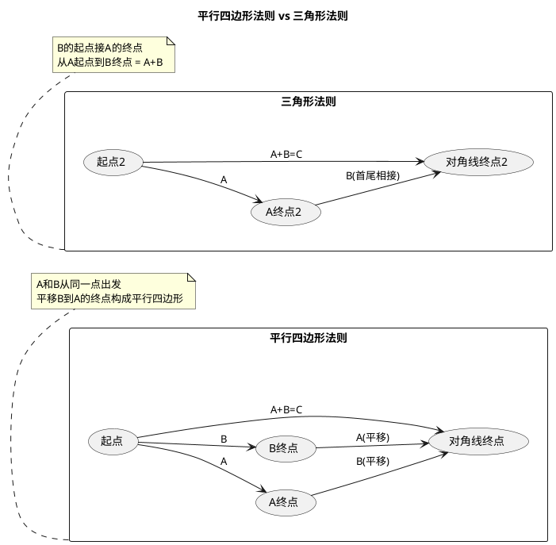

# 矢量加减法与平行四边形法则
**关键词**：矢量的代数运算

## 教科书原文

> 📖 参见：[[§1-2 矢量的代数运算]]

## 平行四边形法则直观

```plantuml
@startuml
title 平行四边形法则 vs 三角形法则

left to right direction

rectangle "平行四边形法则" as P {
  (起点) --> (A终点) : A
  (起点) --> (B终点) : B
  (A终点) --> (对角线终点) : B(平移)
  (B终点) --> (对角线终点) : A(平移)
  (起点) --> (对角线终点) : A+B=C
}

rectangle "三角形法则" as T {
  (起点2) --> (A终点2) : A
  (A终点2) --> (对角线终点2) : B(首尾相接)
  (起点2) --> (对角线终点2) : A+B=C
}

note bottom of P
  A和B从同一点出发
  平移B到A的终点构成平行四边形
end note

note bottom of T
  B的起点接A的终点
  从A起点到B终点 = A+B
end note

@enduml
```

> 📖 参见：[[§1-2 矢量的代数运算]]
