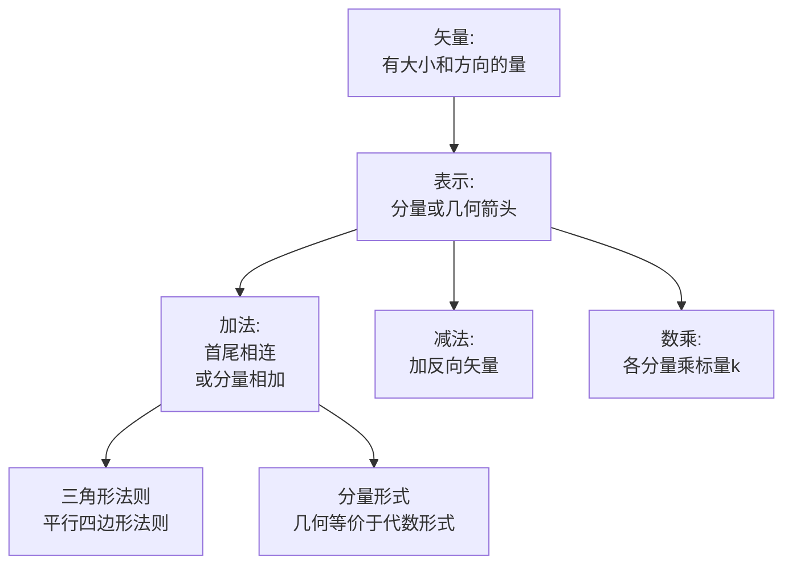

# 矢量的代数运算 MOC

## 教科书原文

> 📖 参见：[[§1-2 矢量的代数运算]]

## 概念定义（费曼一句话）

矢量的代数运算是整个矢量分析和电磁场理论的"算术基础"——加法和数乘定义了矢量的线性空间结构，为后续的梯度（对标量场的"数乘-微分"）、散度（对标量积的推广）、旋度（对矢量积的推广）奠定了最基本的运算规则。

## 类比与直觉

**类比1：位移的拼接**。矢量加法 $$\mathbf{A} + \mathbf{B}$$ 就像你从家走到超市（$$\mathbf{A}$$），再从超市走到学校（$$\mathbf{B}$$）——总位移是从你家到学校的直线（$$\mathbf{A}+\mathbf{B}$$）。这个"首尾相连"的几何直觉（三角形法则）是矢量加法最直观的理解。

**类比2：缩放的箭头**。数乘 $$k\mathbf{A}$$ 就像把箭头 $$\mathbf{A}$$ 沿着原方向拉伸或压缩 k 倍，然后决定要不要翻转方向（k<0时翻转）。在电磁场中，$$\mathbf{D} = \varepsilon\mathbf{E}$$ 就是一个典型的数乘——D是E沿原方向的线性放大（放大倍数为$$\varepsilon$$）。

## 核心公式详释

**矢量加法（分量形式）**：
$$\boxed{\mathbf{A} + \mathbf{B} = (A_x+B_x)\mathbf{a}_x + (A_y+B_y)\mathbf{a}_y + (A_z+B_z)\mathbf{a}_z}$$

**矢量减法**：
$$\mathbf{A} - \mathbf{B} = \mathbf{A} + (-\mathbf{B}) = (A_x-B_x)\mathbf{a}_x + (A_y-B_y)\mathbf{a}_y + (A_z-B_z)\mathbf{a}_z$$

**标量乘矢量**：
$$\boxed{k\mathbf{A} = (kA_x)\mathbf{a}_x + (kA_y)\mathbf{a}_y + (kA_z)\mathbf{a}_z}$$

**平行四边形法则**（加法的几何等价表示）：
$$\mathbf{A} + \mathbf{B} = \mathbf{B} + \mathbf{A}$$

**三角形法则**（加法的另一种几何表示）：
将 $$\mathbf{B}$$ 的起点平移至 $$\mathbf{A}$$ 的终点，从 $$\mathbf{A}$$ 起点到 $$\mathbf{B}$$ 终点的矢量即为和矢量。

| 运算 | 结果类型 | 几何意义 | 运算法则 |
|------|:---:|------|------|
| $\mathbf{A}+\mathbf{B}$ | 矢量 | 三角形/平行四边形 | 分量对应相加 |
| $\mathbf{A}-\mathbf{B}$ | 矢量 | 加反向矢量 | $A_x-B_x$$ 等 |
| $k\mathbf{A}$ | 矢量 | 缩放+反向(k<0) | 各分量同乘k |
| $|\mathbf{A}|$ | 标量 | 矢量长度 | $\sqrt{A_x^2+A_y^2+A_z^2}$ |

## 推导脉络

## 常见误区

1. **矢量加法的模 = 模的加法**：$$|\mathbf{A}+\mathbf{B}| \neq |\mathbf{A}| + |\mathbf{B}|$$（三角不等式）。只有在A和B同方向时等式成立。一般情况是 $$|\mathbf{A}+\mathbf{B}| \leq |\mathbf{A}| + |\mathbf{B}|$$。
2. **认为数乘改变了矢量的"本质"**：$$k\mathbf{A}$$ 和 $$\mathbf{A}$$ 是共线矢量——方向相同（k>0）或相反（k<0）。它们在物理上描述的是同一条直线上的矢量。数乘只是缩放，不是旋转。
3. **混淆矢量的减法和"零矢量"**：$$\mathbf{A}-\mathbf{A} = \mathbf{0}$$（零矢量），零矢量没有方向，不是数值0。在物理上，零矢量意味着合力为零，受力平衡。

## 费曼检验

1. 三个非共面矢量 $$\mathbf{A},\mathbf{B},\mathbf{C}$$ 首尾相连形成闭合三角形。$$\mathbf{A}+\mathbf{B}+\mathbf{C}$$ 等于什么？物理上这描述了什么情况（如三力平衡）？
2. 如果 $$\mathbf{A}+\mathbf{B} = \mathbf{A}-\mathbf{B}$$，$$\mathbf{B}$$ 必须是什么矢量？
3. 如何用矢量加法证明"平行四边形对角线互相平分"？

## 概念导航

- **前置**：[[标量与矢量 MOC]]、[[矢量的几何表示与单位矢量]]
- **后继**：[[矢量的标积和矢积 MOC]]、[[标量场的方向导数与梯度 MOC]]
- **核心文件**：[[矢量加减法与平行四边形法则]]、[[矢量与标量的乘法]]

## 自己理解

矢量代数运算是电磁场数学语言中的"字母和拼音"。所有复杂的场论运算——梯度 $$\nabla\phi$$（对标量场的"矢量值函数"）、散度 $$\nabla\cdot\mathbf{E}$$（对标量积的推广）、旋度 $$\nabla\times\mathbf{E}$$（对矢量积的推广）——都可以追溯回这三个基本操作：加法（分量加）、标量乘法（数乘）、以及它们与微分的组合。把这些"元操作"练到无需思考的程度，后续的场论推导才能真正聚焦于物理含义。

> 📖 参见：[[§1-2 矢量的代数运算]]
