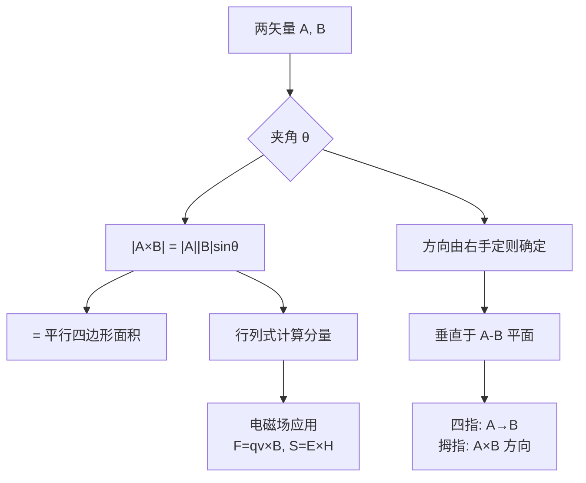

# 矢量积（叉积）的右手定则
**关键词**：矢量的标积和矢积

## 概念定义

$$\vec{A} \times \vec{B} = |A||B|\sin\theta \cdot \hat{n}$$

**叉积 = 两个矢量张成的平行四边形的面积 × 垂直于该平面的单位方向**。结果是一个矢量，垂直于 A 和 B 所在的平面，方向由右手定则确定。

## 类比与直觉

**拧螺丝类比**：右手握住螺丝刀，四指从 A 旋向 B（经过较小角度），拇指指向的方向就是 A×B 的方向。拧紧螺丝时（逆时针旋转），螺丝向里进——这个"进"的方向就是叉积的方向。

**开门类比**：推门的力 F 作用在离门轴距离 r 处。力矩 τ = r × F。r 从门轴指向施力点，F 是推力方向。力矩的方向沿门轴（向上或向下），决定了门是"推开"还是"拉关"。这就是为什么力矩公式是叉积。

**平行四边形面积**：|A×B| = |A||B|sinθ。当 A 和 B 垂直时（θ=90°），sinθ=1，面积最大 = |A||B|；当 A 和 B 平行时（θ=0°），sinθ=0，面积为 0（"压扁"成一条线）。这正好解释了为什么两个平行矢量的叉积为零。

## 右手定则详解

```
    C = A × B
    ↑ (拇指 — 结果方向)
    |
    A ——→ (食指 — 第一个矢量)
    |
    B (中指，从掌心向外 — 第二个矢量)
```

执行步骤：
1. 右手四指从矢量 A（第一个矢量）**扫向**矢量 B（第二个矢量），经过两者之间的较小角度 θ
2. 拇指伸直所指的方向 = **C = A×B 的方向**
3. |C| = |A||B|sinθ = 以 A 和 B 为邻边的平行四边形面积

## 核心公式

### 代数定义（行列式形式）

$$A \times B = \begin{vmatrix} \hat{x} & \hat{y} & \hat{z} \ A_x & A_y & A_z \ B_x & B_y & B_z \end{vmatrix}$$

展开为：

$$A \times B = (A_y B_z - A_z B_y)\hat{x} + (A_z B_x - A_x B_z)\hat{y} + (A_x B_y - A_y B_x)\hat{z}$$

### 记忆技巧（循环排列）

x→y→z→x：正项按此循环，负项反向。

### 重要性质

| 性质 | 数学表达 | 物理含义 |
|------|---------|---------|
| 反交换律 | $A \times B = -(B \times A)$ | 顺序颠倒，方向反转！ |
| 自叉积为零 | $A \times A = 0$ | 平行矢量叉积为零 |
| 与标量乘法 | $(kA) \times B = k(A \times B)$ | 标量可提出 |
| 分配律 | $A \times (B + C) = A \times B + A \times C$ | 像普通乘法一样分配 |
| 最大值条件 | $|A \times B| = |A||B|$ | 当且仅当 A ⟂ B（θ = 90°） |

## 电磁场核心应用

| 应用 | 公式 | 物理意义 |
|------|------|---------|
| 洛伦兹力（磁力） | $\vec{F} = q\vec{v} \times \vec{B}$ | 运动电荷在磁场中受力，方向垂直于速度和磁场 |
| 坡印亭矢量 | $\vec{S} = \vec{E} \times \vec{H}$ | 电磁能量流的方向和大小（功率密度） |
| 毕奥-萨伐尔定律 | $d\vec{B} = \frac{\mu_0}{4\pi}\frac{I d\vec{l} \times \hat{r}}{r^2}$ | 电流元产生磁场的定量规律 |
| 力矩 | $\vec{\tau} = \vec{r} \times \vec{F}$ | 力对参考点的力矩 |
| 角动量 | $\vec{L} = \vec{r} \times \vec{p}$ | 位置矢量与动量的叉积 |
| 旋度定义 | $\nabla \times \vec{F}$ | 矢量场的"旋转程度"，用叉积算子 |

## 推导脉络



## MATLAB 可视化提示词

```
请生成完整的 MATLAB 代码，实现以下功能：

1. **叉积三维可视化**
   - 定义两个三维矢量，例如 A = [2, 1, 0], B = [1, 3, 0]
   - 计算叉积 C = cross(A, B)

2. **绘图要求**
   - 使用 quiver3 分别绘制三个矢量 A, B, C
   - A 用红色箭头，B 用蓝色箭头，C = A×B 用绿色粗箭头
   - 起点都设在原点
   - 用 patch 或 fill3 绘制 A 和 B 张成的平行四边形（半透明）
   - 标注各矢量名称和模长

3. **验证**
   - 显示 C 同时垂直于 A 和 B（dot(C,A) 和 dot(C,B) 约等于 0）
   - 显示 |C| = |A||B|sinθ
   - 用右手定则验证方向正确性

4. **交互功能**
   - 添加旋转视角 view(45, 25)
   - 添加网格 grid on
   - 图形标题："叉积（矢积）的几何意义 —— 右手定则"
   - 图例标注各矢量
```

## 常见误区

1. **A×B 和 B×A 方向相反**：这是叉积最重要的性质——**反交换律**。顺序搞反，结果方向完全反转（指向纸面里 vs 纸面外）。

2. **叉积的结果是矢量，不是标量**：与点积（标积）不同，叉积同时有大小和方向。

3. **|A×B| = |A||B|sinθ，不是 cosθ**：很多人记混。点积是 cosθ（投影），叉积是 sinθ（垂直分量）。

4. **平行矢量叉积为零，垂直矢量叉积最大**：逻辑上刚好和点积"互补"——点积在平行时最大（cos0°=1），叉积在垂直时最大（sin90°=1）。

5. **右手定则不是可选的约定**：它是叉积方向的**定义**。用左手会得到相反的结果，导致洛伦兹力等物理公式出错。

## 费曼检验

1. 给出两个具体矢量 A = (2, 0, 0) 和 B = (0, 3, 0)，请用行列式算出 A×B，再用右手定则验证方向。如果计算 B×A，结果是什么？为什么不同？

2. 洛伦兹力 F = qv×B 中，如果一个正电荷在均匀磁场中运动，什么时候受到的磁力最大？什么时候为零？请画图说明 v、B、F 三者的方向关系。

## 概念导航

- 前置概念：[[行列式的几何意义：面积与体积]]、[[标量与矢量的定义及区别]]
- 后续概念：[[旋度的定义与方向判定]]、[[洛伦兹力的叉积形式]]
- 关联概念：[[标量积（点积）的物理意义]]、[[坡印亭矢量与电磁能量流]]

> 📖 **教科书参考**：§1-3, p.3
