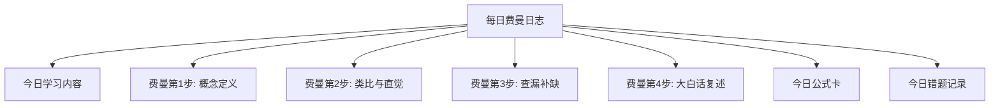

# 学习日志模板 MOC

## 模板说明

本目录提供基于费曼学习法的每日学习日志模板，用于系统记录电磁场与电磁波的学习过程。费曼学习法的核心是：**如果你不能简单地解释它，你就没有真正理解它**。

## 模板结构

## 使用建议

1. **每天一个概念**：不要贪多，一个核心概念的深度理解远胜十个概念的表面了解
2. **大白话复述最重要**：这是费曼法的精髓——用12岁孩子能听懂的语言解释
3. **类比要个人化**：用你自己的经历、爱好来构建类比（如：用水管类比电路、用山类比梯度）
4. **记录困惑**：不理解的地方要明确标注，后续重点攻克
5. **每周回顾**：周末花30分钟回顾一周的费曼日志，发现知识连接

## 学习状态
- [x] 模板创建
- [ ] 每日使用

## 原子笔记索引
- [[每日费曼学习日志模板]] -- 具体模板格式
- 关联：[[费曼法专项 攻克梯度散度旋度 MOC]]、[[费曼法专项 理解麦克斯韦方程组 MOC]]

## 自己理解
> 费曼学习法的本质：理解一个概念，不是记住它的定义，而是能用你自己的语言重新发明它。

## 扩展学习

### 更多教科书内容

本概念在电磁场与电磁波中有广泛的应用。位移电流 $$\frac{\partial D}{\partial t}$$ 是麦克斯韦方程组中最具创造性的部分，它将电场的变化与磁场的产生联系起来。坡印亭矢量 $$S = E \times H$$ 揭示了电磁能量的流动规律。时谐电磁场的复矢量方法将时间域的偏微分方程转化为频率域的代数方程，极大地简化了计算。

### 关键公式速览

| 公式 | 含义 | 所属章节 |
|------|------|----------|
| $\nabla \times H = J + \frac{\partial D}{\partial t}$ | 全电流定律 | §7-1 |
| $\nabla \times E = -\frac{\partial B}{\partial t}$ | 法拉第定律 | §7-2 |
| $S = E \times H$ | 坡印亭矢量 | §7-6 |
| $S_c = \dot{E} \times \dot{H}^*$ | 复能流密度 | §7-11 |
| $E_x = E_{x0}e^{-jkz}$ | 均匀平面波 | §8-2 |
| $\delta = \frac{1}{\sqrt{\pi f\mu\sigma}}$ | 集肤深度 | §8-3 |

### 常见考试错误提醒

1. 在时变场中忘记添加位移电流项 $$\partial D/\partial t$$
2. 混淆有效值和最大值（$$\dot{E}_m = \sqrt{2}\dot{E}$$）
3. 复能流密度计算时忘记取共轭：$$S_c = \dot{E} \times \dot{H}^*$$
4. 理想介质和导电介质的传播参数混淆
5. 边界条件的切向/法向分量搞错

### 与其他概念的关联网络

建议使用 Obsidian 图谱视图查看本笔记与其他笔记的关联：
- 核心前置概念：矢量分析、麦克斯韦方程组、静态场
- 核心后续概念：平面电磁波、天线辐射、波导
- 横向关联：能量守恒、波动方程、边界条件

### 费曼学习建议

用自己的话完成以下三个任务来检验理解：
1. 画一幅图表示本概念的核心物理图像
2. 给一个非物理专业的朋友用大白话解释本概念
3. 找一道与本概念相关的习题独立求解

> 📖 持续参考教科书原文和例题来深化理解。

## 费曼深度讲解

学习日志的本质是"元认知记录"——不是记录"今天学了什么"，而是记录"今天我是怎么学会的"。当你写下"我发现理解高斯定律的难点在于选高斯面"时，你不仅在记录困难，还在训练自己识别和克服困难的策略。好的学习日志是"对学习过程的学习"——记录自己的思维轨迹，发现自己的理解盲区，优化自己的学习方法。

为什么需要对"理解了的概念"和"不理解的概念"分别记录？因为这是费曼学习法的核心循环：理解的东西用费曼复述来巩固（变成你的永久知识），不理解的东西用费曼提问来定位（搞清楚到底卡在哪一步）。如果不区分两者，日志就会变成混沌的"学习流水账"——没有重点，没有策略，没有进步。

"简化解释"栏是整个日志的灵魂——把复杂的电磁概念用大白话说出来，这迫使你用简单的词来表达深刻的思想。如果你说不出来，说明你没真懂。这是费曼检验的精髓：what I cannot create, I do not understand（我不能创造的，就是我不理解的）。借用费曼的原话："如果你不能用一年级的语言解释清楚，那你就还没理解它。"

## 更多类比

学习日志就像健身日志——不是记录"今天去了健身房"，而是记录"深蹲120kg×5×3组，感觉核心收紧需要加强"。同样，好的电磁场学习日志不是"今天看了第二章"，而是"今天理解了高斯定律的核心——选对高斯面的对称性要求，但在处理圆柱外电场时漏了面电荷分布。原因：混淆了D的切向跳跃和法向跳跃。"

## 更多费曼检验

1. 用不超过50个字写出你今天学会的最重要的电磁场概念。然后试着用不超过20个字再写一次——这就是简化解释的训练。

2. 回顾你上周的学习日志，找出一个"当时不理解但现在理解了"的概念——是什么突破了你的理解障碍？

