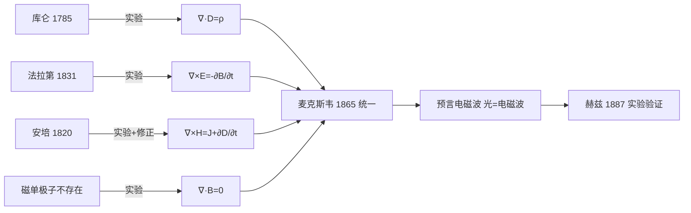

# 费曼法：从四大实验到四大方程的故事线

## 教科书原文

> 📖 参见：[[§7-2 麦克斯韦方程]]

## 四大实验的故事

### 实验1：库仑的扭秤（1785年）→ 高斯定律 $$\nabla \cdot D = \rho$$

库仑用细丝悬挂带电小球，测量电荷之间的力与距离平方成反比。经过高斯的数学提炼：电场从正电荷"流出"，终止于负电荷。穿过闭合面的电通量 = 面内总电荷。

### 实验2：从未找到的磁单极子 → 磁通连续性 $$\nabla \cdot B = 0$$

无论你把磁铁切多碎，每一小片都有N和S极。磁力线永远闭合 —— 没有起点也没有终点。这个"零实验结果"同样重要：$$\nabla \cdot B = 0$$ 是所有四个方程中最不可动摇的。

### 实验3：法拉第的线圈（1831年）→ 法拉第定律 $$\nabla \times E = -\frac{\partial B}{\partial t}$$

法拉第将磁铁插入线圈 → 电流计偏转。磁铁静止 → 无电流。结论：**变化的磁场产生电场**。这是发电机、变压器、感应加热的基础。

### 实验4：奥斯特/安培 + 麦克斯韦的修正（1820/1865年）→ 全电流定律 $$\nabla \times H = J + \frac{\partial D}{\partial t}$$

奥斯特发现通电导线使附近磁针偏转（电流→磁场）。安培总结出定量规律。但麦克斯韦发现：如果只有J项，时变场中会出现矛盾。他大胆地加上了 $$\partial D/\partial t$$ 项，这不仅修正了方程，还预言了电磁波的存在。

## 故事线的科学启示

四个方程中，三个有直接的实验先驱，只有位移电流项（$$\partial D/\partial t$$）是麦克斯韦的纯理论创造——这在科学史上极为罕见。

## 概念导航
- [[费曼法专项 理解麦克斯韦方程组 MOC]]
- [[麦克斯韦方程组 MOC]]、[[每个方程的物理意义与对应实验]]

## 自己理解（费曼复述）
> 学完本节后，用自己的大白话写一段解释。
> （在这里写你的理解）
> 📖 参见：[[§7-2 麦克斯韦方程]]

## 扩展学习

### 更多教科书内容

本概念在电磁场与电磁波中有广泛的应用。位移电流 $$\frac{\partial D}{\partial t}$$ 是麦克斯韦方程组中最具创造性的部分，它将电场的变化与磁场的产生联系起来。坡印亭矢量 $$S = E \times H$$ 揭示了电磁能量的流动规律。时谐电磁场的复矢量方法将时间域的偏微分方程转化为频率域的代数方程，极大地简化了计算。

### 关键公式速览

| 公式 | 含义 | 所属章节 |
|------|------|----------|
| $\nabla \times H = J + \frac{\partial D}{\partial t}$ | 全电流定律 | §7-1 |
| $\nabla \times E = -\frac{\partial B}{\partial t}$ | 法拉第定律 | §7-2 |
| $S = E \times H$ | 坡印亭矢量 | §7-6 |
| $S_c = \dot{E} \times \dot{H}^*$ | 复能流密度 | §7-11 |
| $E_x = E_{x0}e^{-jkz}$ | 均匀平面波 | §8-2 |
| $\delta = \frac{1}{\sqrt{\pi f\mu\sigma}}$ | 集肤深度 | §8-3 |

### 常见考试错误提醒

1. 在时变场中忘记添加位移电流项 $$\partial D/\partial t$$
2. 混淆有效值和最大值（$$\dot{E}_m = \sqrt{2}\dot{E}$$）
3. 复能流密度计算时忘记取共轭：$$S_c = \dot{E} \times \dot{H}^*$$
4. 理想介质和导电介质的传播参数混淆
5. 边界条件的切向/法向分量搞错

### 与其他概念的关联网络

建议使用 Obsidian 图谱视图查看本笔记与其他笔记的关联：
- 核心前置概念：矢量分析、麦克斯韦方程组、静态场
- 核心后续概念：平面电磁波、天线辐射、波导
- 横向关联：能量守恒、波动方程、边界条件

### 费曼学习建议

用自己的话完成以下三个任务来检验理解：
1. 画一幅图表示本概念的核心物理图像
2. 给一个非物理专业的朋友用大白话解释本概念
3. 找一道与本概念相关的习题独立求解

> 📖 持续参考教科书原文和例题来深化理解。

## 费曼深度讲解

四大实验到四大方程的故事线是科学史上最激动人心的叙事弧之一——四个看似无关的实验跨越近一个世纪，被一个人的天才合成为四行方程。时间线：(1)1785年库仑实验→静止电荷之间的力$\propto q_1q_2/r^2$→高斯电定律$\nabla\cdot D=\rho$；(2)"没有磁单极子"的实验事实（至今仍未被发现）→磁通连续性原理$\nabla\cdot B=0$→所有磁体都有N-S两极配对，磁力线永远闭合；(3)1831年法拉第实验→变化的磁通在导线回路中感应电动势→法拉第感应定律$\nabla\times E=-\partial B/\partial t$；(4)1820年安培实验（电流产生磁场）+1865年麦克斯韦位移电流修正→全电流定律$\nabla\times H=J+\partial D/\partial t$。

这四个方程在静态极限下分裂为两组解耦的方程——静电场（D/ρ/E、旋度为零）和静磁场（B=0散度、H/J/旋度）。但在时变情况下通过$\partial B/\partial t$和$\partial D/\partial t$项耦合——这就是为什么"变化的磁场产生电场"和"变化的电场产生磁场"导致电磁场不能独立存在（必须同时考虑两者）——正是这种耦合使得电磁波得以存在：E的变化→产生H的旋度→H的变化→又产生E的旋度→这是一个闭环的自我维持过程。

麦克斯韦方程组的"内部自洽性"之美：这四个方程不是独立的——从两个散度方程取散度旋度方程可以导出电荷守恒$\nabla\cdot J+\partial\rho/\partial t=0$（全电流定律的散度+高斯电定律的时间导数）。方程组的自洽性检查是物理学中"知其所以然"的绝佳练习——如果你提出一个新的场方程体系，首先必须验证方程之间有自洽性，否则就是逻辑上有漏洞的理论。

## 更多费曼检验

1. 如果"磁单极子"被发现，四个麦克斯韦方程中有哪些需要修改？如何修改才能使方程保持对称？

2. 从$\nabla\times H=J+\partial D/\partial t$取散度，结合$\nabla\cdot D=\rho$，推导电荷守恒方程$\nabla\cdot J+\partial\rho/\partial t=0$。这一推导揭示了麦克斯韦方程组与电荷守恒定律之间的什么关系？

