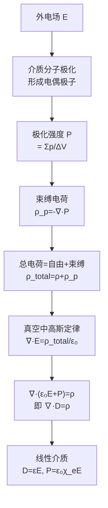

# 介质中的静电场 MOC

## 教科书原文

> 📖 参见：[[§2-4 介质的极化]], [[§2-5 介质中的静电场]]

## 概念定义（费曼一句话）

介质中的静电场与真空中的本质区别在于：电场使介质分子极化（形成微观电偶极子），这些极化产生的束缚电荷也参与产生电场——于是我们引入电位移矢量 $$\mathbf{D} = \varepsilon_0\mathbf{E} + \mathbf{P}$$ 来"吸收"束缚电荷的影响，使高斯定律简化为 $$\nabla\cdot\mathbf{D} = \rho_{\text{自由}}$$。

## 类比与直觉

**类比1：海绵吸水后变重**。真空中的电场类似"净重"（只有自由电荷产生的电场），而介质极化类似海绵吸了水——周围的"有效重量"（$$\mathbf{D}$$）包括自由电荷（海绵本身）和束缚电荷（吸入的水）。$$\mathbf{D} = \varepsilon_0\mathbf{E} + \mathbf{P}$$ 就是在区分"谁是自由电荷的贡献"（$$\mathbf{D}$$）和"谁是所有电荷的合力"（$$\mathbf{E}$$）。

**类比2：人群中的"从众效应"**。外部电荷（领导意见）使介质分子极化（人群中的观点偏移），极化后的分子又产生自己的"电场"（次生舆论），影响周围的人。最终，实际电场（$$\mathbf{E}$$）是所有来源（自由+极化）的叠加，而 $$\mathbf{D}$$ 只追踪自由电荷的"直接贡献"。

## 核心公式详释

**极化强度的定义**：
$$\mathbf{P} = \lim_{\Delta V\to 0}\frac{\sum\mathbf{p}}{\Delta V}$$

**束缚电荷密度**：
$$\rho_p = -\nabla\cdot\mathbf{P}$$
$$\sigma_p = \mathbf{P}\cdot\mathbf{n}$$

**电位移矢量（D矢量的定义）**：
$$\boxed{\mathbf{D} = \varepsilon_0\mathbf{E} + \mathbf{P}}$$

**介质中高斯定律**：
$$\boxed{\nabla\cdot\mathbf{D} = \rho}$$

**线性各向同性介质的本构关系**：
$$\mathbf{P} = \varepsilon_0\chi_e\mathbf{E}$$
$$\mathbf{D} = \varepsilon_0(1+\chi_e)\mathbf{E} = \varepsilon_0\varepsilon_r\mathbf{E} = \varepsilon\mathbf{E}$$

## 介质静电场方程一览

| 方程 | 微分形式 | 积分形式 |
|------|---------|---------|
| 高斯定律 | $\nabla\cdot\mathbf{D} = \rho$ | $\oint\mathbf{D}\cdot d\mathbf{S} = q_{\text{自由}}$ |
| 环路定律 | $\nabla\times\mathbf{E} = 0$ | $\oint\mathbf{E}\cdot d\mathbf{l} = 0$ |

## 推导脉络

## 常见误区

1. **D和E在介质中方向相同**：仅在**线性各向同性**介质中 $$\mathbf{D} = \varepsilon\mathbf{E}$$ 才同向。在各向异性介质（如晶体）中，$$\varepsilon$$ 是张量，$$\mathbf{D}$$ 和 $$\mathbf{E}$$ 方向可以不同。
2. **认为 $$\nabla\cdot\mathbf{D} = 0$$ 意味着没有自由电荷**：对的，但 $$\mathbf{D}$$ 本身可以很大（如平行板电容器内部）。$$\nabla\cdot\mathbf{D} = 0$$ 只表示D的散度为零，即D线的通量连续、D线无源。
3. **混淆P和D的物理指向**：$$\mathbf{D} = \varepsilon_0\mathbf{E} + \mathbf{P}$$ 中的加法是矢量加。极化方向与E同向（一般介质），P指向正束缚电荷到负束缚电荷。D和E不一定同向。

## 费曼检验

1. 一块均匀极化的介质（$$\mathbf{P}$$ = 常数），内部的束缚电荷密度 $$\rho_p = -\nabla\cdot\mathbf{P} = 0$$。束缚电荷分布在哪里？
2. 两种不同介质分界面上，如果界面上没有自由面电荷（$$\rho_s=0$$），$$\mathbf{D}$$ 的哪个分量连续？$$\mathbf{E}$$ 的哪个分量连续？
3. 为什么我们需要引入 $$\mathbf{D}$$ 矢量？直接用 $$\mathbf{E}$$ 加上束缚电荷来解决问题不行吗？

## 概念导航

- **前置**：[[真空中的静电场 MOC]]、[[介质的极化 MOC]]
- **后继**：[[静电场的边界条件 MOC]]、[[电容 MOC]]
- **核心文件**：[[相对介电常数与介质分类]]、[[极化强度与束缚电荷]]

## 自己理解

$$\mathbf{D}$$ 矢量的引入是电磁学中一个典型的"分层抽象"思维——下层（微观）是介质极化（P），上层（宏观）是自由电荷（$$\rho$$）。$$\mathbf{D}$$ 作为中间层，它的散度只与自由电荷有关，把所有极化（束缚）效应的复杂性封装在P中。这种分而治之的策略贯穿了整个电磁场理论（H矢量类似地分离了磁化效应）。

> 📖 参见：[[§2-4 介质的极化]], [[§2-5 介质中的静电场]]
