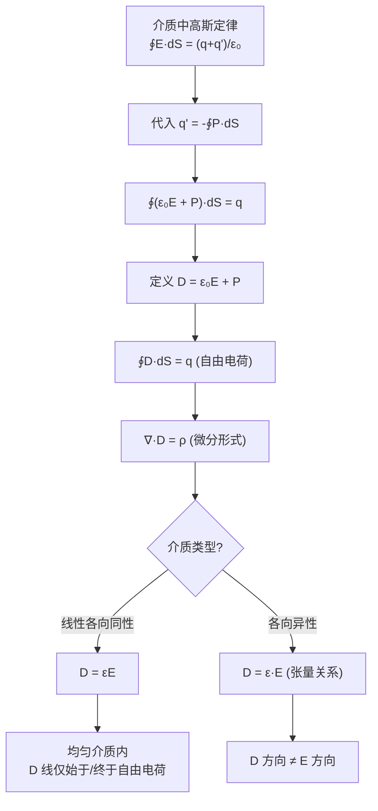

# 电位移矢量 D 的引入
**关键词**：介质中的静电场

📌 **一句话本质**：D矢量只看自由电荷产生的通量，不管介质极化电荷——把介质的影响抽象掉了

🏷️ **重要度**：🔴 | 考试：★★★ | 题型：计

🔧 **工程/实际场景**：多层PCB介质叠层设计必须用D矢量法向连续性条件分析各层电场分布——如果把D和E的法向条件搞混，会算错层间电压分配导致介电击穿；高压电缆的多层绝缘设计（XLPE+半导体层）依赖D矢量分析法向场强——算错电缆绝缘寿命会从30年缩短到3个月

## 概念定义

**电位移矢量 D 是为了在电介质中"屏蔽掉"束缚极化电荷的复杂性而引入的辅助场量。**

$$\vec{D} = \varepsilon_0 \vec{E} + \vec{P}$$

在均匀各向同性线性介质中：

$$\vec{D} = \varepsilon \vec{E} = \varepsilon_0 \varepsilon_r \vec{E}$$

高斯定律用电位移矢量表示为：

$$\oint_S \vec{D} \cdot d\vec{S} = q_{\text{free}} \quad \text{或} \quad \nabla \cdot \vec{D} = \rho_{\text{free}}$$

**D 的通量只取决于自由电荷，与束缚极化电荷完全无关**——这是 D 最重要的性质。

## 🧠 类比与直觉

**公司财务审计类比**：
- **总支出**（对应 D）= 老板批准的预算支出（仅由自由电荷 ρ_free 决定）
- **各部门实际花销**（对应 E）= 老板批准的钱 + 各部门自己小金库的钱（束缚极化电荷 ρ'）
- 外部审计师（高斯定律）用 D 审计：只看老板批准的支出，不管小金库 → ∇·D = ρ_free

**河流与地下水类比**：
- D 场像河流的总流量（只取决于源头注入了多少水，即自由电荷）
- E 场像河流某处的实际流速分布（还受地下渗水即束缚电荷的影响）
- 如果只关心"总共有多少水量通过"，用 D 就够了；如果关心"某处的实际流速"，才需要 E

**"简化工具"类比**：D 就像你在做预算时用的宏观指标——只关注你能控制的变量（自由电荷），而把所有被动的、依赖于材料的复杂响应（极化）打包进 ε 中。这样原本要解"自由电荷 + 束缚电荷 → E"的复杂问题，变成了"自由电荷 → D → E = D/ε"的两步简单问题。

**口诀**："D只认自由电荷，ε₀E加P就是D"

## 核心公式推导轨迹

### 从真空到介质：D 的诞生逻辑

真空中：$$\oint_S E \cdot dS = \frac{q}{\varepsilon_0}$$

介质中，总电荷 = 自由电荷 q + 束缚电荷 q'：

$$\oint_S E \cdot dS = \frac{1}{\varepsilon_0}(q + q')$$

代入束缚电荷与 P 的关系：$$q' = -\oint_S P \cdot dS$$

$$\oint_S (\varepsilon_0 E + P) \cdot dS = q$$

定义：$$\vec{D} \equiv \varepsilon_0 \vec{E} + \vec{P}$$

即得介质中高斯定律的积分形式：

$$\oint_S \vec{D} \cdot d\vec{S} = q$$

### 微分形式

$$\nabla \cdot \vec{D} = \rho$$

### 本构关系

线性各向同性介质：

$$\vec{D} = \varepsilon_0(1 + \chi_e)\vec{E} = \varepsilon_0\varepsilon_r\vec{E} = \varepsilon\vec{E}$$

| 量 | 定义 | 决定因素 | 单位 |
|----|------|---------|------|
| E | 电场强度 | 所有电荷（自由+束缚） | V/m |
| P | 极化强度 | 介质对外电场的响应 | C/m² |
| D | 电位移矢量 | **仅由自由电荷决定** | C/m² |
| ε₀ | 真空介电常数 | 基本物理常数 | F/m |
| εᵣ | 相对介电常数 | 材料属性，εᵣ = 1 + χₑ | 无量纲 |
| χₑ | 电极化率 | 材料极化能力 | 无量纲 |

## 📐 推导脉络



## D 场线的关键特征

- **D 场线起始于正自由电荷，终止于负自由电荷**，与束缚电荷无关
- D 场线穿过介质边界时，即使两侧 ε 不同，D 的法向分量是连续的（若边界无自由面电荷）
- 而 E 场线在介质边界处会"中断"或"新生成"（因为束缚电荷的出现/消失）

这就是引入 D 的核心价值：**D 场是一个在宏观上更"干净"的场**——它的源（散度）仅来自你主动放置的自由电荷，介质的复杂微观响应被 "D = εE" 这一步对材料性质的封装所吸收。

## 💻 MATLAB 可视化提示词

```
请生成完整的 MATLAB 代码，实现以下功能：

1. **场景：点电荷 +q 在均匀介质球内**
   - 点电荷位于原点，被半径为 a 的介质球（εᵣ）包围
   - 球外为真空（εᵣ=1）
   - 参数：q = 1e-9 C, a = 0.5 m, εᵣ = 5

2. **计算与对比**
   - 计算 D 场（仅取决于自由电荷 q，与介质无关）：D = q/(4πr²) 方向径向
   - 计算 E 场：球内 E = D/(ε₀εᵣ)，球外 E = D/ε₀
   - 计算 P 场：球内 P = D - ε₀E，球外 P = 0
   - 计算束缚面电荷密度 ρ'ₛ = P·n̂ 在 r=a 处

3. **可视化要求**
   - 三个子图并排显示：D 场大小分布、E 场大小分布、P 场矢量图
   - D 场应完全连续（过边界不跳变）
   - E 场在介质边界处跳变（标注比值 εᵣ:1）
   - P 场仅在球内非零

4. **输出**
   - figure 窗口 1400×500
   - 配色方案：D=蓝色，E=红色，P=绿色
   - 标注关键数值和结论
```

## ⚠️ 常见误区

1. **D 叫"电位移"但和机械位移无关**：这是历史遗留命名。"电通密度"（electric flux density）是更准确的现代名称。

2. **∇·D = ρ 中的 ρ 只含自由电荷**：不包括束缚极化电荷。这是 D 区别于 E 的核心价值所在。

3. **D 和 E 方向不一定相同**：仅在**各向同性**介质中 D 与 E 同方向。在各向异性介质（如晶体）中，D = ε·E 是张量关系，D 的某个分量可能取决于 E 的所有分量。

4. **D 线不一定连续穿过边界**：只有法向分量在无自由面电荷的边界上连续。如果边界上有自由面电荷 ρₛ，D 法向分量会发生跳变：D₂ₙ − D₁ₙ = ρₛ。

5. **不能认为 D 比 E"更基本"**：D 是为了计算方便而引入的**辅助矢量**。从物理本质上说，作用在电荷上产生力的是 E（F = qE），而不是 D。

## ❓ 费曼检验

1. 一个点电荷 q 放在无限大均匀介质（εᵣ）中。请写出 D(r) 和 E(r) 的表达式，并说明为什么 D 的表达式与介质无关而 E 取决于 εᵣ。

2. 两块平行金属板之间一半填充 εᵣ₁，一半填充 εᵣ₂。施加电压 U 后，两侧的 D 相同还是 E 相同？请用边界条件论证。

## 🔗 概念导航

- 前置概念：[[极化机制]]、[[高斯定律的对称性应用技巧]]
- 后续概念：[[静电场的边界条件 MOC]]、[[电容的定义与计算方法]]
- 关联概念：[[磁场强度H的引入]]（H 对磁场的角色 = D 对电场的角色）、[[各向异性介质的本构关系]]

> 📖 **教科书参考**：§2-5, p.53

## ✂️ 可跳过
- MATLAB 可视化代码的具体参数细节
- D场线关键特征中关于各向异性介质的部分（考试仅考各向同性）
