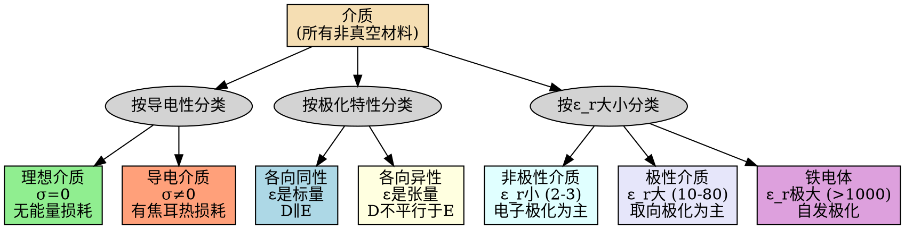

# 相对介电常数与介质分类
**关键词**：介质中的静电场

## 教科书原文

> 📖 参见：[[§2-5 介质中的静电场]]

## 介质分类的关系图

```graphviz
digraph G {
    rankdir=TB;
    node [shape=box, style=filled];

    A [label="介质\n(所有非真空材料)", fillcolor=wheat];
    B [label="按导电性分类", shape=ellipse, fillcolor=lightgray];
    C [label="理想介质\nσ=0\n无能量损耗", fillcolor=lightgreen];
    D [label="导电介质\nσ≠0\n有焦耳热损耗", fillcolor=lightsalmon];
    E [label="按极化特性分类", shape=ellipse, fillcolor=lightgray];
    F [label="各向同性\nε是标量\nD∥E", fillcolor=lightblue];
    G [label="各向异性\nε是张量\nD不平行于E", fillcolor=lightyellow];

    A -> B;
    B -> C;
    B -> D;
    A -> E;
    E -> F;
    E -> G;

    H [label="按ε_r大小分类", shape=ellipse, fillcolor=lightgray];
    I [label="非极性介质\nε_r小 (2-3)\n电子极化为主", fillcolor=lightcyan];
    J [label="极性介质\nε_r大 (10-80)\n取向极化为主", fillcolor=lavender];
    K [label="铁电体\nε_r极大 (>1000)\n自发极化", fillcolor=plum];

    A -> H;
    H -> I;
    H -> J;
    H -> K;
}
```

> 📖 参见：[[§2-5 介质中的静电场]]
