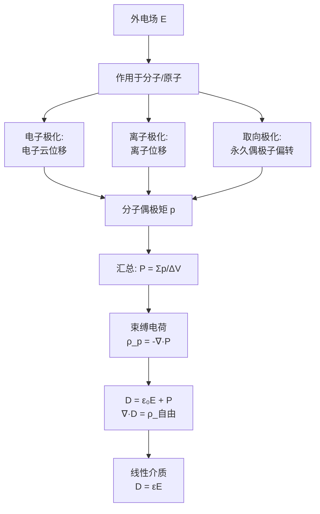

# 介质的极化 MOC

## 教科书原文

> 📖 参见：[[§2-4 介质的极化]]

## 概念定义（费曼一句话）

介质的极化是电介质在外电场作用下，内部正负电荷重心分离形成大量微观电偶极子的过程——它产生的宏观效果是出现束缚电荷分布，这个束缚电荷也参与产生电场，从而改变了介质中的总电场分布。

## 类比与直觉

**类比1：弹簧连接的电荷对**。介质中的每个分子就像一对用弹簧连接的正负电荷——外电场一加上，弹簧被拉长（正电荷顺电场方向，负电荷逆电场方向），形成了微观电偶极子。外电场撤去后，无极分子中的"弹簧"恢复原状（电子云归位），而极性分子中的"弹簧偏移"可能保留（驻极体效应）。

**类比2：人群的"跟风"效应**。未加电场时，极性分子的永久电偶极矩方向杂乱无章（人群中每人朝向随机），外电场就像一个"意见领袖"——让所有人倾向于朝同一方向看齐。温度（热运动）像是"噪音"——越高越破坏这种整齐排列。所以取向极化随温度升高而减弱（P ∝ 1/T）。

## 核心公式详释

**极化强度的定义**：
$$\boxed{\mathbf{P} = \lim_{\Delta V\to 0}\frac{\sum_i \mathbf{p}_i}{\Delta V}}$$

**束缚电荷密度**：
体束缚电荷：$$\boxed{\rho_p = -\nabla\cdot\mathbf{P}}$$
面束缚电荷：$$\boxed{\sigma_p = \mathbf{P}\cdot\mathbf{n}}$$

**线性各向同性介质的本构关系**：
$$\mathbf{P} = \varepsilon_0\chi_e\mathbf{E}$$
$$\mathbf{D} = \varepsilon_0\mathbf{E} + \mathbf{P} = \varepsilon_0(1+\chi_e)\mathbf{E} = \varepsilon_0\varepsilon_r\mathbf{E}$$

**总电荷 = 自由 + 束缚**：
$$\rho_{\text{总}} = \rho_{\text{自由}} + \rho_p$$

## 三种极化机制对比

| 机制 | 介质类型 | 响应速度 | 温度依赖 |
|------|---------|----------|:---:|
| 电子极化 | 所有介质 | $10^{-15}$$ s | 极弱 |
| 离子极化 | 离子晶体 | $10^{-13}\sim10^{-12}$$ s | 弱 |
| 取向极化 | 极性分子 | $10^{-10}\sim10^{-6}$$ s | 强（$$P\propto 1/T$$） |

## 推导脉络

## 常见误区

1. **极化=介质带电**：极化不产生净电荷——束缚电荷的总和为零（正束缚电荷 = 负束缚电荷在数值上）。极化只是电荷的空间分布发生了变化。
2. **所有介质都是线性极化**：铁电体（如BaTiO₃、PZT）的P-E关系呈滞回曲线——"铁电性"类似"铁磁性"。驻极体在撤去外电场后仍保留极化（≈永磁体）。
3. **电子极化 = 原子的唯一极化机制**：有极性分子的介质中，取向极化通常远大于电子极化（水在静电场下 $$\chi_e \approx 80$$，电子极化贡献仅~2）。

## 费曼检验

1. 一块均匀极化的介质（P=常数），内部体束缚电荷为零。束缚电荷分布在哪里？面电荷密度是多少？
2. 水的 $$\varepsilon_r \approx 80$$（静态）。为什么在可见光频率（~5×10¹⁴ Hz）下，水的 $$\varepsilon_r$$ 降至约1.8？
3. 电介质极化（P的散度→束缚电荷）和磁介质磁化（M的旋度→束缚电流）之间的数学对偶，物理上反映了什么本质区别？

## 概念导航

- **前置**：[[真空中的静电场 MOC]]、[[电偶极矩的定义]]
- **后继**：[[介质中的静电场 MOC]]、[[静电场的边界条件 MOC]]
- **核心文件**：[[极化强度与束缚电荷]]、[[极化机制：电子极化、取向极化]]

## 自己理解

介质的极化是"微观到宏观"物理学思维的精美示例：微观层面每个分子都是一个带方向的小电偶极子（~10⁻³⁰ C·m量级），宏观层面汇总成一个连续的矢量场P（单位C/m²），再通过散度运算产生等效的束缚电荷分布。这种"微观现象→宏观平均场→等效源"的三级抽象是电磁理论处理所有"介质响应"的统一范式——磁化完全类比于极化，只是用旋度代替散度（$$\mathbf{J}_m=\nabla\times\mathbf{M}$$ vs $$\rho_p = -\nabla\cdot\mathbf{P}$$）。

> 📖 参见：[[§2-4 介质的极化]]
