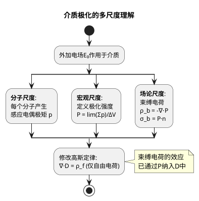

# 极化强度与束缚电荷
**关键词**：极化, P, 电偶极矩, 束缚电荷, εᵣ, 介电常数

📌 **一句话本质**：极化导致介质表面出现束缚电荷——这些电荷不是自由的，被绑在分子上

🏷️ **重要度**：🟡 | 考试：★★ | 题型：计

## 🧠 类比与直觉

**"橡皮筋网"类比**：介质分子像橡皮筋连接的正负电荷，电场拉伸橡皮筋时，正负电荷分开但被橡皮筋拴住不能跑。表面上看电荷分开了，但它们是"束缚"的——像弹簧床上的小球被压下去但弹不飞。

**口诀**："极化表面出束缚，不是自由不能流"

## 教科书原文

> 📖 参见：[[§2-4 介质的极化]]

## 极化电荷面密度的三种等效

束缚电荷的体密度：$\rho_b = -\nabla\cdot\mathbf{P}$
束缚电荷的面密度：$\sigma_b = \mathbf{P}\cdot\mathbf{n}$

在均匀极化（均匀介质、均匀场）时，$\nabla\cdot\mathbf{P}=0$，体内无束缚电荷——束缚电荷仅出现在介质表面。

> 📖 参见：[[§2-4 介质的极化]]

## ✂️ 可跳过
- PlantUML 多尺度理解图（可视化辅助，不考）
