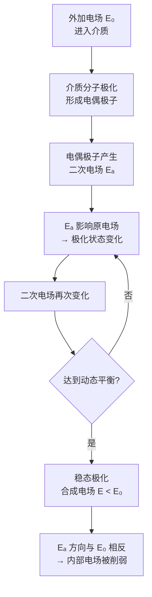

# 极化机制
**关键词**：极化, P, 电偶极矩, 束缚电荷, εᵣ, 介电常数

📌 **一句话本质**：极化是电场把介质里的正负电荷拉开——正电荷顺场移，负电荷逆场移，介质内部出现电偶极矩

🏷️ **重要度**：🟡 | 考试：★★ | 题型：简

## 概念定义

**极化**是电介质在外加电场作用下，内部束缚电荷发生微观位移，导致介质中出现大量排列方向大致相同的电偶极子的物理现象。极化后的介质内部合成电场总是**小于**外加电场。

一句话给12岁孩子：介质中的正负电荷被电场"拉偏了"——正电荷往电场方向偏，负电荷往反方向偏，形成无数微小的电偶极子，它们的电场恰好抵消了一部分外加电场。

## 🧠 类比与直觉

**弹簧-小球模型**：把介质原子想象成弹簧连接的正负电荷对。没有电场时，正负电荷中心重合（弹簧自然长度）。施加电场后，正电荷被拉向一方，负电荷被拉向反方向，弹簧被拉伸。所有原子内部的"小球"都偏了相同方向。结果：介质一端表面积累正电荷，另一端积累负电荷——这就是束缚极化电荷。

**排队效应类比**：无极分子像整齐排列的磁针——没有外磁场时杂乱无章，对外不显磁性。外加电场时所有"小磁针"（电偶极子）沿电场方向排队对齐。排列得越整齐，极化程度越强。

**铁屑在磁铁旁的类比**：介质分子像散落的铁屑，外加电场像一块大磁铁逼近。铁屑被"磁化"（极化）后重新排列，内部产生与外加电场方向相反的"退极化场"。

**口诀**："极化正负被拉开，介质内部出偶极"

## 两类极化机制

### 1. 位移极化（无极分子）

- **机制**：原子的正负电荷中心在无外场时**重合**
- **过程**：外电场使电子云相对原子核发生微小位移，正负电荷中心分离，形成**诱导电偶极子**
- **特点**：响应极快（电子质量小），与温度基本无关
- **典型介质**：氢气 H₂、氮气 N₂、聚乙烯、石蜡

### 2. 取向极化（有极分子）

- **机制**：分子本身具有**固有电偶极矩**（正负电荷中心不重合），但无外场时杂乱排列
- **过程**：外电场使各分子的固有电偶极子**转向**趋于沿电场方向排列
- **特点**：响应较慢，受热运动（温度）显著影响——温度越高，热扰动越强，取向越难
- **典型介质**：水 H₂O（εᵣ≈80）、氯化氢 HCl、有机玻璃

## 极化建立过程

关键结论：电偶极子中央部分的二次电场方向总是与外加电场**相反**，导致极化后介质内的合成电场小于外加电场。

## 核心公式

### 电极化强度（宏观描述极化程度）

$$P = \frac{\sum_{i=1}^{N} p_i}{\Delta V}$$

即单位体积内电偶极矩的矢量和。单位为 C/m²。

### 线性各向同性介质的本构关系

$$P = \varepsilon_0 \chi_e E$$

其中 χₑ 为**电极化率**（正实数，无量纲）。

### 束缚电荷与极化强度的关系

面束缚电荷密度：

$$\rho'_S = P \cdot \hat{e}_n$$

体束缚电荷密度：

$$\rho' = -\nabla \cdot P$$

总束缚电荷与 P 的通量关系：

$$q' = -\oint_S P \cdot dS$$

| 符号 | 含义 | 单位 |
|------|------|------|
| P | 电极化强度矢量 | C/m² |
| χₑ | 电极化率（正实数） | 无量纲 |
| pᵢ | 第 i 个电偶极子的电矩 | C·m |
| ρ'ₛ | 束缚面电荷密度 | C/m² |
| ρ' | 束缚体电荷密度 | C/m³ |

## 介质分类

| 分类维度 | 类别 | 特征 |
|---------|------|------|
| 各向同性 vs 各向异性 | 各向同性 | χₑ 与电场方向无关，P 与 E 同方向 |
| | 各向异性 | χₑ 为 3×3 张量，P 与 E 方向不同 |
| 均匀 vs 不均匀 | 均匀介质 | χₑ 与空间坐标无关 |
| | 不均匀介质 | χₑ 随位置变化，内部可能出现束缚体电荷 |
| 线性 vs 非线性 | 线性介质 | χₑ 与 E 的大小无关 |
| | 非线性介质 | χₑ 随电场强度变化（如铁电材料） |

## ⚠️ 常见误区

1. **极化 ≠ 导电**：极化是束缚电荷的微观位移（电子仅在原子/分子范围移动），导电是自由电荷的宏观迁移（电子在整个导体中流动）。极化不产生持续电流。

2. **极化电荷是"束缚电荷"**：不能自由离开介质表面，不能像金属中的自由电子那样被导线导出。

3. **所有分子都有位移极化**：即使是有极分子，在电场作用下也会同时发生位移极化和取向极化，只是取向极化通常占主导地位。

4. **合成电场 E 不是简单的 E₀ − Eₐ**：极化的建立是动态的、非线性的反馈过程，Eₐ 本身又取决于合成电场 E。最终达到的稳态由介质的自洽极化状态决定。

5. **均匀介质内部通常无束缚体电荷**：在均匀线性介质中若无自由电荷，∇·P = χₑε₀∇·E = 0，故 ρ' = 0。束缚电荷只出现在介质表面或非均匀处。

## ❓ 费曼检验

1. 为什么水的相对介电常数 εᵣ ≈ 80 远大于空气的 εᵣ ≈ 1？从分子极化的两种机制解释。

2. 一块均匀介质平板放入均匀电场中，介质内部的电场变大了还是变小了？介质表面的束缚电荷如何分布？画出电场线和等位面。

## 🔗 概念导航

- 前置概念：[[电偶极子的电场与电位]]、[[标量与矢量的定义及区别]]
- 后续概念：[[电位移矢量D的引入]]、[[介质中的静电场]]
- 关联概念：[[击穿场强与介质强度]]、[[各向异性介质的本构关系]]

> 📖 **教科书参考**：§2-4, p.49

## ✂️ 可跳过
- 介质分类的三维度表格（了解即可，不考分类细节）
- Mermaid 极化建立过程流程图（直观理解用）
