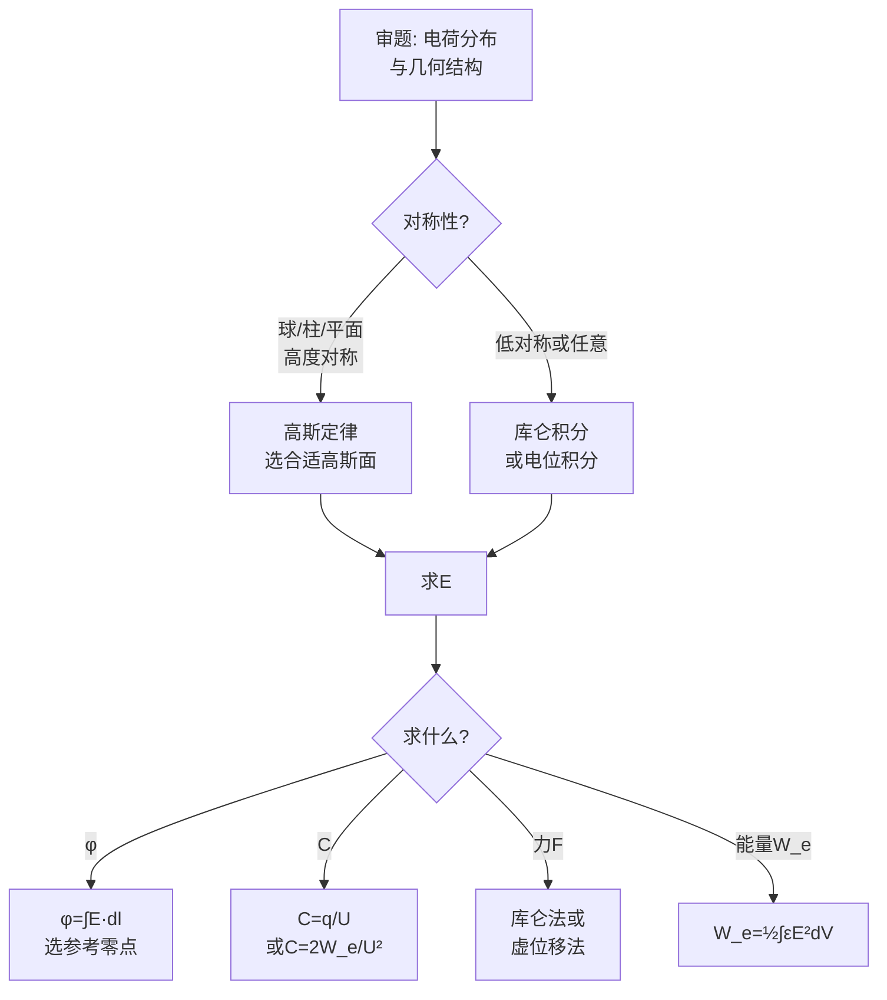

# 习题：第2章 静电场（教科书p.75-78）

## 教材原题概览

第2章习题涵盖静电场的核心计算：E的计算（库仑积分、高斯定律）、电位的计算、电容的计算、静电能量的计算。这是全书最重要的习题集之一——后续所有章节的计算能力都建立在第2章的基础上。

| 题号范围 | 主题 | 核心技能 |
|----------|------|----------|
| 2-1~2-4 | 电场强度计算 | 库仑积分法、叠加原理 |
| 2-5~2-8 | 高斯定律应用 | 对称性分析+高斯面选取 |
| 2-9~2-12 | 电位计算 | E积分求$\phi$、叠加原理 |
| 2-13~2-16 | 电容计算 | 定义法、能量法 |
| 2-17~2-20 | 静电能量和力 | 能量法、虚位移法 |

> 📖 习题2-1~2-20, p.75-78

## 费曼4步解题法

### 第1步：审题与分类

拿到静电场习题后，第一步是判断问题类型：
- **已知电荷分布求E/$\phi$** → 库仑积分法（一般分布）或高斯定律（高对称性）
- **已知E求$\phi$** → 线积分 $\phi = \int\mathbf{E}\cdot d\mathbf{l}$ + 选参考零点
- **求电容** → 先求$\phi$或E → 再算q或$W_e$ → C = q/U 或 C = $2W_e/U^2$
- **求力和能量** → 库仑力法（简单分布）或虚位移法（复杂结构）

### 第2步：核心公式速查

**点电荷电场**：$$\mathbf{E} = \frac{q}{4\pi\varepsilon_0 R^2}\mathbf{e}_R$$

**高斯定律**：$$\oint_S\mathbf{D}\cdot d\mathbf{S} = q_{\text{自由}}$$

**电位**：$$\phi = \int_{\infty}^{r}\mathbf{E}\cdot d\mathbf{l}$$（参考零在无穷远）

**平行板电容**：$$C = \frac{\varepsilon S}{d}$$

**能量密度**：$$w_e = \frac{1}{2}\varepsilon E^2$$

**虚位移法求力**：$$F = -\left.\frac{\partial W_e}{\partial g}\right|_{q=\text{const}}$$

### 第3步：典型题目详解

**例1（高斯定律法）**：求半径为R、均匀带电（体密度$\rho$）的球体内部和外部各点的E。

*球外（r>R）*：取同心球面为高斯面 $\to E_r(4\pi r^2) = \rho(4\pi R^3/3)/\varepsilon_0$
$\to E_r = \frac{\rho R^3}{3\varepsilon_0 r^2}$（等效于圆心处点电荷）

*球内（r<R）*：$E_r(4\pi r^2) = \rho(4\pi r^3/3)/\varepsilon_0$
$\to E_r = \frac{\rho r}{3\varepsilon_0}$（线性增大！）

**例2（电容计算）**：平行板电容器（面积S，间距d，介质$\varepsilon$）。假设板带电荷±q，则D=$\sigma$ = q/S，E=D/$\varepsilon$，U=Ed=qd/($\varepsilon$S)。
$\to C = q/U = \varepsilon S/d$。

**例3（虚位移法）**：平行板电容器板间作用力。$W_e = q^2d/(2\varepsilon S)$
$F = -\partial W_e/\partial d|_{q} = -q^2/(2\varepsilon S)$（负号表示吸引力）

### 第4步：验证技巧

- 量纲检查：$[\varepsilon_0]$ = F/m, [E] = V/m, 确保所有量纲一致
- 对称性验证：球对称问题中E必须只有径向分量
- 极限检验：r→∞时E→0是否正确？d→0时C→∞是否正确？
- 两个方法交叉验证：能用高斯定律的题再用库仑积分验证关键点

## 解题流程图



## 常见误区

1. **高斯面选错**：选高斯面必须是闭合面，且"面上一部分与E平行、一部分与E垂直"才能简化。
2. **电位参考零点混乱**：对无限大带电体不能取无穷远为零点（电位发散）。
3. **忘记介质的影响**：介质中 D = $\varepsilon$E，不是真空中的 $\varepsilon_0$E。
4. **电容计算中混淆"电荷"和"电荷密度"**：C的定义是用总电荷q除以电压U，不是电荷密度。
5. **虚位移法符号**：常电荷系统$F = -\partial W_e/\partial g$，常电位系统$F = +\partial W_e/\partial g$——符号相反！

## 概念导航

- **关联**：[[习题：高斯定律应用题精选]]、[[真空中的静电场 MOC]]、[[电容 MOC]]
- **公式速查**：[[边界条件汇总表]]、[[梯度散度旋度公式表]]

## 自己理解

第2章习题是所有电磁场计算的基础。E→$\phi$→C→$W_e$→F 这条计算链是标准流程。其中最关键的一步是"对称性判断+高斯面选取"——这是区分"会做题"和"能高效做题"的分水岭。球对称选球面、柱对称选柱面、平面对称选柱面——这三个组合必须刻在肌肉记忆里。

> 📖 习题2-1~2-20, p.75-78

## 各题型的得分权重分布

```json
{
  "$schema": "https://vega.github.io/schema/vega-lite/v5.json",
  "mark": "bar",
  "title": "第2章习题各题型预估分值分布",
  "data": {
    "values": [
      {"category": "电场强度计算", "score": 25},
      {"category": "高斯定律应用", "score": 30},
      {"category": "电位计算", "score": 15},
      {"category": "电容计算", "score": 15},
      {"category": "能量与力", "score": 15}
    ]
  },
  "encoding": {
    "x": {"field": "category", "type": "nominal", "title": "题型", "sort": "-y"},
    "y": {"field": "score", "type": "quantitative", "title": "预估分值"},
    "color": {"field": "category", "type": "nominal", "legend": null}
  }
}
```

> 📖 习题2-1~2-20, p.75-78
