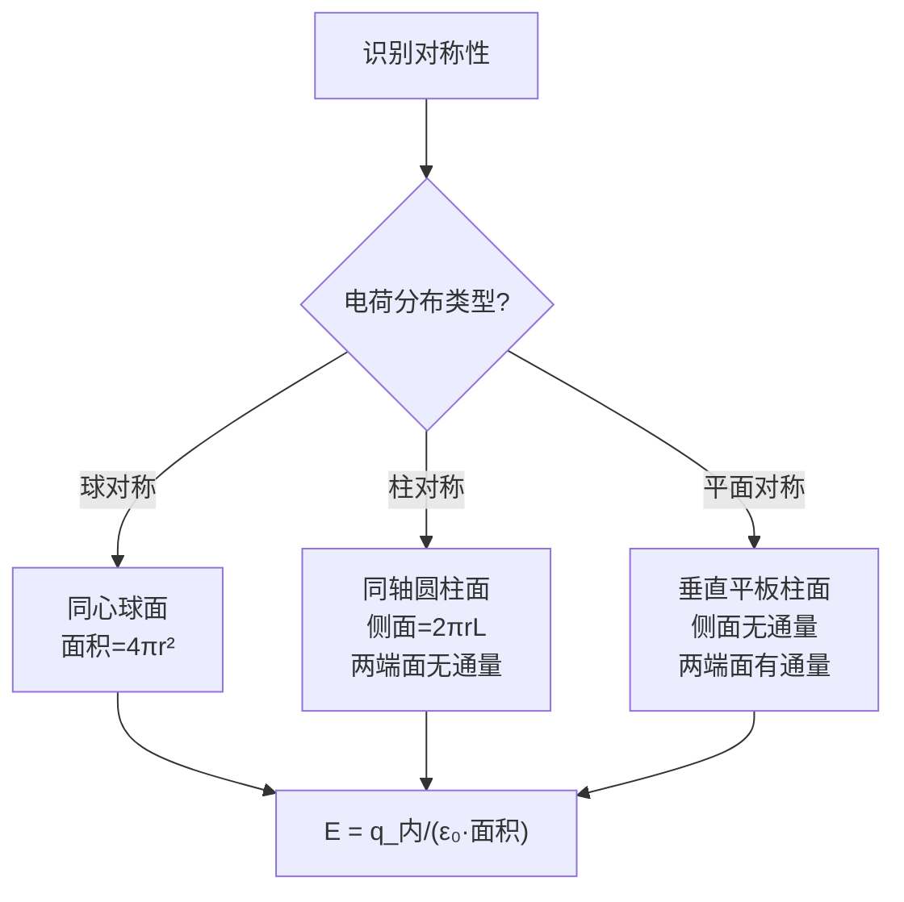

# 习题：高斯定律应用题精选
**关键词**：思考题, 预习, 概念检验, 静电场

📌 **一句话本质**：高斯定律应用题精选——球对称、柱对称、平面对称三种场景的高斯面选取与电场求解

🏷️ **重要度**：⚪ | 考试：★ | 题型：计

## 教材原题

精选高斯定律应用的典型习题，涵盖球对称、柱对称、平面对称三种情况下的电场求解。高斯定律是求解静电场的最强对称性工具——当电荷分布具有高度对称性时，它比库仑积分法简单得多。

## 费曼4步解题法

### 第1步：高斯定律解题核心逻辑

高斯定律解题的"三步走"策略：
1. **分析对称性** → 确定E的方向（只有径向/柱径向/法向）
2. **选取高斯面** → 使E在高斯面上大小恒定、方向与面法向平行
3. **应用高斯定律** → $$\oint\mathbf{E}\cdot d\mathbf{S} = q_{\text{内}}/\varepsilon_0$$ 化简求解

### 第2步：三种经典对称性例题

**例题1：均匀带电球体（球对称）**

一个半径R的球体均匀带电（体密度$$\rho$$），求球内部和外部各点的电场。

*对称性分析*：球对称 → E只有径向分量，大小只依赖于r，$$E = E_r(r)\mathbf{a}_r$$

*球外（r>R）*：取半径为r的同心球面为高斯面
$$E_r\cdot 4\pi r^2 = \frac{\rho\cdot\frac{4}{3}\pi R^3}{\varepsilon_0}$$
$$\boxed{E_r = \frac{\rho R^3}{3\varepsilon_0 r^2}}$$（等效于点电荷 $$Q = \rho\frac{4}{3}\pi R^3$$ 位于球心）

*球内（r<R）*：
$$E_r\cdot 4\pi r^2 = \frac{\rho\cdot\frac{4}{3}\pi r^3}{\varepsilon_0}$$
$$\boxed{E_r = \frac{\rho r}{3\varepsilon_0}}$$（线性增大！）

关键发现：球内电场从中心（零）线性增大到表面最大值，球外按 $$1/r^2$$ 衰减。

**例题2：无限长均匀带电圆柱（柱对称）**

无限长圆柱（半径a）均匀带电（体密度$$\rho$$），求电场。

*对称性分析*：柱对称 → E只有径向分量（柱坐标），大小只依赖于r

*柱外（r>a）*：取半径r、长L的同轴圆柱面为高斯面
$$E_r\cdot 2\pi r L = \frac{\rho\pi a^2 L}{\varepsilon_0}$$
$$\boxed{E_r = \frac{\rho a^2}{2\varepsilon_0 r}}$$（按 $$1/r$$ 衰减）

*柱内（r<a）*：
$$E_r\cdot 2\pi r L = \frac{\rho\pi r^2 L}{\varepsilon_0}$$
$$\boxed{E_r = \frac{\rho r}{2\varepsilon_0}}$$（线性增大）

**例题3：无限大均匀带电平板（平面对称）**

厚度为t、体密度$$\rho$$的无限大平板，求平板内部和外部电场。

*对称性分析*：平面对称 → E只有垂直于板面的分量

*板外*（取垂直穿过板面的柱面为高斯面）：
$$E\cdot A + E\cdot A = \frac{\rho t A}{\varepsilon_0}$$（两个底面都有通量）
$$\boxed{E = \frac{\rho t}{2\varepsilon_0}}$$（均匀！与距离无关！）

*板内*（距中心面x处）：$$E = \frac{\rho x}{\varepsilon_0}$$（线性）

### 第3步：高斯面选取诀窍

高斯面选取的核心原则：
- 面上E的大小为常数（选等距面）
- 面上一部分与E平行（通量 = E × 面积），其余部分与E垂直（通量 = 0）

### 第4步：扩展——有介质时的高斯定律应用

对于D矢量（含介质）：$$\oint\mathbf{D}\cdot d\mathbf{S} = q_{\text{自由}}$$
同样的对称性原则适用，只需将E替换为D，$$\varepsilon_0$$替换为本构关系。

介质球：$$\varepsilon_1$$（内），$$\varepsilon_2$$（外），中心有点电荷q
- 介质内（r<R）：$$D_r = q/(4\pi r^2)$$（D连续，因无自由界面电荷）
  $$E_r^{\text{内}} = D_r/\varepsilon_1$$
- 介质外（r>R）：$$E_r^{\text{外}} = D_r/\varepsilon_2$$

## 常见误区

1. **高斯面上的E不一定指向外法向**：如果内部净电荷为负，E指向内法向。高斯定律只给出大小和方向（通过正负号），要结合物理直觉判断。
2. **无限长/无限大的假设在现实中"近似"有效**：只要考察点离电荷分布的特征尺寸足够近，边缘效应可忽略，无限假设就近似成立。
3. **遗忘面电荷密度$$\sigma$$和体电荷密度$$\rho$$之间的转换**：均匀带电球体表面处 $$\sigma$$ 无限薄层 → $$E$$的跃变 = $$\sigma/\varepsilon_0$$。

## 概念导航

- **关联**：[[真空中的静电场 MOC]]、[[电通量密度与高斯定律]]、[[习题：第2章 静电场（教科书p.75-78）]]
- **延伸**：[[安培环路定律的对称性条件]]（磁场中的对应类比）

## 自己理解

高斯定律解题是电磁学中最"爽"的体验——当对称性条件满足时，一个看似需要复杂积分的三维问题瞬间化简为"内部总电荷除以面积"的简单除法。但记住：这种"爽"是有代价的——只有在三种高度对称性下（球、柱、平面）才有效。对于不对称的分布，高斯定律仍然成立但无法直接求解，需要回到库仑积分或其他方法。

> 📖 参见：[[§2-2 真空中的静电场]]
