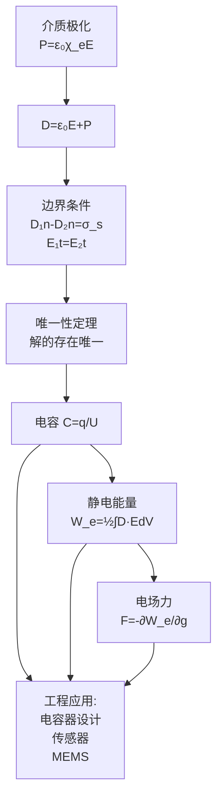

# 思考题：2-10至2-16 介质特性边界条件电容能量与电场力
**关键词**：思考题, 极化, 边界条件, 唯一性定理, 电容, 能量, 电场力

📌 **一句话本质**：静电学的综合应用段——极化→边界条件→唯一性定理→电容→能量→力的完整知识链

🏷️ **重要度**：⚪ | 考试：★ | 题型：简

## 教科书原题

> 2-10 什么叫极化？简述介质极化的微观机制。
> 2-11 写出两种不同介质分界面上的边界条件。
> 2-12 介质中的能量密度如何表示？
> 2-13 唯一性定理的内容是什么？
> 2-14 电容的定义是什么？它与哪些因素有关？
> 2-15 静电能量与哪些因素有关？
> 2-16 如何计算电场力？

## 费曼4步解题法

### 第1步：明确最后7道思考题的结构

这7题构成了静电学的"收尾"部分——从极化（微观机制）→边界条件（宏观界面）→唯一性定理（解的存在唯一性）→电容/能量/力（工程应用）。掌握这些，静电学的理论框架和应用方法就完整了。

### 第2步：逐题详解

**2-11 介质分界面边界条件**

| | 法向条件 | 切向条件 |
|---|---------|---------|
| 一般情况 | $D_{1n} - D_{2n} = \sigma_s$ | $E_{1t} = E_{2t}$ |
| 无自由面电荷 | $D_{1n} = D_{2n}$$（D法向连续） | $E_{1t} = E_{2t}$$（E切向连续） |
| 折射定律 | $\frac{\tan\theta_1}{\tan\theta_2} = \frac{\varepsilon_1}{\varepsilon_2}$ | （$$\theta$$ 为E与法线夹角） |

**来源**：法向条件由高斯定律导出（$$\oint\mathbf{D}\cdot d\mathbf{S} = q_{\text{自由}}$$），切向条件由环路定律导出（$$\oint\mathbf{E}\cdot d\mathbf{l} = 0$$）。

**物理含义**：电场穿越介质界面时发生"折射"——从大$$\varepsilon$$介质进入小$$\varepsilon$$介质时，E线弯向界面法线。介电常数差异越大，折射越显著。

**2-12 介质中的能量密度**

$$\boxed{w_e = \frac{1}{2}\mathbf{D}\cdot\mathbf{E} = \frac{1}{2}\varepsilon E^2}$$

总静电能量：$$W_e = \frac{1}{2}\int_V\mathbf{D}\cdot\mathbf{E}\,dV$$

对比其他表达式：$$W_e = \frac{1}{2}\sum q_k\phi_k = \frac{1}{2}\int\rho\phi\,dV$$

**2-13 唯一性定理**

内容：满足泊松方程（或拉普拉斯方程）和给定边界条件的电位函数解是**唯一的**。

意义：不管用什么方法（分离变量法、镜像法、数值法），只要找到了一个解满足方程和边界条件，**它就是唯一正确的**。这让工程师可以放心使用各种近似或取巧方法。

**2-14 电容的定义和影响因素**

$$C = \frac{q}{U}$$（两导体系统）

影响因素：**仅取决于**导体几何形状、相对位置和填充介质（$$\varepsilon$$）——与电压和电荷无关（线性介质中）。

**2-15 静电能量与哪些因素有关**

$$W_e = \frac{1}{2}CU^2 = \frac{q^2}{2C} = \frac{1}{2}\int\varepsilon E^2\,dV$$

取决于：电荷分布、导体几何、介质特性、边界条件。**能量储存在电场中**——即使在真空中，只要有电场就有能量。

**2-16 计算电场力的两种方法**

1. **库仑力直接法**：$$\mathbf{F} = q\mathbf{E}$$（对点电荷）或 $$\mathbf{F} = \int\rho\mathbf{E}dV$$（对分布电荷）
2. **虚位移法**（推荐）：$$F = -\left.\frac{\partial W_e}{\partial g}\right|_{q=\text{const}} = +\left.\frac{\partial W_e}{\partial g}\right|_{\phi=\text{const}}$$

### 第3步：概念关系图

### 第4步：记忆要点总结

| 题号 | 核心概念 | 关键公式 | 一句话精髓 |
|:---:|------|------|------|
| 2-10 | 极化微观机制 | $\mathbf{P}=\varepsilon_0\chi_e\mathbf{E}$ | 分子偶极子在外场下的取向/位移 |
| 2-11 | 边界条件 | D法向跃变 $$=\sigma_s$$，E切向连续 | 界面两侧场的衔接规则 |
| 2-12 | 能量密度 | $w_e=\frac{1}{2}\mathbf{D}\cdot\mathbf{E}$ | 能量储存在场中，每点都有 |
| 2-13 | 唯一性定理 | 给定边界→解唯一 | 保证任何正确方法都找到同一答案 |
| 2-14 | 电容 | $C=q/U$ | 几何+介质决定，与q/U无关 |
| 2-15 | 静电能量 | $W_e=\frac{1}{2}CU^2$ | 建场所做的功全部转化为储能的 |
| 2-16 | 电场力 | 库仑法或虚位移法 | 力=能量对位移的偏导（符号看约束） |

## 常见误区

1. **电容总是 $$\varepsilon S/d$$**：这仅是平行板的公式。不同几何形状有不同公式。
2. **唯一性定理要求解是精确的**：近似解（数值解、截断级数）不是"唯一"意义上的解，但可以通过误差估计逼近真解。
3. **虚位移法中两个符号恒为正**：恒电荷条件下力做正功减少储能（负号），恒电位条件下电源补充能量（正号）。两种条件下算出的力**大小相同**。

## 概念导航

- **前置**：[[电位 MOC]]、[[介质的极化 MOC]]、[[镜像法 MOC]]
- **核心**：[[电容 MOC]]、[[电场能量 MOC]]、[[电场力 MOC]]
- **关联**：[[惟一性定理]]

## 自己理解

思考题2-10至2-16是静电学的"综合应用段"。前面所有的基础（E的定义、高斯定律、电位、极化）在这里汇集成可以解决实际工程问题的工具。尤其是唯一性定理——它可以让你在计算复杂问题时放心使用近似方法；虚位移法——它可以让你不用做复杂的应力张量积分就能求力。这两个"取巧"是电磁工程师的必备技能。

> 📖 参见：[[§2-6 静电场的边界条件]], [[§2-8 电场能量]]
