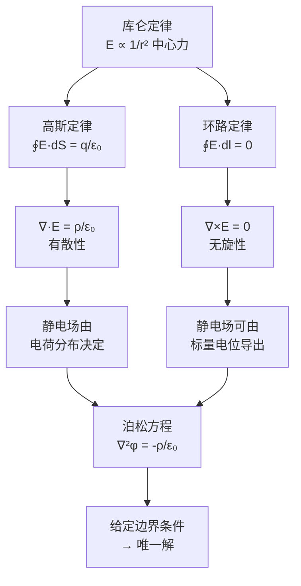

# 思考题：2-1至2-4 电场强度与真空中静电场方程
**关键词**：思考题, 静电场, E定义, 高斯定律, 环路定律

📌 **一句话本质**：静电场由两条方程完整描述——高斯定律说"电荷产生电场散度"，环路定律说"静电场无旋"

🏷️ **重要度**：⚪ | 考试：★ | 题型：简

## 教科书原题

> 2-1 电场强度的定义是什么？它的单位是什么？
> 2-2 写出真空中静电场的基本方程（积分形式和微分形式），并说明其物理意义。
> 2-3 什么是高斯定律？它反映静电场的什么性质？
> 2-4 什么是静电场的环路定律？它表明静电场具有什么性质？

## 费曼4步解题法

### 第1步：明确问题结构

这4道思考题是循序渐进的：2-1定义核心物理量（E），2-2给出完整的方程体系，2-3和2-4分别解释两条基本方程（高斯定律和环路定律）的物理含义。合在一起，构成了真空中静电场的完整理论框架。

### 第2步：逐题解答

**2-1 电场强度的定义**

电场强度 $$\mathbf{E}$$ 定义为：**单位正试验电荷在电场中某点所受的力**。

$$\boxed{\mathbf{E} = \frac{\mathbf{F}}{q_0}}$$

- 单位：V/m（伏特每米）或 N/C（牛顿每库仑），两者等价
- $$\mathbf{E}$$ 是**矢量场**：空间每一点都有一个方向和大小
- 试验电荷 $$q_0 > 0$$ 且足够小，不显著影响原有的电荷分布

**2-2 真空中静电场的基本方程**

| | 积分形式 | 微分形式 | 名称 |
|---|---------|---------|------|
| 方程1 | $\oint_S \mathbf{E}\cdot d\mathbf{S} = \frac{q}{\varepsilon_0}$ | $\nabla\cdot\mathbf{E} = \frac{\rho}{\varepsilon_0}$ | 高斯定律 |
| 方程2 | $\oint_l \mathbf{E}\cdot d\mathbf{l} = 0$ | $\nabla\times\mathbf{E} = 0$ | 环路定律 |

这两条方程分别描述了静电场的**有散性**（电场从电荷流出）和**无旋性**（电场绕闭合路径不做净功）。

**2-3 高斯定律的物理意义**

高斯定律反映：**电场是有散场**。电场的"源"是电荷——正电荷是电场的"喷泉"，电场线从它出发；负电荷是电场的"下水口"，电场线终止于它。穿过任何闭合曲面的电通量等于曲面内部总电荷除以 $$\varepsilon_0$$。

$$\nabla\cdot\mathbf{E} = \rho/\varepsilon_0$$ 是库仑定律 $$1/r^2$$ 力的必然数学推论。

**2-4 环路定律的物理意义**

环路定律反映：**静电场是保守场（无旋场）**。将单位正电荷沿任何闭合路径移动一圈，静电力所做的净功为零。这意味着：
- 可以定义标量电位 $$\phi$$：$$\mathbf{E} = -\nabla\phi$$
- 两点间电压与路径无关：$$U_{AB} = \int_A^B \mathbf{E}\cdot d\mathbf{l} = \phi_A - \phi_B$$
- 能量守恒在静电场中的体现

### 第3步：两条方程的相互关系

### 第4步：深层统一——从实验到方程

高斯定律 + 环路定律 = 亥姆霍兹定理对静电场的应用。根据亥姆霍兹定理，一个矢量场由其散度和旋度**唯一确定**（加上边界条件）。这两条方程连同适当的边界条件，给出了静电场问题的完整数学描述。

| 特性 | 数学表达 | 物理意义 |
|------|---------|---------|
| 散度 | $\nabla\cdot\mathbf{E} = \rho/\varepsilon_0$ | 电荷是电场的源 |
| 旋度 | $\nabla\times\mathbf{E} = 0$ | 电场无"涡旋" |
| 结果 | E由上述两者唯一确定 | 静电问题可解 |

## 常见误区

1. **认为 $$\oint\mathbf{E}\cdot d\mathbf{l}=0$$ 意味着E处处为零**：环量为零只意味着"净功为零"，个别段上E可以很强——只要正功段和负功段恰好抵消。
2. **混淆"高斯面"和"任意闭合面"**：高斯定律对**任意**闭合面成立，不限于"高斯面"（球面、柱面等）。选"高斯面"只是为了方便**求解**。
3. **忘记 $$\nabla\times\mathbf{E}=0$$ 只在静电学中成立**：在时变电磁场中，法拉第定律给出了 $$\nabla\times\mathbf{E} = -\partial\mathbf{B}/\partial t \neq 0$$——变化的磁场使电场产生旋度！

## 概念导航

- **前置**：[[库仑定律]]、[[电场强度的定义与叠加原理]]
- **后继**：[[真空中的静电场 MOC]]、[[电位 MOC]]
- **核心**：[[电通量密度与高斯定律]]、[[环路定律与保守场]]

## 自己理解

这两条方程（高斯定律 + 环路定律）就是静电场的"DNA"——一条告诉你"电荷产生电场"（散度），一条告诉你"电场是保守的"（旋度为零）。两者结合，加上边界条件，就完整地定义了任何静电场问题。这种"散度+旋度"的二元描述方式在电磁场中反复出现，是理解所有场论问题的统一范式。

> 📖 参见：[[§2-1 电场强度]], [[§2-2 真空中的静电场]]
