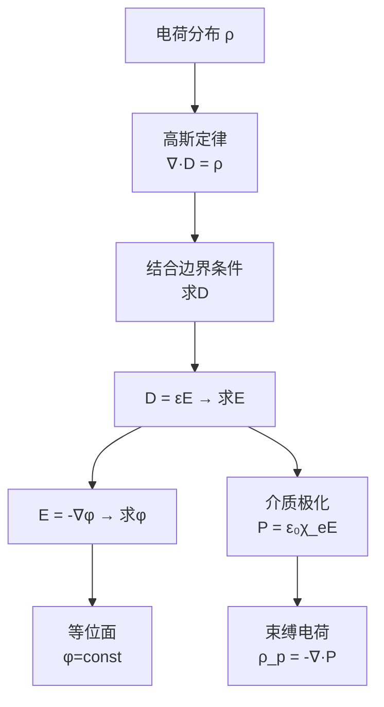

# 思考题：2-5至2-9 等位面极化和介质中静电场

## 教科书原题

> 2-5 什么是等位面？等位面有什么性质？
> 2-6 电位的定义是什么？电位和电场强度有什么关系？
> 2-7 简述介质极化的物理过程。
> 2-8 电位移矢量D是如何定义的？引入D有什么好处？
> 2-9 介质中静电场的基本方程是什么？

## 费曼4步解题法

### 第1步：明确问题结构

这5道思考题构成介质中静电场的完整知识链：电位（2-5, 2-6）→ 极化（2-7）→ D矢量（2-8）→ 介质中完整方程（2-9）。从真空过渡到介质，核心变化是：自由电荷之外多了**束缚电荷**，为此引入D矢量来"封装"极化效应。

### 第2步：逐题详解

**2-5 等位面——电位相等点构成的曲面**

$$\mathbf{E}$$ 垂直于等位面，沿等位面移动电荷不做功。

**性质**：
- 等位面处处与电场线垂直：$$\mathbf{E} \perp$$ 等位面（因 $$\mathbf{E} = -\nabla\phi$$，梯度垂直于等值面）
- 沿等位面移动电荷不做功：$$\int_A^B \mathbf{E}\cdot d\mathbf{l} = \phi_A - \phi_B = 0$$（A、B在同一等位面上）
- 导体表面在静电平衡时是等位面（因导体内部E=0，表面E⊥表面）
- 等位面密集处电场强（电位变化快），稀疏处电场弱

**2-6 电位的定义与关系**

电位 $$\phi(\mathbf{r})$$ = 将单位正电荷从该点移至参考零点时电场力做的功：

$$\phi(\mathbf{r}) = \int_{\mathbf{r}}^{P_0} \mathbf{E}\cdot d\mathbf{l}$$

**与电场的关系**：$$\boxed{\mathbf{E} = -\nabla\phi}$$（负号：E指向电位降低方向）

点电荷电位：$$\phi = \frac{q}{4\pi\varepsilon_0 R}$$

**2-7 介质极化的物理过程**

三种机制（详见思考题：介质极化的微观机制）：
1. **电子极化**：电子云相对原子核位移（所有介质，极快）
2. **离子极化**：正负离子反方向位移（离子晶体）
3. **取向极化**：永久电偶极子沿外电场排列（极性分子）

**2-8 D矢量的定义和好处**

$$\boxed{\mathbf{D} = \varepsilon_0\mathbf{E} + \mathbf{P}}$$

**引入D的好处**：$$\nabla\cdot\mathbf{D} = \rho_{\text{自由}}$$（高斯定律只需要自由电荷！）——D的散度只依赖于自由电荷，P的效应被"封装"在D的定义中。这样自由电荷产生D的方式与真空中电荷产生E的方式完全相同，可以用同样的对称性方法求解D。

**2-9 介质中静电场的基本方程**

| 方程 | 微分形式 | 积分形式 |
|------|---------|---------|
| 高斯定律 | $\nabla\cdot\mathbf{D} = \rho$ | $\oint\mathbf{D}\cdot d\mathbf{S} = q_{\text{自由}}$ |
| 环路定律 | $\nabla\times\mathbf{E} = 0$ | $\oint\mathbf{E}\cdot d\mathbf{l} = 0$ |
| 本构关系 | $\mathbf{D} = \varepsilon\mathbf{E}$ | （线性各向同性介质） |

### 第3步：真空 vs 介质 方程对比

| | 真空 | 介质 | 关系 |
|---|------|------|------|
| 散度方程 | $\nabla\cdot\mathbf{E} = \rho/\varepsilon_0$ | $\nabla\cdot\mathbf{D} = \rho$ | $\mathbf{D} = \varepsilon_0\mathbf{E} + \mathbf{P}$ |
| 旋度方程 | $\nabla\times\mathbf{E} = 0$ | $\nabla\times\mathbf{E} = 0$ | 相同！静电场始终无旋 |
| 本构关系 | $\mathbf{D}=\varepsilon_0\mathbf{E}$ | $\mathbf{D}=\varepsilon\mathbf{E}$ | $\varepsilon = \varepsilon_0\varepsilon_r$ |

### 第4步：知识链整合

## 常见误区

1. **等位面上E=0**：等位面上只是E无**切向分量**，E的法向分量可以很大。导体表面是等位面但E=σ/ε₀可以非常强。
2. **D矢量比E更"基本"**：E才是物理上可直接测量的基本场（通过力F=qE）。D是"辅助场"，其引入完全是为了数学便利（分离自由电荷和束缚电荷的效应）。
3. **介质中的高斯定律和真空中的"不同"**：本质相同——都来自库仑定律和叠加原理。只是介质中的总电荷=自由+束缚，而D的定义恰好让束缚电荷的贡献被"吸收"。

## 概念导航

- **前置**：[[真空中的静电场 MOC]]、[[电位 MOC]]
- **关联**：[[介质的极化 MOC]]、[[极化机制：电子极化、取向极化]]、[[相对介电常数与介质分类]]
- **后继**：[[静电场的边界条件 MOC]]、[[电容 MOC]]

## 自己理解

从真空到介质，静电学经历了一次"从微观到宏观"的跨越。核心智慧在于：与其逐个处理每个分子的极化效应（不可能！），不如引入一个"平均场"P来统计描述，再进一步通过D矢量将P的影响"封装"进高斯定律。这是物理学中"分层简化"思维的典范——每层只暴露必要的接口，隐藏内部复杂性。

> 📖 参见：[[§2-3 电位]], [[§2-6 静电场的边界条件]]
