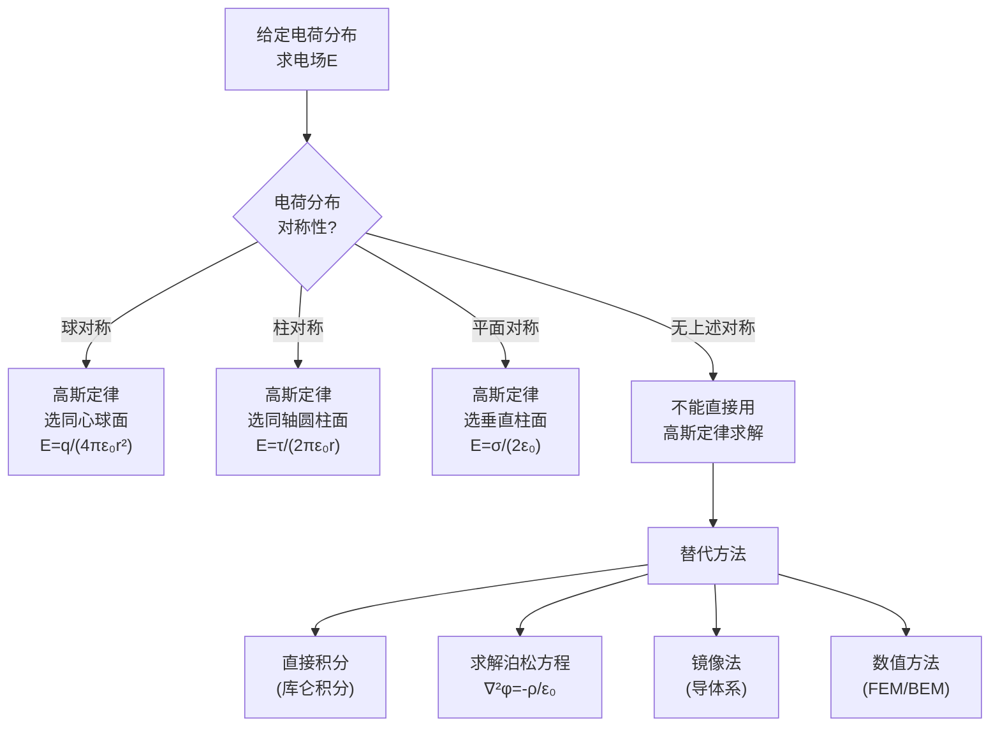

# 思考题：高斯定律的对称性条件
**关键词**：思考题, 预习, 概念检验, 静电场

📌 **一句话本质**：高斯定律永远正确但只有三种对称性下能直接求解——球对称、柱对称、平面对称

🏷️ **重要度**：⚪ | 考试：★ | 题型：简

## 教科书原题

> 2-5 应用高斯定律求解静电场时，对电荷分布和电场分布有什么要求？

## 费曼4步解题法

### 第1步：明确问题核心

这道思考题考察的是**高斯定律的适用条件**——高斯定律 $$\oint_S \mathbf{E}\cdot d\mathbf{S} = q_{\text{内}}/\varepsilon_0$$ 永远是正确成立的，但要从它**直接解出电场** $$\mathbf{E}$$，需要满足特定的对称性条件。

### 第2步：核心分析

**高斯定律求解电场的前提条件**：

要使积分 $$\oint_S \mathbf{E}\cdot d\mathbf{S}$$ 能够简化为 $$E \times (\text{面积})$$，需要：
1. **在所选高斯面上，E的大小为常数**
2. **在所选高斯面上，E的方向与面法向平行或垂直**

这两个条件仅在以下三种对称性下同时满足：

**三种可解对称性**：

| 对称类型 | 电荷分布 | 高斯面选择 | E的表达式 |
|----------|----------|-----------|----------|
| **球对称** | 点电荷、均匀带电球体/球壳 | 同心球面 | $E_r = \frac{q_{\text{内}}}{4\pi\varepsilon_0 r^2}$ |
| **柱对称** | 无限长均匀线电荷、圆柱体 | 同轴圆柱面 | $E_r = \frac{\tau_l}{2\pi\varepsilon_0 r}$ |
| **平面对称** | 无限大均匀面电荷 | 垂直平面的柱面 | $E = \frac{\sigma}{2\varepsilon_0}$$（大小恒定） |

**为什么"无限长/无限大"是关键**：如果线电荷长度有限，则"无限长"的柱对称被打破——在柱的端部附近，E不在有纯径向分量，方向与高斯面法向不再严格一致，无法提取E到积分号外。

### 第3步：反例说明

**不能用高斯定律直接求解的实例**：

1. **电偶极子**（两个等量异号点电荷）：电荷分布不具备球/柱/平面对称性，尽管高斯定律永远是成立的——任何闭合面的电通量等于内部净电荷/$$\varepsilon_0$$。但高斯面上E**既**不是常数**也**不与面法向平行或垂直，积分无法分离出E。

2. **有限长带电线段**：不具备柱对称（端部效应），不能直接用高斯定律求解任意点的电场。

3. **任意形状的导体**：表面电荷分布不均匀，一般不能用高斯定律直接求E——需要借助镜像法、分离变量法或数值方法。

### 第4步：解题策略定位

## 常见误区

1. **高斯定律只能用于对称情况**：高斯定律在任何情况下都成立（电磁学基本定律！），只是**直接求解**时需对称性。即使在非对称分布中，高斯定律依然提供通量和电荷的关系。
2. **认为有对称性就行，忽略"无限"要求**：有限长的带电棒不具备完美的柱对称（端部有边缘效应），所以不能直接用高斯定律。
3. **混淆"高斯面"和"等位面"**：高斯面上的E不一定为常数（对称性差时），等位面上的E也不一定为常数。只在球对称+点电荷这一特殊情况下两者重合。

## 概念导航

- **关联**：[[真空中的静电场 MOC]]、[[高斯定律的微分形式]]、[[电通量密度与高斯定律]]
- **延伸**：[[对称性与守恒律]]（诺特定理的角度）

## 自己理解

高斯定律是电磁学中最强大的工具之一——但它的"强大"是有限的。它是一把精确的"手术刀"而不是"万能钥匙"。理解高斯定律的对称性使用条件 = 理解库仑定律（$$1/r^2$$ 力）和叠加原理如何神奇地结合，在特定几何条件下简化出极其简单的E表达式。这个直觉在工程中同样重要：如果一个问题不具备对称性，就不要浪费时间硬套高斯定律——换积分法、镜像法或数值方法。

> 📖 参见：[[§2-2 真空中的静电场]]

## 费曼深度讲解

高斯定律的对称性条件是静电场中最核心的概念之一——它决定了"复杂积分"能否退化为"简单乘法"。三个判断条件——高斯面必须满足：(1)D在高斯面的有效面积上是常数大小（利用了场的对称性——球对称时D只依赖r，柱对称时D只依赖r，平面对称时D只依赖z）；(2)D的方向在高斯面的每个点上要么平行于面法向（全部贡献），要么垂直于法向（零贡献）；(3)高斯面内的总自由电荷可以简单地计算出来（通常就是积分$\int\rho dV$的简化）。

三个条件不能同时满足的情况——高斯定律在原理上对任意闭合面都成立（$\oint D\cdot dS=Q enclosed$永远正确），但不能直接用来求出D的大小。因为你在闭合面上无法把D从积分中提出来（D在面上大小不一、方向不恒定）。举例：电偶极子的场——不对称分布，高斯定律说包围偶极子的球面总通量为零（正负电荷抵消），但这并不能告诉你曲面上每一点的D值为多少。这种情况下必须用叠加原理（积分）或解泊松方程。

为什么均匀带电环不能用高斯定律求任意点的电场？因为带电环只有轴对称但没有球对称——选择圆形/轴对称的闭合面，环上各点到闭合面的距离不同、方向不同，D无法在闭合面上处处常数且与面法向定向。唯一能用高斯定律求解的情况——无限大平面、无限长直线（或圆柱）、球对称分布——恰好对应了"退化到一维问题"的情况。

## 更多费曼检验

1. 对于均匀带电的有限长圆柱（长度L，半径a），能否用高斯定律求解任意点的电场？在离圆柱非常远的地方，场近似于什么？

2. 对称性的"降维"本质：球对称使问题从3D降为1D（只依赖r）。柱对称降为依赖r和z（2D）还是一维（如果无限长则只依赖r）？

