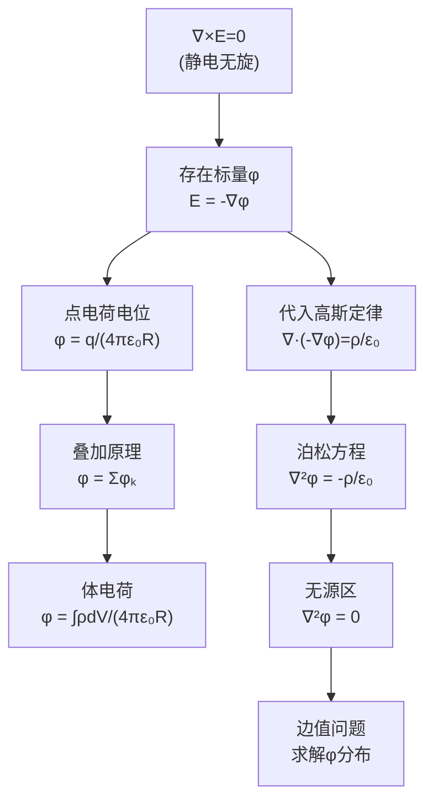

# 电位 MOC

## 教科书原文

> 📖 参见：[[§2-3 电位]]

## 概念定义（费曼一句话）

电位 $$\phi$$ 是静电场的"标量化身"——它是标量场中每点的"电势能海拔"，电场强度 $$\mathbf{E}$$ 是其最陡下降方向的负梯度。用电位代替电场的好处是：从三个分量的矢量运算简化为一个标量函数，使所有静电场问题都化归为标量泊松方程 $$\nabla^2\phi = -\rho/\varepsilon_0$$ 的求解。

## 类比与直觉

**类比1：地形图上的海拔高度**。电位 $$\phi$$ 如同地形图上的海拔高度（标量），等位面如同等高线。电场强度 $$\mathbf{E}$$ 则是最陡下坡方向（矢量），垂直于等高线指向高度降低最快的方向。$$\mathbf{E} = -\nabla\phi$$ 中的负号正是因为E指向电位**降低**的方向，就像滚石沿最陡坡下落一样。

**类比2：重力势能**。电位 $$\phi$$ 之于电荷q就如同重力势 $$\Psi_g = gh$$ 之于质量m：$$W_e = q\phi$$ vs $$W_g = mgh$$。放在高电位处的正电荷具有更高的电势能，就像放在高处的物体具有更高的重力势能——都"想要"下落以释放能量。

## 核心公式详释

**电位的定义（参考点P0）**：
$$\phi(\mathbf{r}) = \int_{\mathbf{r}}^{P_0} \mathbf{E}\cdot d\mathbf{l}$$

**电位与电场的关系**：
$$\boxed{\mathbf{E} = -\nabla\phi}$$

**点电荷的电位**：
$$\phi(\mathbf{r}) = \frac{q}{4\pi\varepsilon_0 R}$$

**N个点电荷的电位**：
$$\phi = \frac{1}{4\pi\varepsilon_0}\sum_{k=1}^{N}\frac{q_k}{R_k}$$

**连续分布电荷的电位**：
$$\phi = \frac{1}{4\pi\varepsilon_0}\int_V \frac{\rho}{R}dV'$$

**电位满足的泊松方程**：
$$\boxed{\nabla^2\phi = -\frac{\rho}{\varepsilon_0}}$$

**无源区的拉普拉斯方程**：
$$\nabla^2\phi = 0$$

**电压（电位差）**：
$$U_{AB} = \phi_A - \phi_B = \int_A^B \mathbf{E}\cdot d\mathbf{l}$$

| 物理量 | 符号 | 单位 | 关键性质 |
|--------|------|------|----------|
| 电位 | $\phi$ | V (伏特) | 标量场，有相对性 |
| [[电位的定义与等位面|等位面]] | $\phi=\text{const}$ | - | 处处与E垂直 |
| 电压 | $U_{AB}$ | V | 绝对量（与参考点无关） |
| 电偶极矩 | $\mathbf{p}$ | C·m | 极化强度的微观单元 |

## 推导脉络



## 常见误区

1. **电位等于电压**：电位 $$\phi$$ 是相对于参考零点的"高度"（有相对性），而电压 $$U_{AB} = \phi_A - \phi_B$$ 是两点间的"高差"（绝对量，与参考点无关）。电位选不同的参考零点会整体平移，但电压不变。
2. **认为 $$\phi=0$$ 意味着没有电场**：电场 $$E = -\nabla\phi$$ 取决于电位的**梯度**（空间变化率），而非电位的绝对值。等位面上 $$\phi$$ 可以是100V但梯度为零（E=0）；反过来 $$\phi=0$$ 处梯度可以很大（E很强）。
3. **混淆电位和电势能**：电位 $$\phi$$ 是\"单位电荷的势能\"（V = J/C），电势能是 $$W_e = q\phi$$（J）。两者差一个电荷因子。

## 费曼检验

1. 在一个均匀电场 $$\mathbf{E} = E_0\mathbf{a}_x$$ 中，电位分布是怎样的？画出等位面和电场线的关系。
2. 取无限远处电位为零，一个均匀带电球体外部（r>R）的电位是 $$\phi = Q/(4\pi\varepsilon_0 r)$$。如果改为取大地电位为零，外部电位公式如何变化？
3. 电偶极子（±q相距d）在远处的电位是 $$\phi \propto 1/r^2$$，比点电荷的 $$\phi \propto 1/r$$ 衰减更快。为什么？

## 概念导航

- **前置**：[[电场强度的定义与叠加原理]]、[[梯度与方向导数]]
- **后继**：[[介质的极化 MOC]]、[[电容 MOC]]、[[静电场的边值问题 MOC]]
- **核心文件**：[[电位的定义与等位面]]、[[泊松方程与拉普拉斯方程的推导]]

## 自己理解

电位 $$\phi$$ 是电磁场理论中最优雅的数学工具之一。它将求解矢量场 $$\mathbf{E}$$（3个分量耦合）的问题简化为求解标量场 $$\phi$$（1个未知函数）的问题。这一简化之所以可行，根源在于静电场的无旋性（保守性）——正是 $$\nabla\times\mathbf{E}=0$$ 保证了标量位的存在性。在后续的边值问题求解中，$$\phi$$ 是绝对的主角。

> 📖 参见：[[§2-3 电位]]

## 可视化图表

```vega-lite
{
  "$schema": "https://vega.github.io/schema/vega-lite/v5.json",
  "description": "点电荷电位 V(r)=Q/(4πε₀r) 3D曲面",
  "width": 400,
  "height": 300,
  "mark": {"type": "line", "interpolate": "monotone"},
  "encoding": {
    "x": {"field": "r", "type": "quantitative", "title": "径向距离 r [m]"},
    "y": {"field": "V", "type": "quantitative", "title": "电位 V [V]"},
    "color": {"field": "charge", "type": "nominal", "scale": {"domain": ["+Q", "-Q"], "range": ["#e74c3c", "#3498db"]}, "title": "电荷符号"}
  },
  "data": {
    "values": [
      {"r": 0.2, "V": 5.0, "charge": "+Q"}, {"r": 0.3, "V": 3.333, "charge": "+Q"},
      {"r": 0.5, "V": 2.0, "charge": "+Q"}, {"r": 0.7, "V": 1.429, "charge": "+Q"},
      {"r": 1.0, "V": 1.0, "charge": "+Q"}, {"r": 1.5, "V": 0.667, "charge": "+Q"},
      {"r": 2.0, "V": 0.5, "charge": "+Q"}, {"r": 3.0, "V": 0.333, "charge": "+Q"},
      {"r": 5.0, "V": 0.2, "charge": "+Q"}, {"r": 10.0, "V": 0.1, "charge": "+Q"},
      {"r": 0.2, "V": -5.0, "charge": "-Q"}, {"r": 0.3, "V": -3.333, "charge": "-Q"},
      {"r": 0.5, "V": -2.0, "charge": "-Q"}, {"r": 0.7, "V": -1.429, "charge": "-Q"},
      {"r": 1.0, "V": -1.0, "charge": "-Q"}, {"r": 1.5, "V": -0.667, "charge": "-Q"},
      {"r": 2.0, "V": -0.5, "charge": "-Q"}, {"r": 3.0, "V": -0.333, "charge": "-Q"},
      {"r": 5.0, "V": -0.2, "charge": "-Q"}, {"r": 10.0, "V": -0.1, "charge": "-Q"}
    ]
  },
  "title": "点电荷电位 V(r)=Q/(4πε₀r) 随距离衰减 §2-3"
}

```
