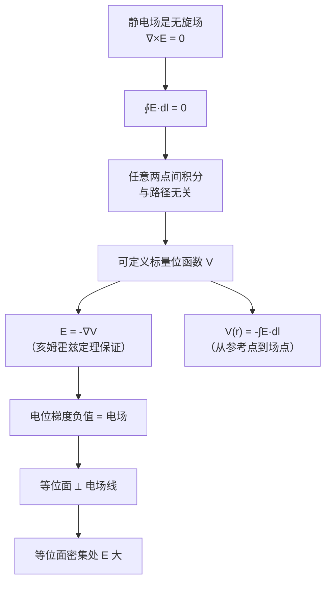

# 电位与电场强度的梯度关系
**关键词**：电位, V, E=-∇V, 等位面, 标量场

## 概念定义

$$\vec{E} = -\nabla V$$

**电场强度等于电位的负梯度**。电场指向电位下降最快的方向，大小等于电位的空间变化率。这是联系静电场的标量描述（电位）与矢量描述（电场强度）的核心桥梁。

## 类比与直觉

**"电压山"类比**：把电位想象成一座三维山峰：
- 山顶 = 高电位（+10V），山谷 = 低电位（0V）
- 电场 E = 一个正电荷在山上受到的"下滑力"
- 方向：始终指向下坡最陡的方向（高电位 → 低电位）= **负**梯度
- 大小：坡越陡，|∇V| 越大，下滑力越强，电场越强

**重力场类比**：电位 φ 相当于重力势，电场 E 相当于重力。物体从高处滚向低处，正电荷从高电位移向低电位。E = -∇φ 恰好对应于重力加速度 g = -∇(gh)。

**水流类比**：水总是从水位高的地方流向水位低的地方，而且流速最快的水流沿着最陡的坡度方向。电位差相当于水位差，电流（电场驱动的电荷流动）相当于水流。

## 核心公式

### 电位 → 电场（梯度关系）

$$E = -\nabla V = -\left(\frac{\partial V}{\partial x}\hat{x} + \frac{\partial V}{\partial y}\hat{y} + \frac{\partial V}{\partial z}\hat{z}\right)$$

### 电场 → 电位（积分关系）

$$V(\vec{r}) = -\int_{\infty}^{\vec{r}} \vec{E} \cdot d\vec{l}$$

电位的物理意义：将单位正电荷从无穷远处移到该点，**电场力**所做的功。（也可理解为外力反抗电场力所做的功。）

### 两点间电位差

$$V_1 - V_2 = \int_{P_1}^{P_2} \vec{E} \cdot d\vec{l} = \frac{W}{q}$$

任意两点之间的电位差等于单位正电荷在电场力作用下沿**任意路径**从一点移到另一点时电场力做的功。由于静电场是保守场，积分与路径无关。

| 符号 | 含义 | 单位 |
|------|------|------|
| V (或 φ) | 电位（标量） | 伏特 V |
| E | 电场强度（矢量） | 伏特/米 V/m |
| -∇V | 负梯度 = 最陡**下**山方向 | V/m |
| q | 电荷量 | 库仑 C |
| W | 功（能量） | 焦耳 J |

## 推导脉络



## 为什么先求电位再求电场？

| 方法 | 先求 E | 先求 V, 再 E = -∇V |
|------|--------|---------------------|
| 数学对象 | 矢量（3个分量） | 标量（1个数） |
| 叠加原理 | 矢量求和 | 标量求和（简单！） |
| 积分维度 | 三重矢量积分 | 三重标量积分 |
| 典型场景 | 直接高斯定律 | 任何电荷分布 |

**实用策略**：由于电位是标量，叠加时只需代数相加，因此在工程计算中几乎总是先求 V，再用 E = -∇V 得到电场。这比直接矢量叠加三个分量的电场要简单得多。

## 等位面与电场线的几何关系

- **等位面**：V(x,y,z) = C（常数的空间曲面）
- **电场线**：处处与等位面垂直
- **梯度方向** = 等位面的法线方向，指向 V 增大的方向
- **电场方向** = 等位面法线的反方向（负梯度），指向 V 减小的方向

若相邻等位面之间的电位差保持恒定，则等位面越密集处，|∇V| 越大，电场强度越强。均匀电场对应等间距的等位面族。

## MATLAB 可视化提示词

```
请生成完整的 MATLAB 代码，实现以下功能：

1. **电偶极子电位场**
   - 正电荷 +q 在 (d/2, 0)，负电荷 -q 在 (-d/2, 0)，取 d = 0.5
   - 计算 x,y 平面上的电位分布 V(x,y) = q/(4πε₀) * (1/r₁ - 1/r₂)
   - x, y 范围 [-2, 2]，网格密度 50×50

2. **梯度计算与电场绘制**
   - 使用 gradient() 计算 -∇V 得到电场分量 Ex, Ey
   - 用 surf 绘制 3D 电位曲面，用 contour 投影等位线到曲面下方

3. **关键展示**
   - quiver 在等位线图上叠加电场向量箭头
   - 验证箭头方向：从正电荷指向负电荷（高电位→低电位）
   - 电场线始终垂直于等位线

4. **输出要求**
   - 图形窗口 1200×800
   - 双视图：左侧 3D 曲面 + 梯度箭头，右侧等位线 + 电场矢量
   - 标题："E = -∇V：电场始终指向电位下降最快的方向"
```

## 常见误区

1. **负号不可忘**：E = **-**∇V。没有负号意味着电场指向电位**上升**方向，这在物理上完全错误——正电荷不可能自发从低电位爬向高电位。

2. **V 为零处 E 不一定为零**：电位参考点可以任意选取，给 V 加上任意常数不影响 E = -∇V 的结果。判断电场强度要看电位差（梯度），而非电位绝对值。

3. **等位面密集 ≠ E 大的充分条件**：需要相邻等位面的**电位差恒定**这一前提。如果等位面取值间距不匀，疏密不能直接反映电场强弱。准确说是 |∇V| 越大处 E 越大。

4. **积分路径任意不等于结果任意**：V₁ - V₂ 的计算与路径无关（静电场保守性的必然结论），但计算时应选最简单的积分路径（通常沿电场线方向）。

5. **"电位"和"电位差"不同**：通常说的"某点电位"是以无穷远（或大地）为参考点的电位差。工程中常以大地（V=0）为参考点。

## 费曼检验

1. 已知均匀电场 E = E₀x̂（沿 x 轴正方向），求电位函数 V(x,y,z)。如果选取原点为电位零点（V(0,0,0)=0），写出 V(x) 表达式。如果原点电位取 5V，结果会怎样？

2. 两个点电荷的电位可以直接标量相加，但电场强度需要矢量相加。请解释为什么 E = -∇V 使得这两种方法等价。

## 概念导航

- 前置概念：[[梯度的物理意义：标量场最大变化率方向]]、[[电位的定义与等位面]]
- 后续概念：[[电容的定义与计算方法]]、[[泊松方程与拉普拉斯方程]]
- 关联概念：[[静电场的边界条件 MOC]]、[[亥姆霍兹定理：无旋场必有标量位]]

> 📖 **教科书参考**：§2-3, p.47
