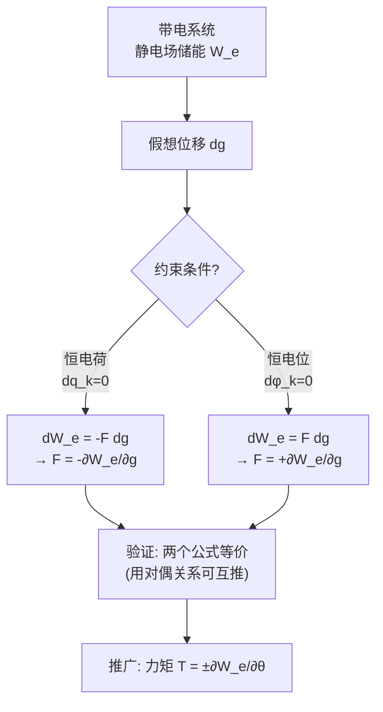

# 电场力 MOC

## 教科书原文

> 📖 参见：[[§2-7 电容]]

## 概念定义（费曼一句话）

电场力是电荷在电场中受到的机械力，可以用两种等效方法求得——**库仑力直接法**（把每个电荷受到的力叠加，适合简单分布）和**虚位移法**（从能量对位移的偏导数求力，适合复杂结构）——两者的区别就像用力的公式推箱子（直接法）和从势能变化率推算箱子移动趋势（能量法）。

## 类比与直觉

**类比1：重力场中的势能-力关系**。苹果从树上落下——我们既可以用 $$F=mg$$（直接法）计算重力，也可以从 $$F = -d(mgh)/dh = -mg$$（能量法）出发。电场力完全类似：$$F = qE$$（直接法）或 $$F = -\partial W_e/\partial g$$（能量法）。区别在于，电场能量 $$W_e = \frac{1}{2}\int\varepsilon E^2 dV$$ 有时比电荷分布更容易算。

**类比2：橡皮筋的弹性力**。当你拉橡皮筋时，拉力 $$F = -dW/dx$$，其中 $$W = \frac{1}{2}kx^2$$ 是储存的弹性能。带电导体之间的电场力就像"电弹簧"——它们之间储存了电场能量，改变距离就改变了能量，力就是能量对位移的负梯度。

## 核心公式详释

**库仑力直接法（叠加原理）**：
$$\mathbf{F} = \int_V \rho\mathbf{E}\; dV$$
（对于点电荷：$$\mathbf{F} = q\mathbf{E}$$）

**虚位移法——恒电荷条件**：
$$\boxed{F = -\frac{\partial W_e}{\partial g}\bigg|_{q_k=\text{const}}}$$

**虚位移法——恒电位条件**：
$$\boxed{F = +\frac{\partial W_e}{\partial g}\bigg|_{\phi_k=\text{const}}}$$

**能量公式**：
$$W_e = \frac{1}{2}\sum_k q_k\phi_k = \frac{1}{2}\int_V \rho\phi\; dV = \frac{1}{2}\int_V \varepsilon E^2 dV$$

**广义力推广（力矩）**：
$$T = -\frac{\partial W_e}{\partial\theta}\bigg|_{q_k=\text{const}} = +\frac{\partial W_e}{\partial\theta}\bigg|_{\phi_k=\text{const}}$$

| 条件 | 公式 | 符号 | 物理原因 |
|------|------|:---:|----------|
| 恒电荷（孤立系统） | $F = -\partial W_e/\partial g$ | 负号 | 力做功源于储能减少（能量守恒） |
| 恒电位（接电源系统） | $F = +\partial W_e/\partial g$ | 正号 | 电源同时供能，储能增=力做正功 |

## 推导脉络



## 常见误区

1. **恒电荷和恒电位条件搞混符号**：恒电荷是孤立系统（如已经充好电后断开电源），力做功能量减少，所以负号。恒电位是接电源（移动过程中电源补充电荷维持电位恒定），力做功能量增加，所以正号。两个条件下算出的力相同，但符号推理不同。

2. **将 $$\partial W_e/\partial g$$ 理解为"能量在空间中每点的偏导数"**：本文中 $$g$$ 是**广义坐标**（如极板间距、角度），不是空间坐标 $$x$$。$$\partial W_e/\partial g$$ 是对这个机械坐标求偏导，不是对场点位置求导。

3. **忘记虚位移法只适用于保守力系统**：静电场力是保守力，虚位移法有效。但如果涉及非保守力（如同步电机中的磁阻转矩涉及磁滞），虚位移法需谨慎使用。

## 费曼检验

1. 一个平行板电容器充电后断开电源（恒q），板间距离增大一倍，板间作用力如何变化？如果是接电源（恒V）呢？
2. 用虚位移法求微带线（传输线）的静电力的具体步骤是什么？
3. 库仑法 $$F = qE$$ 和能量法 $$F = -\partial W_e/\partial g$$ 在原理上等价吗？如何证明？

## 概念导航

- **前置**：[[电场能量 MOC]]、[[电容 MOC]]、[[库仑定律与电场强度]]
- **核心文章**：[[库仑力直接计算法]]、[[虚位移法]]
- **关联**：[[磁场力 MOC]]（磁场力的虚位移法与电场力类比）

## 自己理解

虚位移法是一种"曲线救国"的聪明方法——与其从头算每个电荷受到的力（直接法需要知道完整的电荷分布），不如算系统的总能量对几何参数的变化率。在工程中，有限元软件（如ANSYS、COMSOL）计算电磁力几乎都在用能量法（通过计算不同位置下的场能求导数），因为这比直接积分应力张量更稳健。

```signal
{signal: [
  {name: '恒电荷', wave: 'z2.....', data: ['F=-∂W_e/∂g, 孤立系统']},
  {name: '恒电位', wave: 'z......', data: ['F=+∂W_e/∂g, 接电源']},
  {name: '力大小', wave: 'x3.....', data: ['两种条件下算出的F相同!']},
],
head: {text: '虚位移法：恒q vs 恒φ 符号对比'},
foot: {text: '两个公式算出力的大小一致，差别仅在于能量平衡方程中的符号。'}}
```

> 📖 参见：[[§2-7 电容]]
