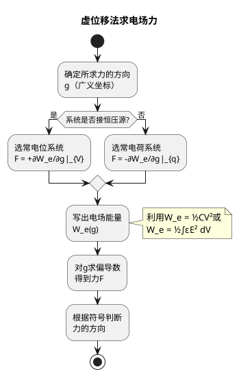

# 虚位移法
**关键词**：电场力, F=qE, 虚位移法, 库仑力

## 教科书原文

> 📖 参见：[[§2-9 电场力]]

## 虚位移法的能量守恒解释

虚位移法基于能量守恒：假设系统发生一个微小虚位移$dg$，机械功$F\cdot dg$等于系统能量的变化（常电荷系统：$F\cdot dg = -dW_e$；常电位系统：$F\cdot dg = +dW_e$——因为电源额外提供能量来维持电位）。

**常电荷 vs 常电位的符号差异**：

| 系统 | 力公式 | 能量来源 | 物理过程 |
|------|--------|----------|----------|
| 常电荷 q | $F = -\partial W_e/\partial g\|_q$ | 仅电场储能 | 孤立系统，无外接电源 |
| 常电位 V | $F = +\partial W_e/\partial g\|_V$ | 电源提供+电场储能 | 接恒压源，电源持续供能 |

## 虚位移法流程

> 📖 参见：[[§2-9 电场力]]
