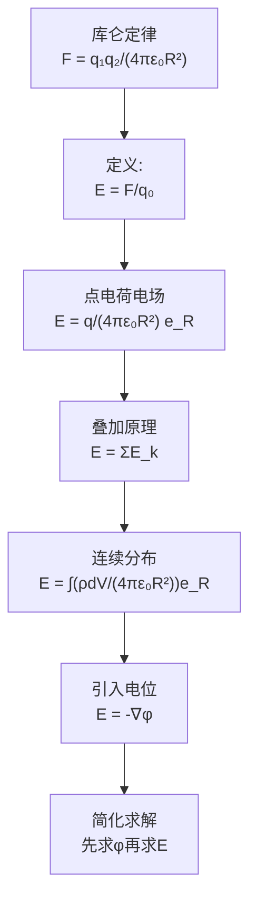

# 电场强度 MOC

## 教科书原文

> 📖 参见：[[§2-1 电场强度]]

## 概念定义（费曼一句话）

电场强度 $$\mathbf{E}$$ 是一个矢量场，它告诉我们：如果在空间某点放一个微小的正试验电荷，该电荷会受到多大的力、朝向哪个方向。$$\mathbf{E}$$ 的单位是 V/m（伏特每米），也可以理解为 N/C（牛顿每库仑）——但用 V/m 更自然，因为它直接联系到"每单位距离的电位变化"（梯度）。

## 类比与直觉

**类比1：重力场中的"重力加速度"**。$$\mathbf{E}$$ 之于电荷就如同 $$\mathbf{g}$$（重力加速度）之于质量。$$\mathbf{F} = q\mathbf{E}$$ 完全类似 $$\mathbf{F}_g = m\mathbf{g}$$。在重力场中你感受到"向下拉"，在电场中正电荷感受到"顺电场方向推"。

**类比2：地形图的等高线梯度**。等位面 $$\phi = \text{常数}$$ 如同地形图上的等高线，电场强度 $$\mathbf{E} = -\nabla\phi$$ 则是"最陡下坡方向"——垂直于等高线，指向电位降低最快的方向，大小正比于等高线的密度。

## 核心公式详释

**点电荷的电场（库仑场）**：
$$\boxed{\mathbf{E}(\mathbf{r}) = \frac{q}{4\pi\varepsilon_0 R^2}\mathbf{e}_R}$$

**N个点电荷的叠加**：
$$\mathbf{E} = \frac{1}{4\pi\varepsilon_0}\sum_{k=1}^{N}\frac{q_k}{R_k^2}\mathbf{e}_{R_k}$$

**体电荷的积分**：
$$\mathbf{E} = \frac{1}{4\pi\varepsilon_0}\int_V \frac{\rho(\mathbf{r}')}{R^2}\mathbf{e}_R dV'$$

**面电荷的积分**：
$$\mathbf{E} = \frac{1}{4\pi\varepsilon_0}\int_S \frac{\sigma(\mathbf{r}')}{R^2}\mathbf{e}_R dS'$$

**线电荷的积分**：
$$\mathbf{E} = \frac{1}{4\pi\varepsilon_0}\int_l \frac{\tau(\mathbf{r}')}{R^2}\mathbf{e}_R dl'$$

**与电位的关系**：
$$\boxed{\mathbf{E} = -\nabla\phi}$$

| 物理量 | 符号 | 单位 | 物理含义 |
|--------|------|------|----------|
| 电场强度 | $\mathbf{E}$ | V/m | 单位正电荷所受的力 |
| 试验电荷 | $q_0$ | C | 用于"探测"场的微小电荷 |
| 源电荷 | $q$ | C | 产生电场的电荷 |
| 位置矢量 | $\mathbf{r}, \mathbf{r}'$ | m | 场点和源点的位置 |
| 距离 | $R = |\mathbf{r}-\mathbf{r}'|$ | m | 源点到场点的距离 |

## 推导脉络



## 常见误区

1. **$$\mathbf{E}$$ 只在电荷所在处有意义**：电场充满整个空间——即使远离所有电荷，电场仍然存在（虽然很弱）。场的概念本身就是"作用不需要接触"的现代物理思想。
2. **混淆试验电荷的符号**：定义中试验电荷 $$q_0 > 0$$，$$\mathbf{E}$$ 方向是正电荷受力的方向。如果放负电荷，力的方向和 $$\mathbf{E}$$ 相反。
3. **认为 $$E = 0$$ 意味着没有电荷**：电场可以因对称性抵消而为零（例如两个等量同号电荷的中点，$$E=0$$ 但电荷都存在）。

## 费曼检验

1. 两个点电荷 +q 和 -q 相距 d。它们连线中垂面上任意一点的电场方向如何？大小随距离如何衰减？
2. 为什么 $$\mathbf{E} = -\nabla\phi$$ 中有负号？如果把负号去掉，电场的行为会有什么物理上的矛盾？
3. 均匀带电无限大平面产生的电场与距离无关（$$E = \sigma/(2\varepsilon_0)$$）。这和你对"点电荷电场随距离平方衰减"的直觉如何调和？

## 概念导航

- **前置**：[[库仑定律]]、[[向量基础 MOC]]
- **后继**：[[真空中的静电场 MOC]]、[[电位 MOC]]、[[高斯定律与对称性]]
- **关键文件**：[[电场强度的定义与叠加原理]]、[[电偶极子的电场分布]]

## 自己理解

$$\mathbf{E}$$ 是整个电磁场理论的"起点"。一切更高级的概念——电位、高斯定律、边界条件——都是对 $$\mathbf{E}$$ 的不同视角的描述。把 $$\mathbf{E}$$ 的两种等价定义（力的定义和梯度的定义）内化：$$\mathbf{E} = \mathbf{F}/q_0 = -\nabla\phi$$。前者告诉你"场如何作用于电荷"，后者告诉你"场如何由电位导出"。

> 📖 参见：[[§2-1 电场强度]]

## 可视化图表

```wavedrom
{
  "signal": [
    {"name": "V=const 等位面(同心球)", "wave": "2", "period": 4, "data": ["球面 r=r₁", "球面 r=r₁", "球面 r=r₂", "球面 r=r₂", "球面 r=r₃", "球面 r=r₃", "球面 r=r₄", "球面 r=r₄"]},
    {"name": "E场线(径向向外)", "wave": "x", "period": 4, "data": ["→r", "→r", "→r", "→r", "→r", "→r", "→r", "→r"]},
    {"name": "E⊥V V↘梯度方向", "wave": "x", "period": 4, "data": ["E⟂V", "E⟂V", "E⟂V", "E⟂V", "E⟂V", "E⟂V", "E⟂V", "E⟂V"]},
    {"name": "E=-∇V 电位梯度", "wave": "z", "period": 4, "data": ["E大 V密集", "E大 V密集", "E中 V中等", "E中 V中等", "E小 V稀疏", "E小 V稀疏", "E≈0 V平坦", "E≈0 V平坦"]}
  ],
  "head": {
    "text": "E场线与等位面: 处处正交 E=-∇V §2-3",
    "tick": 0
  },
  "foot": {
    "text": "等位面密→|E|大  等位面疏→|E|小  电力线⊥等位面"
  }
}

```


```vega-lite
{
  "$schema": "https://vega.github.io/schema/vega-lite/v5.json",
  "description": "电偶极子E场强度热力图: E(r,θ)=p√(3cos²θ+1)/(4πε₀r³)",
  "width": 450,
  "height": 300,
  "mark": "rect",
  "encoding": {
    "x": {"field": "x", "type": "quantitative", "scale": {"domain": [-5, 5]}, "title": "x [归一化]"},
    "y": {"field": "y", "type": "quantitative", "scale": {"domain": [-3, 3]}, "title": "y [归一化]"},
    "color": {
      "field": "E_magnitude",
      "type": "quantitative",
      "scale": {"scheme": "viridis", "domain": [0, 1]},
      "title": "|E| 归一化"
    }
  },
  "data": {
    "values": [
      {"x": 0, "y": 0.5, "E_magnitude": 1.0}, {"x": 0, "y": -0.5, "E_magnitude": 1.0},
      {"x": 1, "y": 0, "E_magnitude": 0.8}, {"x": -1, "y": 0, "E_magnitude": 0.8},
      {"x": 0, "y": 1.5, "E_magnitude": 0.35}, {"x": 0, "y": -1.5, "E_magnitude": 0.35},
      {"x": 1.5, "y": 0, "E_magnitude": 0.25}, {"x": -1.5, "y": 0, "E_magnitude": 0.25},
      {"x": 1, "y": 1, "E_magnitude": 0.2}, {"x": -1, "y": 1, "E_magnitude": 0.2},
      {"x": 1, "y": -1, "E_magnitude": 0.2}, {"x": -1, "y": -1, "E_magnitude": 0.2},
      {"x": 2, "y": 0.5, "E_magnitude": 0.06}, {"x": -2, "y": 0.5, "E_magnitude": 0.06},
      {"x": 2, "y": -0.5, "E_magnitude": 0.06}, {"x": -2, "y": -0.5, "E_magnitude": 0.06},
      {"x": 3, "y": 0, "E_magnitude": 0.03}, {"x": -3, "y": 0, "E_magnitude": 0.03},
      {"x": 0, "y": 2.5, "E_magnitude": 0.05}, {"x": 0, "y": -2.5, "E_magnitude": 0.05},
      {"x": 4, "y": 0, "E_magnitude": 0.01}, {"x": -4, "y": 0, "E_magnitude": 0.01},
      {"x": 2, "y": 2, "E_magnitude": 0.01}, {"x": -2, "y": 2, "E_magnitude": 0.01},
      {"x": 2, "y": -2, "E_magnitude": 0.01}, {"x": -2, "y": -2, "E_magnitude": 0.01}
    ]
  },
  "title": "电偶极子E场强度热力图 |E|∝1/r³ §2-5"
}

```
