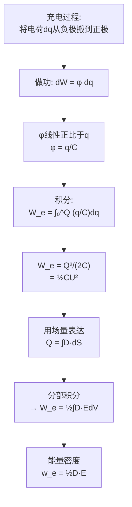

# 电场能量 MOC

## 教科书原文

> 📖 参见：[[§2-8 电场能量]]

## 概念定义（费曼一句话）

电场能量是"建立电场时克服库仑力所做的功转化而来的储存能量"——它分布在整个电场所占据的空间中，密度为 $$\frac{1}{2}\mathbf{D}\cdot\mathbf{E}$$。它可以通过电场分布的体积分来算，也可以通过导体的电荷-电位参数来算。两种方法等价——它们是能量守恒在不同层面的体现。

## 类比与直觉

**类比1：水库蓄水的势能**。电容C类比水库的底面积，电压U类比水位高度。给电容充电就像往水库注水——做的功转化为储存的势能 $$W_e = \frac{1}{2}CU^2$$（类似 $$\frac{1}{2}mgh$$）。1/2因子的来源也是一样的——充电/注水过程中，电压/水位是从零线性增加到终值的。

**类比2：拉开的弹簧弓**。拉开弹簧弓做的功转化为弹性势能 $$\frac{1}{2}kx^2$$。充电就是将正负电荷从"无电场"状态（弹簧松弛）"拉开"到产生电场的状态（弹簧拉紧），储存的能量正比于电压（力）的平方。

## 核心公式详释

**电场能量密度**：
$$\boxed{w_e = \frac{1}{2}\mathbf{D}\cdot\mathbf{E} = \frac{1}{2}\varepsilon E^2 = \frac{D^2}{2\varepsilon}}$$

**总静电能量（场量形式）**：
$$W_e = \frac{1}{2}\int_V \mathbf{D}\cdot\mathbf{E}\; dV = \frac{1}{2}\int_V \varepsilon E^2\; dV$$

**总静电能量（导体形式）**：
$$W_e = \frac{1}{2}\sum_k q_k\phi_k$$

**通过电容表示**：
$$W_e = \frac{1}{2}CU^2 = \frac{q^2}{2C}$$

**两导体系统**：
$$W_e = \frac{1}{2}q_1\phi_1 + \frac{1}{2}q_2\phi_2$$

| 物理量 | 符号 | 单位 | 含义 |
|--------|------|------|------|
| 能流密度 | $w_e$ | J/m³ | 单位体积中储存的静电能 |
| 总静电能量 | $W_e$ | J | 整个系统的电场储能 |
| 电容 | $C$ | F | 储能能力（单位电压下的电荷） |
| 电压 | $U$ | V | 两极板间的电位差 |

## 推导脉络

## 常见误区

1. **电场能量集中在电荷附近**：能量密度 $$w_e = \frac{1}{2}\varepsilon E^2$$ 分布在电场所在的所有空间。对于孤立带电球，虽然电荷只在表面上，能量却分布在整个空间中（球外任意有E的地方都有能量）。
2. **当E=0时能量密度一定为零**：正确。但如果$$\mathbf{D} \neq 0$$而$$\mathbf{E} = 0$$（如在理想导体内部）——这种情况不成立，因为在导体内部D=0和E=0同时成立。
3. **能量公式的1/2因子可省略**：1/2来自线性系统的积分$$\int_0^Q (q/C)dq = Q^2/(2C)$$。非线性系统（如铁电介质）中不适用。

## 费曼检验

1. 两个完全相同的电容器，一个充电到U（带电荷Q），另一个未充电。将它们并联后，总电压变为了原来的一半（U/2）。总储能是原来的多少？损耗的能量去了哪里？
2. 平行板电容器充电后断开电源（恒电荷），将板间距加倍。储能如何变化？这个储能增加的能量来自哪里？
3. 在均匀电场E中，能量密度是 $$w_e = \frac{1}{2}\varepsilon E^2$$。如果电场的分布不均匀，这个公式还能逐点使用吗？为什么？

## 概念导航

- **前置**：[[电位 MOC]]、[[电容 MOC]]
- **后继**：[[电场力 MOC]]（能量法求力）、[[磁场的能量 MOC]]（对比学习）
- **核心文件**：[[电场能量密度的推导]]、[[能量法求力和力矩]]

## 自己理解

电场能量最深刻的一点是：它证明了"场是真实的物理实体"——能量不是储存在电荷中，而是储存在场中（即空间本身储存了能量）。这一观点的推广导致了电磁波携带能量（坡印亭定理）→光子概念的诞生。所以看起来枯燥的能量密度公式 $$w_e = \frac{1}{2}\varepsilon E^2$$ 其实是现代物理"场是实体"思想的数学起点之一。

> 📖 参见：[[§2-8 电场能量]]

## 费曼深度讲解

静电场能量$W_e=\frac{1}{2}\int_V D\cdot E dV = \frac{1}{2}\int_V \epsilon E^2 dV$（各向同性线性介质）是整个电磁场能量理论的起点。与磁场能量$W_m=\frac{1}{2}\int_V B\cdot H dV$形同神也同——两者分别对应"电压充能"和"电流充能"。电场能量密度$w_e=\frac{1}{2}D\cdot E$表达——每单位体积储存的电场能。对一个平行板电容器：$W_e=\frac{1}{2}CV^2=\frac{1}{2}\frac{\epsilon S}{d}V^2$用电路语言讲；将均匀场$E=V/d$代入$W_e=\frac{1}{2}\epsilon E^2(Sd)=\frac{1}{2}\frac{\epsilon S}{d}V^2$——完全一致！这验证了"能量密度集成=集中参数储能"的图景。

为什么电容器中的能量是$U=QV/2$而不是$QV$？关键在于充电的过程——电荷不是"全部一次性"移动到极板上的。刚开始充电时极板之间电压为零（无须做功），随着电荷累积电压从0线性增加到V。积分得$W=\int_0^Q v(q)dq=\int_0^Q (q/C)dq=Q^2/(2C)=QV/2$。这就是"充电能是最终静态能的一半"的物理来源——与弹簧的弹性能$W=kx^2/2$类似（力从0线性增加到kx，做功力×距离的积分是½kx²）。

电场能量的两种观点：(1)电荷体系能量$W_e=\frac{1}{2}\sum_i q_i\varphi_i$——能量定位于离散电荷（早期"超距作用"观点）；(2)场能量$W_e=\frac{1}{2}\int_V D\cdot E dV$——能量定位于电场存在的空间（现代"局域化场"观点）。两者数学上等价（恒等），但物理意义截然不同——前者暗示电荷之间直接有能量交换，后者指出能量存储在电磁场中（场是能量的载体）。麦克斯韦场论和后继的坡印亭定理使得第二种观点在物理上正确。

## 更多费曼检验

1. 从$W_e=\frac{1}{2}\int_V D\cdot E dV$出发，利用$E=-\nabla\varphi$和$D=\epsilon E$，推导能量存储的泊松形式$W_e=\frac{1}{2}\int_V \rho\varphi dV$——展示了能量表述的双重视角。

2. 两个带不同电量的孤立导体之间的相互作用能——用$W_e=\frac{1}{2}Q_1 V_1+\frac{1}{2}Q_2 V_2$还是$W_e=\frac{1}{2}QV$？写出正确形式并解释。

