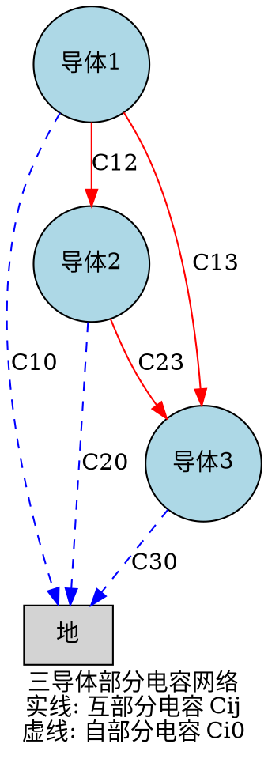

# 多导体系统的部分电容

## 教科书原文

> 📖 参见：[[§2-7 电容]]

## 三导体系统的部分电容示例

以三导体系统（导体1, 2, 3）为例，部分电容矩阵为3×3：

$$\begin{bmatrix} q_1 \ q_2 \ q_3 \end{bmatrix} = \begin{bmatrix} C_{10}+C_{12}+C_{13} & -C_{12} & -C_{13} \ -C_{21} & C_{20}+C_{21}+C_{23} & -C_{23} \ -C_{31} & -C_{32} & C_{30}+C_{31}+C_{32} \end{bmatrix} \begin{bmatrix} \varphi_1 \ \varphi_2 \ \varphi_3 \end{bmatrix}$$

其中 $C_{ij}=C_{ji}$（互易性），独立部分电容数目 = $n(n+1)/2 = 6$。

## 部分电容网络

> 📖 参见：[[§2-7 电容]]

## 费曼深度讲解

多导体系统的部分电容概念是单电容概念的推广——当系统有两个以上的导体时，不能仅用一个电容C来描述，需要部分电容矩阵。对于n导体系统，电位和电荷的关系可以写为$Q_i = \sum_{j=1}^n C_{ij} V_j$，其中$C_{ii}$为自电容（第i个导体对地的电容），$C_{ij}$（i≠j）为互电容的负值（第i和第j个导体之间的耦合电容）。部分电容矩阵的物理本质：每个导体到地面和到其他导体的所有电场路径的总和。

多导体系统的对地"等值电容"和"部分电容"的区别：(1)等值电容——把多导体系统等效为一个对地的单电容，即$C_{eq}=Q_i/V_i$，但这只有在已知所有其他导体的电位或接地状态时才有效；(2)部分电容——独立的电容系数，不依赖于其他导体的状态（是"本征"参数），由导体的几何构形唯一决定。部分电容矩阵是对称的（$C_{ij}=C_{ji}$）且主对角元为正、非对角元为负（或用正表示——取决于系数的定义约定）。

在工程中——多导体传输线（如三相电力线、多芯电缆、PCB走线）的电感电容耦合通过部分电容和部分电感来建模分析。三相输电线的各相之间互电容$C_{ab}$、$C_{bc}$、$C_{ac}$是产生"电容性耦合干扰"的根源。如果三相不平衡（各相电流或电压不对称），互电容分的耦合导致各相电压相互影响——这就是为什么三相输电线需要换位（周期性地交换三相的物理位置以使互电容平均化）。

## 更多费曼检验

1. 三个相同的平行导线按正三角形排列——写出3×3部分电容矩阵。为什么对角线元素相等、非对角线元素也全部相等（对称性）？

2. 静电屏蔽——如果在两个导体之间插入一个接地的导体薄片，它们的互电容会怎么变化？屏蔽原理的物理解释。

