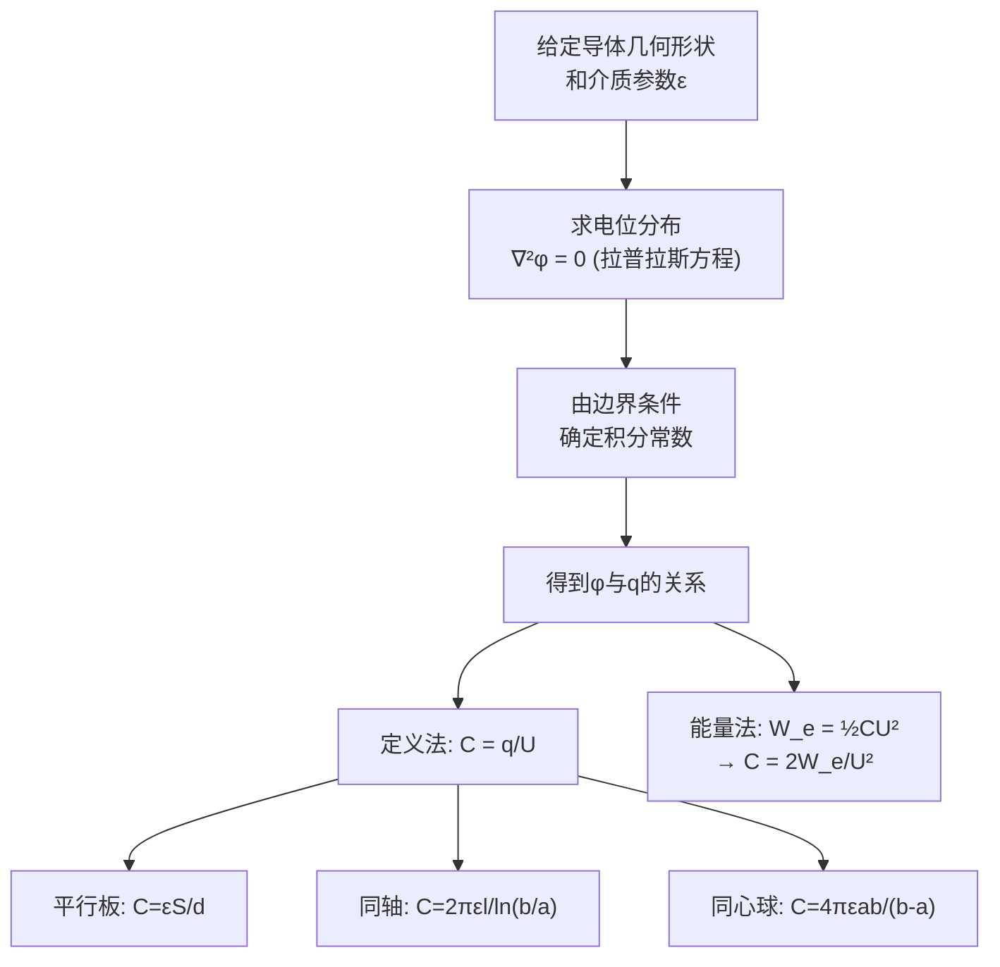

# 电容 MOC

## 教科书原文

> 📖 参见：[[§2-6 静电场的边界条件]]

## 概念定义（费曼一句话）

电容是"电场中的水库"——它衡量的是给定电压下能储存多少电荷（或者说储存了多少电场能量$$W_e = \frac{1}{2}CU^2$$）。电容的大小只取决于导体的几何形状、相对位置以及其间填充的介质（$$\varepsilon$$），与加在上面的电压和电荷无关。

## 类比与直觉

**类比1：水库的储水能力**。电容C类比于水库底面积——给定水位差（电压U），底面积C越大的水库储存的水量（电荷q）越多。$$q = CU$$ 完全对应 "水量 = 底面积 × 水深"。电容由几何形状（水库的形状和大小）决定，而非当前水位。

**类比2：弹簧的柔度**。电容类似于弹簧的柔度（劲度系数的倒数）——给定力（电压），柔度越大的弹簧形变越大（储存的电荷越多）。而电场能量 $$\frac{1}{2}CU^2$$ 完全类似于弹簧势能 $$\frac{1}{2}kx^2$$ 的对偶形式。

## 核心公式详释

**电容的定义**：
$$\boxed{C = \frac{q}{U} = \frac{q}{\phi_1 - \phi_2}}$$

**常见结构的电容**：

| 结构 | 电容公式 | 备注 |
|------|----------|------|
| 平行板 | $C = \frac{\varepsilon S}{d}$ | S为板面积，d为间距 |
| 同轴圆筒 | $C = \frac{2\pi\varepsilon l}{\ln(b/a)}$ | a为内径，b为外径 |
| 同心球 | $C = \frac{4\pi\varepsilon ab}{b-a}$ | a为内径，b为外径 |
| 孤立球 | $C = 4\pi\varepsilon a$ | a为球半径 |

**电场能量与电容**：
$$\boxed{W_e = \frac{1}{2}CU^2 = \frac{q^2}{2C} = \frac{1}{2}qU}$$

**多导体系统——部分电容**：
$$q_k = \sum_{j=1}^{n} \beta_{kj}\phi_j$$
$$\phi_k = \sum_{j=1}^{n} \alpha_{kj}q_j$$

**电位系数与电容系数的关系**：$$[\beta] = [\alpha]^{-1}$$

| 物理量 | 符号 | 单位 |
|--------|------|------|
| 电容 | $C$ | F (法拉) |
| 电荷 | $q$ | C (库仑) |
| 电压（电位差） | $U = \phi_1 - \phi_2$ | V (伏特) |
| 介电常数 | $\varepsilon = \varepsilon_0\varepsilon_r$ | F/m |
| 电位系数 | $\alpha_{kj}$ | 1/F |
| 电容系数 | $\beta_{kj}$ | F |

## 推导脉络



## 常见误区

1. **认为电容总是常数**：只有在介质为线性（$$\varepsilon$$ 不随 $$E$$ 变化）时电容才是常数。对于铁电材料或非线性介质，电容会随电压变化。
2. **平行板电容公式 $$C = \varepsilon S/d$$ 用于非均匀场**：此公式假设电场均匀，边缘效应可忽略。对于小面积比（$$S/d^2$$ 不大）的情况，边缘效应显著。
3. **多导体系统中混淆自部分电容和互部分电容**：自部分电容 $$C_{kk}$$ 是导体k对地的电容，互部分电容 $$C_{kj}$$ 是导体k与j之间的电容。它们都为正，且 $$C_{kj} = C_{jk}$$。

## 费曼检验

1. 平行板电容器充电后断开电源，将板间距减半。电容如何变化？电压如何变化？储存的电场能量如何变化？
2. 同轴电缆的单位长度电容 $$C = 2\pi\varepsilon/\ln(b/a)$$，当外导体半径 $$b\to\infty$$ 时，电容会变为零吗？这合理吗？
3. 为什么部分电容的概念在实际工程中必不可少？用简单的两导体模型有什么局限性？

## 概念导航
- **前置**：[[电位的定义与等位面]]、[[高斯定律与对称性]]
- **后续**：[[多导体系统的部分电容]]、[[电场能量 MOC]]
- **关联**：[[电场能量密度的推导]]

## 自己理解

电容是静电学中最具工程实用价值的概念之一。从电路板上的贴片电容到高压电力电缆，所有涉及"储存电场能量"的设计都在应用电容公式。理解电容的物理本质——"$$\varepsilon$$ 控制储能密度，几何形状控制储能体积"——是设计任何电容性器件的核心直觉。

```signal
{signal: [
  {name: '平板电容', wave: 'x2.....', data: ['C=εS/d, 最简单']},
  {name: '同轴电容', wave: 'x..4...', data: ['C=2πεl/ln(b/a)']},
  {name: '球电容', wave: 'x....6.', data: ['C=4πεab/(b-a)']},
],
head: {text: '三种基本电容结构的电容计算公式'},
foot: {text: '所有公式仅取决于ε和几何参数，与电压电荷无关!'}}
```

> 📖 参见：[[§2-6 静电场的边界条件]]
