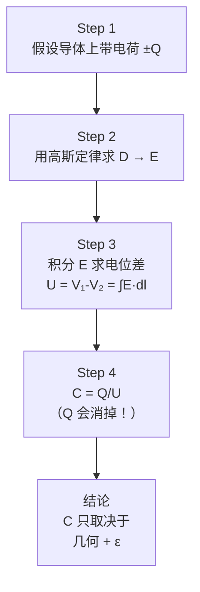
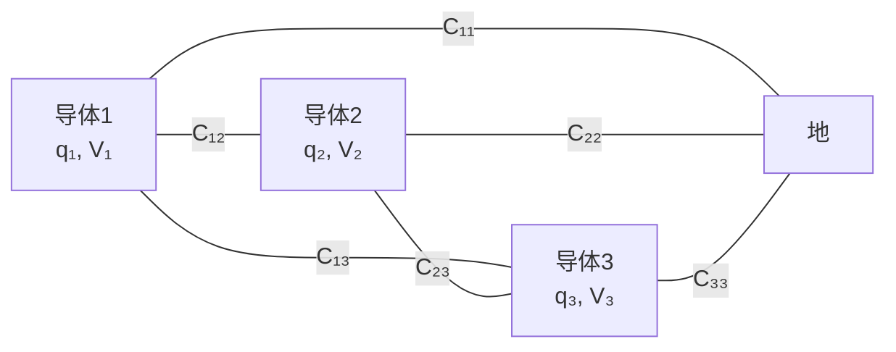

# 电容的定义与计算方法

## 概念定义

$$C = \frac{Q}{V}$$

**电容 = 导体存储电荷的能力**：导体上每伏特电压所能存储的电荷量。单位是法拉（F），实际中常用微法（μF = 10⁻⁶ F）、纳法（nF = 10⁻⁹ F）和皮法（pF = 10⁻¹² F）。

电容的物理本质是**纯粹的几何因子**——它只取决于导体的形状、尺寸、间距以及周围介质的介电常数，与导体上带的电荷量 Q 和电位 V 的绝对值无关。

## 类比与直觉

**水箱类比**：
- 水箱底面积（C）越大 → 存储同样水深（电压 V）需要更多水（电荷 Q）
- Q = CV 就像 水量 = 底面积 × 水深
- 把水箱加高（增大导体间距）→ 同样底面积能装更多水？不！电容反而减小——因为间距越大，同样电荷产生的电位差越大

**弹性容器类比**：
- 电容像气球的"软硬程度"
- 大电容 = 软气球：吹进很多气（Q 大），气压（V）只增加一点
- 小电容 = 硬气球：吹进一点气（Q 小），气压（V）就很大

**停车场类比**：
- 电容 = 停车场容量。大电容的导体在1V电压下能停很多"电荷车"
- 导体面积越大（平行板面积 ↑）→ 停车位越多 → C ↑
- 两板距离越大 → 吸引力越弱 → 更难充电 → C ↓

## 核心公式

### 双导体电容

$$C = \frac{Q}{V_1 - V_2} = \frac{Q}{U}$$

### 孤立导体电容

$$C = 4\pi\varepsilon a$$

其中 a 为导体球半径。这是令"另一个导体在无穷远处"的特例。地球半径约 6371 km，其孤立电容仅约 0.708×10⁻³ F（约 0.7 mF）——可见法拉是一个非常巨大的单位。

### 计算电容的标准四步法

## 典型结构的电容公式

| 结构 | 电容 | 几何参数含义 | 记忆技巧 |
|------|------|------------|---------|
| 平行板电容器 | $C = \frac{\varepsilon A}{d}$ | A=板面积, d=板间距 | 面积↑电容↑, 间距↑电容↓ |
| 同轴电缆（单位长度） | $C_1 = \frac{2\pi\varepsilon}{\ln(b/a)}$ | a=内半径, b=外半径 | 对数关系, b/a 越大 C 越小 |
| 同心球壳 | $C = \frac{4\pi\varepsilon ab}{b-a}$ | a=内球半径, b=外球半径 | 当 b→∞ 退化为孤立球 |
| 孤立导体球 | $C = 4\pi\varepsilon a$ | a=球半径 | b→∞ 的特例 |
| 两平行导线（单位长度） | $C_1 = \frac{\pi\varepsilon}{\ln\left(\frac{D}{a}\right)}$ | a=导线半径, D=轴线间距（D≫a） | 近似公式 |

### 组合电容公式

串联：

$$\frac{1}{C} = \frac{1}{C_1} + \frac{1}{C_2} + \cdots$$

并联：

$$C = C_1 + C_2 + \cdots$$

串联电容像电阻并联（总电容变小），并联电容像电阻串联（总电容变大）。直觉：串联时等效极板间距增大，并联时等效极板面积增大。

## 多导体系统与部分电容

当空间中有 n 个导体时，每个导体的电位不仅取决于自身的电荷，还受其他导体上电荷的影响。引入**部分电容**概念：

$$Q_i = \sum_{j=1}^{n} C_{ij} (V_i - V_j)$$

其中：
- Cᵢᵢ = **固有部分电容**：第 i 个导体对地的电容
- Cᵢⱼ = **互有部分电容**：第 i 和第 j 个导体之间的电容

在实际的集成电路和PCB设计中，部分电容是分析信号串扰（crosstalk）的基础。

## 常见误区

1. **C = εA/d 只对平行板适用**：这是最常见的误解。每种几何结构有其独特的电容公式。同轴电缆使用 ln(b/a)，同心球使用 ab/(b-a)——不能混用。

2. **C 与 Q 和 V 无关**：电容是几何因子。在四步法计算中 Q 会消掉，最终表达式只含 ε 和尺寸参数。但必须注意，这个结论依赖"介质是线性的"假设。

3. **串联电容：C = 1/(1/C₁ + 1/C₂)** 经常被记反。记住：串联 = 等效间距增大 → 电容减小；并联 = 等效面积增大 → 电容增大。

4. **孤立导体电容"4πεa"不是"4π"**：这个 4π 来自球面面积 4πr²。对于非球形孤立导体，公式不是 4πεa。

5. **F（法拉）太大，实际中极少用**：地球的电容仅约 0.7 mF。市面上常见的电解电容是 μF 级，陶瓷电容是 pF~nF 级。超级电容（EDLC）可达数千 F，但那依赖的是电化学双层效应而非纯粹的静电电容。

## 费曼检验

1. 用四步法推导同轴电缆单位长度的电容。为什么结果是 C₁ = 2πε/ln(b/a) 而不是像平行板那样 C = εA/d？

2. 两个相同电容 C 串联后总电容为 C/2，并联后为 2C。请从电荷和电压的角度解释这个结果，而不是死记公式。

## 概念导航

- 前置概念：[[高斯定律的对称性应用技巧]]、[[电位与电场强度的梯度关系]]
- 后续概念：[[多导体系统的部分电容]]、[[电场能量公式]]
- 关联概念：[[电感 MOC]]（C 和 L 的对偶关系）、[[恒定电流场与静电场的比拟]]

> 📖 **教科书参考**：§2-7, p.61
