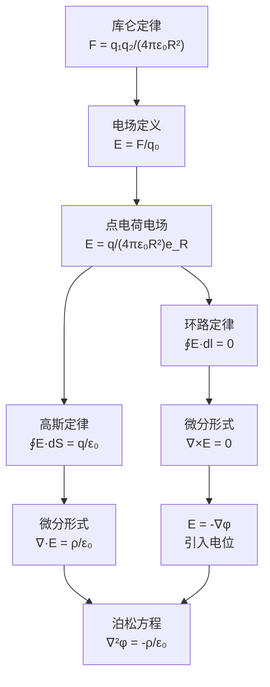

# 真空中的静电场 MOC

## 教科书原文

> 📖 参见：[[§2-2 真空中的静电场]]

## 概念定义（费曼一句话）

真空中的静电场由两个简洁但强大的方程完全描述：**高斯定律**（电场从正电荷流出、流入负电荷——有散性）和**环路定律**（电场绕闭合路径不做功——无旋性）。两者结合意味着：静电场是保守场，可由标量电位 $$\phi$$ 完全导出，满足 $$\nabla^2\phi = -\rho/\varepsilon_0$$。

## 类比与直觉

**类比1：不可压缩流体的源-汇流**。想象正电荷是空间中均匀"喷水"的源（source），负电荷是均匀"吸水"的汇（sink）。高斯定律 $$\nabla\cdot\mathbf{E} = \rho/\varepsilon_0$$ 就是说：空间的每一点，电场的"流出率"正比于该处的电荷密度——有正电荷就有净流出，有负电荷就有净流入。电势线从正电荷出发，终止于负电荷。

**类比2：重力场的高度守恒**。沿着任何闭合路径走一圈，攀登和下降的总净高度变化为零——这就是 $$\oint \mathbf{E}\cdot d\mathbf{l} = 0$$（环路定律）的含义。不管你怎么绕路，起点和终点的"电位高度差"只取决于起点和终点，与路径无关。保守场意味着"势能"这个概念有意义。

## 核心公式详释

**真空中静电场基本方程组**：

| | 积分形式 | 微分形式 |
|---|---------|---------|
| 高斯定律 | $\oint_S \mathbf{E}\cdot d\mathbf{S} = \frac{q_{\text{内}}}{\varepsilon_0}$ | $\nabla\cdot\mathbf{E} = \frac{\rho}{\varepsilon_0}$ |
| 环路定律 | $\oint_l \mathbf{E}\cdot d\mathbf{l} = 0$ | $\nabla\times\mathbf{E} = 0$ |

**高斯定律的对称性应用**：

| 对称性 | 电荷分布 | E的表达式 | 适用区域 |
|--------|----------|-----------|----------|
| 球对称 | 点电荷 $$q$ | $E_r = \frac{q}{4\pi\varepsilon_0 r^2}$ | $r>0$ |
| 球对称 | 均匀带电球 | $E_r = \frac{qr}{4\pi\varepsilon_0 R^3}$ | $r<R$$（内部） |
| 柱对称 | 无限长线电荷 $$\tau_l$ | $E_r = \frac{\tau_l}{2\pi\varepsilon_0 r}$ | $r>0$ |
| 平面对称 | 无限大均匀面电荷 $$\sigma_s$ | $E_z = \frac{\sigma_s}{2\varepsilon_0}$ | 全空间 |

**电位满足的方程**：
$$\nabla^2\phi = -\frac{\rho}{\varepsilon_0} \quad \text{（泊松方程）}$$

**无源区**：
$$\nabla^2\phi = 0 \quad \text{（拉普拉斯方程）}$$

## 推导脉络



## 常见误区

1. **高斯定律可以求解任何静电场问题**：高斯定律永远是成立的，但**只有**在具有高度对称性（球/柱/平面对称）时才能方便地用于求解E。对于任意电荷分布，需要回到积分或微分方程方法。
2. **真空中的高斯面选取不影响结果**：高斯面的选取决定了能否把E提到积分号外。选错了面（面法向和E不垂直或不平行），高斯定律虽然成立但无法求解E。
3. **认为 $$\oint\mathbf{E}\cdot d\mathbf{l}=0$$ 意味着E处处为零**：环路积分为零是"净功为零"，但路径上的E可以很大——只要你回到起点时所有E·dl的贡献加起来为零。这在数学上等于 $$\nabla\times\mathbf{E}=0$$。

## 费曼检验

1. 一个均匀带电球体内部（r<R），电场强度线性增大（$$E \propto r$$），外部按 $$1/r^2$$ 衰减。如何用高斯定律的"只有内部电荷作贡献"来解释这一过渡？
2. 真空中的静电学方程组只有两条：$$\nabla\cdot\mathbf{E} = \rho/\varepsilon_0$$ 和 $$\nabla\times\mathbf{E} = 0$$。这两条方程是否足以唯一确定E？还需要什么条件？
3. 无限长均匀带电直线产生的是径向电场 $$E_r = \tau_l/(2\pi\varepsilon_0 r)$$。如果这条线电荷被弯曲成一个圆环，环外某点的电场还能用高斯定律直接求解吗？为什么？

## 概念导航

- **前置**：[[库仑定律]]、[[电场强度的定义与叠加原理]]
- **后继**：[[介质中的静电场 MOC]]、[[电通量密度与高斯定律]]
- **核心文件**：[[高斯定律的对称性条件]]、[[真空中的静电场基本方程]]

## 自己理解

真空中的静电场是电磁学最基础的"纯净版"。掌握了这里的两条方程（高斯定律+环路定律）及其配合对称性的解题策略，就掌握了静电场分析的"元操作"。后续涉及介质时，只是在这两条方程上加上介质响应（极化、束缚电荷），核心逻辑完全不变。理解真空中的静电场，是理解一切更复杂电磁场问题的基础。

> 📖 参见：[[§2-2 真空中的静电场]]

## 可视化图表

```wavedrom
{
  "signal": [
    {"name": "点电荷+Q 高斯面包围", "wave": "23", "period": 4, "data": ["Φ=Q/ε₀", "Φ=Q/ε₀", "Φ=Q/ε₀", "Φ=Q/ε₀", "0", "0", "0", "0"]},
    {"name": "球对称E场分布", "wave": "cos", "period": 4},
    {"name": "任意形状高斯面", "wave": "cos", "period": 4},
    {"name": "电荷在高斯面外", "wave": "2", "period": 4, "data": ["Φ=0", "Φ=0", "Φ=0", "Φ=0", "Φ=0", "Φ=0", "Φ=0", "Φ=0"]},
    {"name": "圆柱对称(线电荷)", "wave": "sin", "period": 4},
    {"name": "平面对称(面电荷)", "wave": "2", "period": 4, "data": ["E=σ/2ε₀", "E=σ/2ε₀", "E=σ/2ε₀", "E=σ/2ε₀", "E=σ/2ε₀", "E=σ/2ε₀", "E=σ/2ε₀", "E=σ/2ε₀"]}
  ],
  "head": {
    "text": "高斯定律: ∮D·dS=Q  通量∝净电荷 §2-4",
    "tick": 0
  },
  "foot": {
    "text": "三种对称性: 球/圆柱/平面  包围电荷才有通量"
  }
}

```
