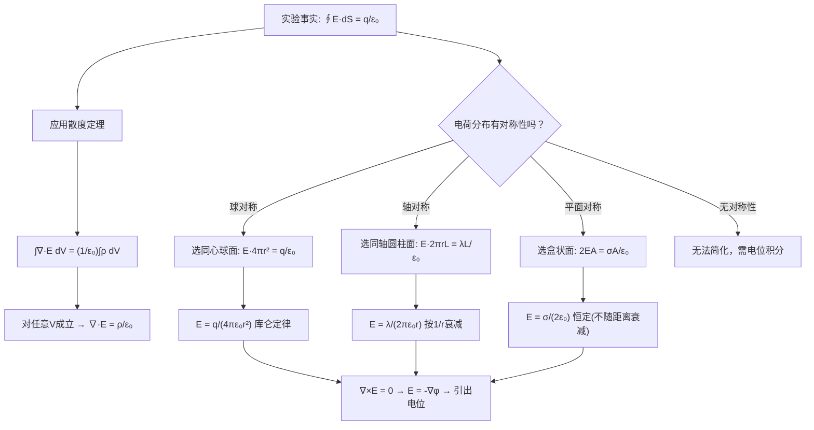

# 高斯定律的对称性应用技巧
**关键词**：真空中的静电场

## 概念定义

**高斯定律**：真空中静电场的电场强度 $$\mathbf{E}$$ 通过任意闭合曲面 $$S$$ 的总电通量，等于该闭合曲面内包围的总自由电荷量 $$q$$ 除以真空介电常数 $$\varepsilon_0$$。

**积分形式**：$$\oint_S \mathbf{E} \cdot d\mathbf{S} = \frac{q}{\varepsilon_0} \quad \text{(2-2-1)}$$

**微分形式**：$$\nabla \cdot \mathbf{E} = \frac{\rho}{\varepsilon_0} \quad \text{(2-2-6)}$$

其中 $$\varepsilon_0 = 8.854187817 \times 10^{-12} \,\mathrm{F/m} \approx \frac{1}{36\pi} \times 10^{-9} \,\mathrm{F/m}$$。

高斯定律的应用核心技巧：**选择与电荷分布对称性匹配的高斯面（Gaussian surface）**，使得 $$\mathbf{E}$$ 在高斯面上要么大小恒定且垂直于面，要么平行于面（对通量贡献为零）。

## 类比与直觉

**类比一：渔网算鱼——形不对则算不准**

想象你用渔网去估算湖中某区域的鱼量。你把网撒下去，如果网的形状恰好和鱼的分布对称——比如鱼均匀散布在一圈圈同心圆上，你用圆形网最有效——你只需知道网沿一圈的平均捕获量，就能准确推算总鱼量。但如果你的网是方形的而鱼沿圆形分布，那各处的捕获量不均匀，计算起来就非常复杂。**高斯面就是你的"渔网"，它必须匹配电荷分布的对称性**，才能让 $$\mathbf{E}$$ 在面上大小恒定、方向处处垂直（或平行）。

**类比二：洋葱剥皮——球对称**

想象一个均匀带电的球体。电荷一层一层均匀分布（像洋葱），那么电场也必须是球对称的——在同一个半径 $$r$$ 的球面上，电场强度大小处处相等，方向处处沿径向。于是取同心球面为高斯面，通量就是电场大小乘以球面积：$$\Phi = E(r) \times 4\pi r^2 = q/\varepsilon_0$$，一切迎刃而解。

**类比三：水管计数——轴对称**

一段无限长均匀带电直线，电荷像一根细面条。由于对称性，电场只能沿径向向外，而且在以直线为轴的同一半径圆柱面上大小相等。于是取同轴圆柱面为高斯面：侧面上 $$E \perp d\mathbf{S}$$（大小恒定），上下底面上 $$E \parallel d\mathbf{S}$$（通量贡献为零）。通量 = $$E(r) \times 2\pi r L = q/\varepsilon_0$$。

## 教科书推导：逐步拆解

### 第1步：高斯定律的实验基础与积分形式

教科书明确指出，高斯定律中的常数 $$\varepsilon_0$$ 由实验测定。积分形式 (2-2-1) 表明：**通过闭合曲面的电通量仅取决于面内包围的总电荷量，与电荷在面内的具体分布位置无关**。

重要的几点澄清（教科书原文）：
- 若通过某闭合面的电通为零，并不表示该面内不存在电荷——可能是正负电荷总量恰好相等（净电荷为零）
- 通过闭合面的电通为零，也不表示面内不存在电场——可能是进入的电通恰好等于穿出的电通
- 高斯定律中的 $$q$$ 应理解为闭合面所包围的**全部正、负电荷的总和（代数和）**

### 第2步：从积分形式到微分形式 —— 散度定理的应用

这是教科书 §2-2 的核心推导步骤。对高斯定律积分形式左边应用散度定理：

$$\oint_S \mathbf{E} \cdot d\mathbf{S} = \int_V \nabla \cdot \mathbf{E} \, dV \quad \text{(2-2-3)}$$

体积 $$V$$ 中的总电荷等于电荷体密度 $$\rho$$ 的体积分：

$$q = \int_V \rho \, dV \quad \text{(2-2-4)}$$

代入高斯定律 (2-2-1)：

$$\int_V \nabla \cdot \mathbf{E} \, dV = \frac{1}{\varepsilon_0} \int_V \rho \, dV$$

即：

$$\int_V \left( \nabla \cdot \mathbf{E} - \frac{\rho}{\varepsilon_0} \right) dV = 0 \quad \text{(2-2-5)}$$

由于上式对**任意体积** $$V$$ 均成立，被积函数必为零，从而得到**高斯定律的微分形式**：

$$\nabla \cdot \mathbf{E} = \frac{\rho}{\varepsilon_0} \quad \text{(2-2-6)}$$

### 第3步：静电场的无旋性

由实验事实 $$\oint_l \mathbf{E} \cdot d\mathbf{l} = 0$$（静电场环量为零，式 2-2-2），应用旋度定理得：

$$\int_S (\nabla \times \mathbf{E}) \cdot d\mathbf{S} = 0$$

对任意曲面 $$S$$ 成立，因此：

$$\nabla \times \mathbf{E} = 0 \quad \text{(2-2-7)}$$

至此得到真空中静电场方程的完整微分形式：

$$\nabla \cdot \mathbf{E} = \frac{\rho}{\varepsilon_0} \quad \text{(2-2-8)}$$

$$\nabla \times \mathbf{E} = 0 \quad \text{(2-2-9)}$$

**核心结论**：真空中静电场是**有散无旋场**。电荷是散度源（发散源），没有旋度源（涡旋源）。在无电荷区域，散度也为零——电场线连续穿过但不增减。

### 第4步：从散度旋度到场本身 —— 电位的引出

根据亥姆霍兹定理，已知矢量场的散度和旋度即可确定该场。由式 (2-2-8) 和 (2-2-9)，$$\mathbf{E}$$ 可表示为：

$$\mathbf{E} = -\nabla \varphi \quad \text{(2-2-13)}$$

其中标量函数 $$\varphi$$ 称为**电位**。式中的负号是约定——电场指向电位降低最快的方向。

已知电荷分布 $$\rho(\mathbf{r}')$$ 时，电位计算公式为：

$$\varphi(\mathbf{r}) = \frac{1}{4\pi\varepsilon_0} \int_{V'} \frac{\rho(\mathbf{r}')}{|\mathbf{r} - \mathbf{r}'|} dV' \quad \text{(2-2-11)}$$

电场强度可直接由电位梯度求得，也可直接积分：

$$\mathbf{E}(\mathbf{r}) = \int_{V'} \frac{\rho(\mathbf{r}')(\mathbf{r} - \mathbf{r}')}{4\pi\varepsilon_0 |\mathbf{r} - \mathbf{r}'|^3} dV' \quad \text{(2-2-14)}$$

### 第5步：高斯定律的对称性应用 —— 选择高斯面的方法论

教科书明确指出：**仅对于某些分布特殊的静电场**才能找到合适的高斯面，使高斯定律的计算十分简便。高斯面必须满足：

1. 面上各点的 $$\mathbf{E}$$ 大小恒定（或至少已知分布规律）
2. $$\mathbf{E}$$ 与面元 $$d\mathbf{S}$$ 的夹角处处相同（理想情况：处处垂直或处处平行）
3. 高斯定律左边的面积分 $$\oint \mathbf{E} \cdot d\mathbf{S}$$ 可以容易地计算

**三种基本对称性对应的高斯面：**

| 对称性 | 电荷分布 | 高斯面形状 | 关键特征 | 电场表达式 |
|--------|---------|-----------|---------|-----------|
| 球对称 | 点电荷、均匀带电球体/球壳 | 同心球面（半径 $$r$$） | $E(r)$$ 仅取决于 $$r$$，方向径向 | $E = q/(4\pi\varepsilon_0 r^2)$ |
| 轴对称 | 无限长均匀带电直线/圆柱 | 同轴圆柱面（半径 $$r$$，长 $$L$$） | 侧面：$$E \perp dS$$，底面：$$E \parallel dS$ | $E = \lambda/(2\pi\varepsilon_0 r)$ |
| 平面对称 | 无限大均匀带电平面 | 盒状面（与平面平行，面积 $$A$$） | 两侧面：$$E \perp dS$$，侧壁：$$E \parallel dS$ | $E = \sigma/(2\varepsilon_0)$ |

### 第6步：三种典型对称性案例的详细分析

**球对称案例（点电荷）**：以点电荷为球心，作半径为 $$r$$ 的球面。由对称性知 $$E$$ 处处沿径向、大小相等。$$\oint \mathbf{E} \cdot d\mathbf{S} = E(r) \cdot 4\pi r^2 = q/\varepsilon_0$$，得 $$E = q/(4\pi\varepsilon_0 r^2)$$——这就是库仑定律！高斯定律在球对称下直接退化为库仑定律。

**轴对称案例（无限长均匀带电直线）**：设线电荷密度 $$\rho_l$$。取半径为 $$r$$、长度 $$L$$ 的圆柱面，加上上下底面构成闭合高斯面。侧面通量：$$E(r) \cdot 2\pi r L$$；上下底面通量：$$0$$（因为 $$E \parallel$$ 底面）。$$\oint \mathbf{E} \cdot d\mathbf{S} = E(r) \cdot 2\pi r L = \rho_l L/\varepsilon_0$$，得 $$E = \rho_l/(2\pi\varepsilon_0 r)$$——电场按 $$1/r$$ 衰减（而非 $$1/r^2$$！）。

**平面对称案例（无限大均匀带电平面）**：设面电荷密度 $$\rho_s$$。作一个以带电平面为中心的盒状高斯面，两侧面面积各为 $$A$$，侧壁高度任意。两侧面通量：$$2E \cdot A$$；侧壁通量：$$0$$。$$\oint \mathbf{E} \cdot d\mathbf{S} = 2EA = \rho_s A/\varepsilon_0$$，得 $$E = \rho_s/(2\varepsilon_0)$$——**电场强度与距离无关（恒定！）**，这是无限大平面最反直觉的结论。

### 第7步：重要澄清 —— 高斯面上电场不恒定时

教科书特别强调：如果找不到合适的高斯面（即面上各点的 $$E$$ 大小不均或方向不定），高斯定律依然正确——任何闭合曲面的电通量总等于 $$q/\varepsilon_0$$——只是积分无法简单计算，失去了作为计算工具的便利性。此时需要通过电位积分或直接积分法求解。

## Mermaid推导流程图

## 教科书例题要点

**点电荷的电场**（教科书 p.42 附近）：取以点电荷为球心的球面为高斯面。利用球对称性：球面上各点 $$E$$ 大小相等、方向沿径向与外法线一致（正电荷时）。$$\oint \mathbf{E} \cdot d\mathbf{S} = E(r) \times 4\pi r^2 = q/\varepsilon_0$$，得 $$E = q/(4\pi\varepsilon_0 r^2)$$。

**无限长均匀带电圆柱的电场**：取半径为 $$r$$、长度为 $$L$$ 的同轴圆柱面与上下底面构成高斯面。由轴对称性，$$E$$ 沿径向且大小仅取决于 $$r$$。侧面通量 = $$E(r) \times 2\pi r L$$，底面通量 = 0。总通量 = 包围电荷 $$/\varepsilon_0$$，求得 $$E = \rho_l/(2\pi\varepsilon_0 r)$$。

**均匀带电球体内部的电场**：在球体内取半径为 $$r < a$$ 的同心球面为高斯面。内部包围的电荷量为 $$q(r) = q \cdot (r^3/a^3)$$（均匀分布）。$$\oint \mathbf{E} \cdot d\mathbf{S} = E(r) \cdot 4\pi r^2 = q(r)/\varepsilon_0$$，得内部 $$E \propto r$$（线性增长），外部 $$E \propto 1/r^2$$（反平方衰减）。

## MATLAB可视化提示词

- **功能描述**：对比绘制三种对称性电荷分布的电场线和高斯面——(a) 点电荷（球对称）的球面高斯面与径向电场线，(b) 无限长线电荷（轴对称）的圆柱高斯面与径向电场线，(c) 无限大平面电荷（平面对称）的盒状高斯面与均匀平行电场线。
- **输入参数**：电荷密度参数（点电荷 q，线密度 λ，面密度 σ），显示范围可调，高斯面尺寸可选。
- **输出要求**：三个子图——(a) 点电荷：球面高斯面 + 径向 quiver 箭头，(b) 线电荷：圆柱高斯面（侧面+顶底面）+ 径向 quiver 箭头，(c) 平面电荷：盒状高斯面 + 均匀单向 quiver 箭头。箭头大小按电场强度 $$1/r^2$$ 或 $$1/r$$ 缩放。
- **代码结构**：分别创建三个子图 → 计算各自电场分布 → 绘制高斯面（球面、圆柱面、平面）使用半透明 surf → 叠加 quiver 箭头 → 标注高斯面上电场方向与法线关系。
- **注释要求**：中文注释每个子图的物理情景、高斯面选取理由、电场衰减规律（$$1/r^2$$、$$1/r$$、恒定）。
- **错误处理**：检查电荷密度参数的有效性（非负），检查高斯面是否闭合。

## 常见误区

1. **高斯面必须是闭合的**：高斯定律说的是闭合曲面（$$\oint$$），不能是开曲面。球面是闭合的；圆柱面必须加上上下两个底面才是闭合的；盒状面必须有六个面才是闭合的。

2. **高斯面不一定是等位面，也不一定与导体表面重合**：高斯面纯粹是为计算方便而选用的数学曲面，不必是物理上存在的表面。

3. **$$E$$ 平行于高斯面的面上通量为零，但 $$E$$ 可以不为零**：比如在无限大平面的盒状高斯面上，侧壁上的 $$E$$ 不为零——它平行于壁面，所以 $$E \cdot dS = 0$$，对通量无贡献。

4. **高斯定律对任何闭合曲面都成立，但只有选对高斯面才能简化计算**：如果一个球形高斯面和一个立方高斯面包围同样的电荷，它们的总通量相等（都是 $$q/\varepsilon_0$$），但立方体面上 $$E$$ 的大小不均匀、方向与面元的夹角也不一致，积分非常复杂。

5. **"无限大"是理想化模型**：真实的带电平面总是有限大的。只有当观测点离平面的距离远小于平面尺寸时，"无限大平面"近似才成立，电场近似均匀且不随距离衰减。

## 费曼检验

1. 一个均匀带电的无限长圆柱体，半径 $$a$$，体电荷密度 $$\rho$$。分别求 (a) 圆柱内部 $$r < a$$ 和 (b) 圆柱外部 $$r > a$$ 的电场强度表达式。内部电场如何随 $$r$$ 变化？（提示：取同轴圆柱面为高斯面，内部包围电荷 $$q(r) = \rho \pi r^2 L$$，外部包围电荷为全部电荷 $$\rho \pi a^2 L$$。）

2. 两个无限大均匀带电平面，面电荷密度分别为 $$+\sigma$$ 和 $$-\sigma$$，平行放置。两板之间和两板之外的电场分别为多少？为什么平行板电容器内部电场是均匀的？（提示：利用叠加原理，每个平面产生的电场为 $$\sigma/(2\varepsilon_0)$$，两板间同向叠加，两板外反向抵消。）

3. 如果电荷分布是"球对称"但不均匀——比如 $$\rho(r) = \rho_0 (1 - r/a)$$，我们还能用高斯定律直接求电场吗？如果可以，高斯面怎么选？（提示：虽然密度不均匀，但仍只依赖于 $$r$$（球对称），因此电场仍沿径向且只依赖于 $$r$$。取同心球面为高斯面，关键是计算 $$q(r) = \int_0^r \rho(r') \cdot 4\pi r'^2 dr'$$。高斯定律仍然有效，只是 $$q(r)$$ 的积分稍微复杂一些。）

## 概念导航

- 前置概念：[[矢量场的通量、散度与散度定理/散度的定义：矢量场的源强度]]、[[散度定理]]、[[库仑定律与点电荷]]
- 后续概念：[[电位移矢量D的引入]]、[[介质中的高斯定律]]、[[电容的定义与计算方法]]
- 关联概念：[[安培环路定律及其对称性应用]]、[[亥姆霍兹定理：矢量场的唯一分解]]

> 📖 **教科书参考**：§2-2, p.38-42
