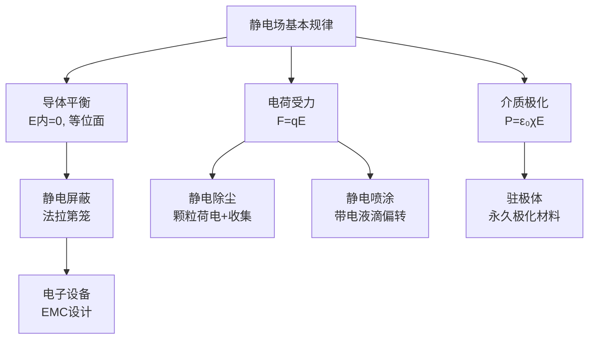
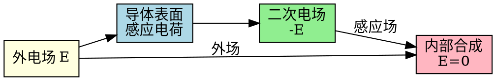

# 静电场的应用 MOC

## 教科书原文

> 📖 参见：[[§2-9 电场力]]

## 概念定义（费曼一句话）

静电场的工程应用都基于一个共同原理：**电荷在电场中受力（$$\mathbf{F} = q\mathbf{E}$$）**，而导体在静电平衡时内部电场为零、表面为等位面。利用这些基本规律，工程师可以设计各种器件来操控带电粒子、隔离电磁干扰、或利用静电力实现精密加工。

## 类比与直觉

**类比1：静电屏蔽 = 法拉第笼 = "电学雨伞"**。就像雨伞挡住雨水（屏蔽物挡住外电场），法拉第笼内的电场为零——不是因为导体"吸收"了电场，而是因为导体表面的感应电荷产生的二次电场恰好抵消了外部电场。你在汽车里遇到雷击时是安全的，因为金属车身就是一个法拉第笼。

**类比2：静电除尘 = "电学磁铁"**。静电除尘器就像用静电代替磁力来"吸住"灰尘——高压电极使尘埃带电，然后带电尘埃在电场力作用下被拉向集尘极板（就像铁屑被磁铁吸引）。区别在于：磁铁只能吸铁磁性物质，而静电可以吸任何带上电荷的颗粒。

## 核心物理原理

**导体静电平衡条件**：
- 导体内部 $$\mathbf{E} = 0$$
- 导体表面为等位面（$$\phi = \text{常数}$$）
- 电荷只分布在导体表面
- 表面电场垂直于表面：$$E_n = \sigma/\varepsilon_0$$

**静电屏蔽**：
- 空腔导体内部不受外部电场影响
- 接地空腔导体也不影响外部空间

**带电粒子在电场中的运动**：
$$\mathbf{F} = q\mathbf{E} = m\mathbf{a} \quad \to \quad \mathbf{a} = \frac{q}{m}\mathbf{E}$$

## 主要应用概览

| 应用 | 核心原理 | 关键参数 |
|------|----------|----------|
| 静电屏蔽 | 导体内部E=0，法拉第笼效应 | 屏蔽效能(SE)，与频率有关 |
| 静电除尘 | 电晕放电使尘埃带电+电场收集 | 电压(30-100kV)，极板间距 |
| 静电喷涂 | 带电液滴在电场中飞向工件 | 电压，液滴电荷量，距离 |
| 静电复印 | 光电导体上形成静电潜像 | 光导体的暗/亮电阻比 |
| 静电纺丝 | 高压电场拉伸聚合物溶液 | 电压(10-30kV)，距离 |

## 应用流程

## 常见误区

1. **静电屏蔽需要接地才有效**：法拉第笼的屏蔽效果（内部E=0）来自导体表面感应电荷的重分布，不需要接地。接地是为了防止笼内电荷影响外部，或让笼体电位固定为零。
2. **静电除尘对所有颗粒都有效**：除尘效率取决于颗粒的电阻率。电阻率太高（>10¹¹ Ω·cm）的颗粒难以带上电荷（反电晕），电阻率太低（<10⁴ Ω·cm）的颗粒到达极板后立即失去电荷被气流重新带走。
3. **认为静电屏蔽能阻挡所有频率的电磁场**：静态或低频电场可以被金属壳有效屏蔽，但高频电磁波因趋肤效应对屏蔽体厚度有要求。

## 费曼检验

1. 一个人手持手机站在金属笼内，手机能否接收到信号？为什么金属笼能屏蔽静电但对手机信号可能无效？
2. 静电除尘器中，如果电压太高会发生什么？物理机制是什么？
3. 为什么印刷电路板上的敏感模拟电路周围经常包一圈接地铜皮？这利用了静电学的什么原理？

## 概念导航

- **前置**：[[静电平衡条件]]、[[电场强度的定义]]
- **核心笔记**：[[静电屏蔽原理与设计]]、[[静电除尘与静电喷涂]]
- **关联**：[[恒定电流场的应用 MOC]]、[[涡流效应与变压器]]

## 自己理解

静电场的工程应用虽然"古老"（法拉第笼是1836年的发明），但其物理本质——导体感应电荷重分布以抵消外场——至今仍然是电磁兼容（EMC）设计的核心思想。现代电子设备中的屏蔽、接地、滤波三大EMC手段，前两者都直接来源于静电屏蔽原理。理解了静电屏蔽，也就理解了为什么你的手机内部被金属壳包裹、为什么同轴电缆有外导体——都是为了"法拉第笼效应"。

> 📖 参见：[[§2-9 电场力]]
