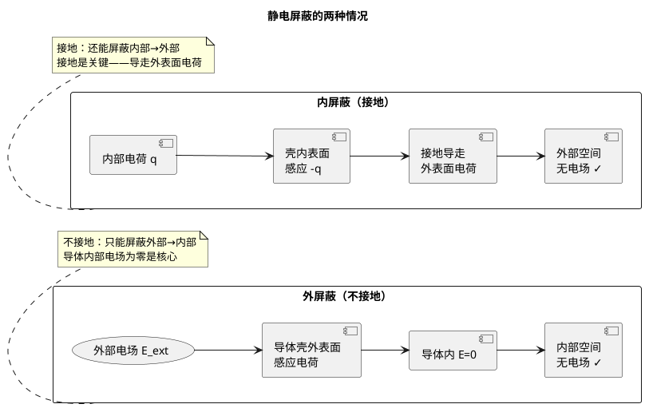

# 静电屏蔽原理与设计
**关键词**：静电场的应用

📌 **一句话本质**：导体空腔内部场强为零——外面电场进不去，里面的电荷也出不来

🏷️ **重要度**：🟡 | 考试：★★ | 题型：简

## 🧠 类比与直觉

**"防弹玻璃"类比**：静电屏蔽像防弹玻璃——外面子弹（外电场）打不进来，里面的东西也飞不出去。不接地的屏蔽壳=单向防弹玻璃（只能挡外面进来）；接地的屏蔽壳=双向防弹玻璃（内外都隔离）。

**口诀**："空腔导体场为零，外电不进内不出"

## 教科书原文

> 📖 参见：[[§2-10 静电场的应用]]

## 屏蔽效果的物理机制

**外屏蔽（不接地）**：外部电场使导体壳外表面感应电荷，感应电荷产生的电场在导体内部与外部电场恰好抵消（$E_{\text{内}}=0$），因此内部空间不受影响。

**内屏蔽（必须接地）**：内部电荷使导体壳内表面感应等量异号电荷。如果不接地，外表面会产生等量同号感应电荷，从而在外部产生电场。接地后，外表面电荷被导入大地，外部电场消失。

## 法拉第笼屏蔽示意

> 📖 参见：[[§2-10 静电场的应用]]

## ✂️ 可跳过
- PlantUML 屏蔽示意图（理解"外屏蔽不接地、内屏蔽必须接地"即可）
