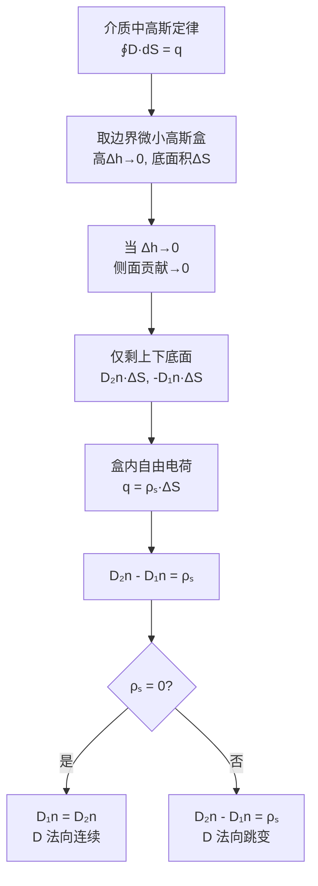

# 法向边界条件：D 的法向跳变
**关键词**：边界条件, D法向, E切向, ρₛ, 介质分界面

## 概念定义

**法向边界条件**描述了电位移矢量 D 的法向分量在穿过两种介质分界面时的行为：

$$D_{2n} - D_{1n} = \rho_s$$

穿过介质分界面时，D 的法向分量发生跳变，跳变量等于界面上的**自由电荷面密度**。若无自由面电荷，则 D 的法向分量**连续**：

$$D_{1n} = D_{2n} \quad (\rho_s = 0 \text{ 时})$$

而对于电场强度 E，法向分量在边界上的关系为：

$$\varepsilon_1 E_{1n} = \varepsilon_2 E_{2n} \quad \Rightarrow \quad E_{2n} = \frac{\varepsilon_1}{\varepsilon_2}E_{1n}$$

电场强度的法向分量**不连续**——其跳变来自界面两侧介质极化产生的束缚面电荷。

## 类比与直觉

**高速公路收费站类比**：
- D 场法向分量 = 穿过收费站横截面的车流量
- 界面 = 收费站本身
- 如果收费站没有"生成新车"或"消灭旧车"（ρₛ = 0，界面无自由电荷），则驶入收费站的车流量 = 驶出的车流量 → D 法向连续
- 如果收费站**产生新车**（ρₛ ≠ 0，界面上有自由电荷），则驶出车流量 > 驶入车流量 → D 法向跳变 ΔDₙ = ρₛ

**水流过坝类比**：
- D 场像水流总量。如果水坝（界面）不漏水也不吸水（无自由面电荷），上下游的流量（Dₙ）必须相等
- 但上下游的水深和流速（Eₙ）不同，因为河床材质不同（ε₁ ≠ ε₂）→ E 法向不连续

## 推导过程

从介质中的高斯定律出发：

$$\oint_S \vec{D} \cdot d\vec{S} = q_{\text{free}}$$

在边界上取一个微小"高斯药盒"（pillbox）：高度 Δh → 0，底面 ΔS 足够小。



## 核心公式表

| 条件 | D 的条件 | E 的条件 | 物理意义 |
|------|---------|---------|---------|
| 一般边界（有自由面电荷） | $D_{2n} - D_{1n} = \rho_s$ | $\varepsilon_1 E_{1n} \neq \varepsilon_2 E_{2n}$ | D 的跳变量 = ρₛ |
| 两种介质边界（无自由面电荷） | $D_{1n} = D_{2n}$ | $\varepsilon_1 E_{1n} = \varepsilon_2 E_{2n}$ | D 法向连续，E 法向不连续 |
| 理想导体表面 | $D_{2n} = \rho_s$$ （导体内部 D = 0） | $E_{1n} = \frac{\rho_s}{\varepsilon}$ | D 法向量 = 表面电荷密度 |
| 束缚面电荷 | $\rho'_S = \varepsilon_0(E_{2n} - E_{1n})$ | — | 束缚电荷由 E 的法向跳变产生 |

## 结合切向与法向条件的完整图像

边界条件是两套独立的约束条件：

- **切向条件**（来自 ∇×E = 0）：$$E_{1t} = E_{2t}$$ → E 的切向分量连续
- **法向条件**（来自 ∇·D = ρ）：$$D_{2n} - D_{1n} = \rho_s$$ → D 的法向跳变 = ρₛ

在两种介质边界（ρₛ = 0）上：
- D 法向连续 + E 切向连续 → 可以推出 **场的折射定律**：

$$\frac{\tan\theta_1}{\tan\theta_2} = \frac{\varepsilon_1}{\varepsilon_2}$$

其中 θ₁ 和 θ₂ 分别是 D 场线（或 E 场线）与边界法线的夹角。当电力线从低 ε 区进入高 ε 区时，会**偏离法线**——折射角更大。

## MATLAB 可视化提示词

```
请生成完整的 MATLAB 代码，实现以下功能：

1. **场景：两种介质分界面的 D 场和 E 场**
   - 上半平面（y>0）为介质 1：εᵣ₁ = 1（空气）
   - 下半平面（y<0）为介质 2：εᵣ₂ = 5（例如石英）
   - 界面上有均匀自由面电荷密度 ρₛ = 1e-9 C/m²（可选）

2. **计算要求**
   - 在介质 1 中设定入射 D₁ 和 E₁（已知 D = ε₀εᵣ E）
   - 利用边界条件计算介质 2 中的 D₂ 和 E₂：
     - D₂ₙ = D₁ₙ + ρₛ（法向条件）
     - E₂ₜ = E₁ₜ（切向条件）
   - 验证 D 法向分量是否满足跳变条件
   - 用折射定律验证角度关系

3. **可视化**
   - 用 quiver 绘制 D 场线和 E 场线，分别用蓝/红色
   - 标注界面（y=0 处水平线）
   - 在界面附近标注 Dₙ₁, Dₙ₂ 的数值
   - 展示 D 法向跳变和 E 切向连续

4. **输出**
   - 图形 1200×600
   - 对比显示：左侧 ρₛ=0（Dₙ连续），右侧 ρₛ≠0（Dₙ跳变）
   - 标题："法向边界条件：D₂ₙ − D₁ₙ = ρₛ"
```

## 常见误区

1. **D 法向跳变 ≠ E 法向跳变**：D 的法向跳变量**恰好等于**ρₛ（由高斯定律直接导出），而 E 的法向跳变取决于两侧 ε 的比值和束缚电荷。两者的物理来源不同。

2. **"法向"的定义方向很重要**：n̂ 的方向约定为**从介质 1 指向介质 2**。如果搞反方向，D₂ₙ − D₁ₙ = ρₛ 的符号就会出错。

3. **理想导体内部 D = 0 且 E = 0**：这是静电平衡的必然结论。因此导体表面的 D 法向分量直接等于表面自由电荷密度 ρₛ。这是计算导体表面电荷分布的标准方法。

4. **D 线在边界处不一定保持直线**：即使 D 法向连续，D 线的方向在边界处会发生折射（角度变化），除非入射方向恰好是法线方向。

5. **法向条件和切向条件是独立的**：它们分别从 ∇·D = ρ 和 ∇×E = 0 推出，互不包含。完整的边界条件 = 法向条件 + 切向条件两套约束。

## 费曼检验

1. 在介质 1（εᵣ₁ = 2）和介质 2（εᵣ₂ = 8）的边界上无自由面电荷。已知介质 1 侧的 E₁ = (3, 4, 0) V/m（其中第一个分量为法向），求介质 2 侧的 E₂ 和两侧的 D₁、D₂。

2. 为什么导体表面的电力线必定垂直于导体表面？请同时用法向条件和切向条件进行论证。

## 概念导航

- 前置概念：[[电位移矢量D的引入]]、[[高斯定律的对称性应用技巧]]
- 后续概念：[[切向边界条件（E的切向连续）]]、[[静电场边界条件的完整方程组]]
- 关联概念：[[恒定磁场的边界条件 MOC]]（B 法向连续 vs D 法向跳变）、[[电场线的折射定律]]

> 📖 **教科书参考**：§2-6, p.56
