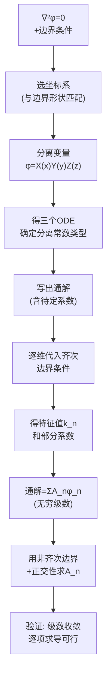

---
tags: [思考题, 电磁场, 边值问题, 分离变量法]
chapter: "第3章"
textbook_section: "§3-6"
textbook_page: "104"
type: concept-check
importance: ⚪
exam_frequency: ★
exam_type: 简
difficulty: advanced
created: 2026-04-28
---

# 思考题：3-10至3-12 分离变量法

📌 **一句话本质**：教科书3-10至3-12思考题——分离变量法的基本思想、坐标系选择、级数展开的概念检验
🏷️ **重要度**：⚪ | 考试：★ | 题型：简

## 教科书原题

> 3-10 简述分离变量法的核心思想及其基本步骤。
> 3-11 在直角坐标系的分离变量法中，分离常数如何确定？
> 3-12 为什么分离变量法得到的解通常是无级数形式？

## 费曼4步解题法

### 第1步：明确问题结构

这三道思考题围绕分离变量法的三个关键问题：思想与步骤（3-10）、分离常数的确定（3-11）、级数解的必然性（3-12）。核心思想是：**将多维偏微分方程分离为多个一维常微分方程**，利用傅里叶级数的完备性叠加满足任意边界条件。

### 第2步：逐题详解

**3-10 分离变量法的核心思想与基本步骤**

核心思想："化整为零"——将 $$\nabla^2\phi=0$$ （三维偏微分方程）分解为三个独立的常微分方程（每维一个），分别求解后线性叠加，利用正交函数系的完备性表示任意边界条件。

直角坐标系五步法：
1. **分离变量**：设 $$\phi(x,y,z) = X(x)Y(y)Z(z)$$，代入拉普拉斯方程
2. **确定分离常数符号**：根据边界是"周期型"（→ sin/cos）还是"衰减型"（→ sinh/cosh）
3. **写出各维通解**：三组含待定系数的基本解
4. **代入齐次边界**：逐步确定特征值和部分系数
5. **级数叠加匹配非齐次边界**：利用傅里叶展开求剩余系数

**3-11 分离常数的确定**

分离后得到：$$X''/X + Y''/Y + Z''/Z = 0$$
设 $$X''/X = \pm k_x^2$$, $$Y''/Y = \pm k_y^2$$, $$Z''/Z = \pm k_z^2$$

满足：$$\pm k_x^2 \pm k_y^2 \pm k_z^2 = 0$$

关键规则：**边界条件决定符号**
- 两个零边界（$$\phi=0$$ 在两端）→ 三角函数（负号）→ $$X = A\sin kx + B\cos kx$$
- 无限远衰减 → 指数函数（正号）→ $$X = Ae^{kx} + Be^{-kx}$$
- 至少一维必须为负（振荡型），因为三正数和不能为零

特征值：由齐次边界条件确定。例如两端为零的弦：$$\sin(ka)=0 \to k_n = n\pi/a$$（n=1,2,3,...）

**3-12 为什么是无级数形式？**

**根本原因**：单独一个乘积解 $$X(x)Y(y)Z(z)$$ 只能满足很特殊的边界——通常是"三角函数的单个模式"。但实际的边界条件（如常数值）是多个空间频率成分的叠加，需要**无级数**（所有可能的模式叠加）才能匹配。

数学本质：三角函数系 $$\{\sin(n\pi x/a)\}_{n=1}^\infty$$ 在区间 $$[0,a]$$ 上构成**完备正交系**——任何合理的函数都可以展成傅里叶正弦级数。因此，只有无穷多模式的叠加才能表示任意边界条件。

### 第3步：坐标系与特征函数对照

| 坐标系 | 方程 | 特征函数 | 常微分方程 |
|--------|------|---------|----------|
| 直角坐标（x,y） | 拉普拉斯 | sin, cos, sinh, cosh, e^kx | $X''\pm k^2 X = 0$ |
| 圆柱坐标（r） | 拉普拉斯 | $J_n(kr)$$, $$N_n(kr)$$, $$I_n$$, $$K_n$ | 贝塞尔方程 |
| 球坐标（$$\theta$$） | 拉普拉斯 | $P_n^m(\cos\theta)$$, $$Q_n^m$ | 连带勒让德方程 |
| 球坐标（r） | 拉普拉斯 | $r^n$$, $$r^{-(n+1)}$ | 欧拉方程 |

### 第4步：解题技术路线

## 常见误区

1. **任何二维拉普拉斯方程都能分离变量**：仅在11种可分离坐标系中可行（直角、圆柱、球、椭圆柱、抛物柱等）。
2. **级数解的第一项就是精确解**：实际需要保留足够多级数项才能达到所需精度。对于尖锐边界变化（如导体角），需要很多项。
3. **分离常数可以任意取**：分离常数由齐次边界条件决定（特征值问题），不是自由参数。

## 概念导航

- **前置**：[[电位微分方程及其定解问题 MOC]]、[[惟一性定理]]
- **核心**：[[直角坐标系中的分离变量法 MOC]]、[[圆柱坐标系中的分离变量法 MOC]]、[[球坐标系中的分离变量法 MOC]]
- **关联**：[[镜像法 MOC]]、[[分离变量法的核心思想]]、[[分离变量法的分步拆分策略]]

## 自己理解

分离变量法 = "调和函数的合成器"。它把求解拉普拉斯方程的问题变成"按正确比例混合basic modes（基本模式）"的作曲工作——每个 $$\phi_n = X_n(x)Y_n(y)$$ 是一个"音符"（基本解），边界条件给定了"乐谱"（需要的比例），傅里叶系数 $$A_n$$ 就是"音量大小"。当无穷多个音符按正确的音量叠加时，就得到了满足任何边界条件的"交响乐"（完备解）。

> 📖 参见：[[§3-6 球坐标系中的分离变量法]]
