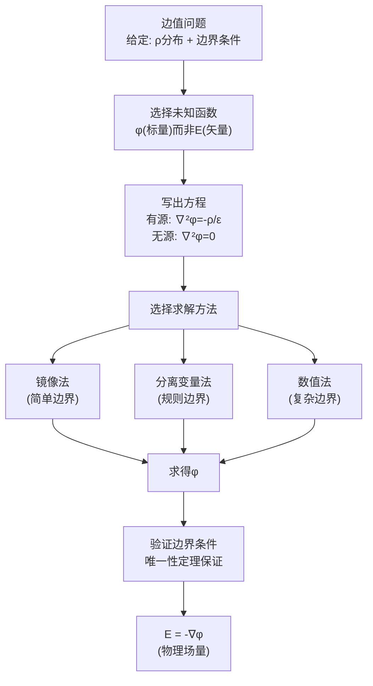

# 思考题：3-1至3-4 电位微分方程与唯一性定理

## 教科书原题

> 3-1 写出泊松方程和拉普拉斯方程，并说明它们在什么条件下适用。
> 3-2 静电场的边值问题有哪几类边界条件？各给出什么条件？
> 3-3 唯一性定理的内容是什么？它在边值问题的求解中有何重要意义？
> 3-4 为什么求解静电场的边值问题通常以电位$$\phi$$为未知函数？

## 费曼4步解题法

### 第1步：明确问题结构

这4道思考题构建了静电场边值问题的理论基础：方程形式（3-1）→ 边界条件类型（3-2）→ 解的合法性保证（3-3）→ 方法选择理由（3-4）。合在一起回答了"为什么边值问题可以解、怎么解、为什么这样解"。

### 第2步：逐题详解

**3-1 泊松方程和拉普拉斯方程**

**泊松方程**：$$\boxed{\nabla^2\phi = -\frac{\rho}{\varepsilon}}$$

适用条件：有自由电荷分布的区域（$$\rho \neq 0$$）。物理来源：将 $$\mathbf{D} = \varepsilon\mathbf{E}$$ 和 $$\mathbf{E} = -\nabla\phi$$ 代入高斯定律 $$\nabla\cdot\mathbf{D} = \rho$$。

**拉普拉斯方程**：$$\boxed{\nabla^2\phi = 0}$$

适用条件：无自由电荷区域（$$\rho = 0$$）。这是泊松方程的特例，在导体间的介质空间中普遍适用。

**3-2 三类边界条件**

| 类型 | 名称 | 给定条件 | 数学表达 | 物理示例 |
|:---:|------|---------|---------|---------|
| 第一类 | 狄利克雷 | 边界上电位值 | $\phi\|_S = f(s)$ | 导体表面给定电位 |
| 第二类 | 诺伊曼 | 边界上电位法向导数 | $\partial\phi/\partial n\|_S = g(s)$ | 给定表面电荷密度 |
| 第三类 | 混合/罗宾 | 电位与法向导数线性组合 | $\phi + \alpha\partial\phi/\partial n = h$ | 对流换热+导体 |

注意：纯诺伊曼问题解不唯一（差常数），需额外条件。

**3-3 唯一性定理的内容与意义**

**内容**：满足泊松方程（或拉普拉斯方程）和给定边界条件的电位函数解是**唯一的**。

**意义**：这是边值问题求解的"法律保障"——不管你用什么方法（镜像法、分离变量法、甚至猜测），只要找到了一个满足方程和边界条件的解，它就是**唯一正确的答案**。这让工程师可以放心使用各种"取巧"方法，只需要最后验证边界条件。

**3-4 为什么以$$\phi$$为未知函数？**

三个理由：
1. **降低维度**：E有3个分量（矢量，3个未知函数），$$\phi$$只有1个（标量，1个未知函数）
2. **方程简化**：E的方程是矢量方程，$$\phi$$的是标量方程（泊松/拉普拉斯）
3. **边界条件自然**：导体边界通常是等位面（$$\phi$$=常数），用$$\phi$$表述边界条件最直接

求得$$\phi$$后，$$\mathbf{E} = -\nabla\phi$$ 自然得到电场。

### 第3步：边值问题的求解流程

### 第4步：泊松方程与拉普拉斯方程在三种坐标系中的展开

直角坐标：$$\frac{\partial^2\phi}{\partial x^2}+\frac{\partial^2\phi}{\partial y^2}+\frac{\partial^2\phi}{\partial z^2} = -\frac{\rho}{\varepsilon}$$

圆柱坐标：$$\frac{1}{r}\frac{\partial}{\partial r}(r\frac{\partial\phi}{\partial r}) + \frac{1}{r^2}\frac{\partial^2\phi}{\partial\phi^2} + \frac{\partial^2\phi}{\partial z^2} = -\frac{\rho}{\varepsilon}$$

球坐标：$$\frac{1}{R^2}\frac{\partial}{\partial R}(R^2\frac{\partial\phi}{\partial R}) + \frac{1}{R^2\sin\theta}\frac{\partial}{\partial\theta}(\sin\theta\frac{\partial\phi}{\partial\theta}) + \frac{1}{R^2\sin^2\theta}\frac{\partial^2\phi}{\partial\varphi^2} = -\frac{\rho}{\varepsilon}$$

## 常见误区

1. **拉普拉斯方程 $$\nabla^2\phi=0$$ 意味着 $$\phi=0$$**：这意味着 $$\phi$$ 是无源区的调和函数。$$\phi=x^2-y^2$$ 满足 $$\nabla^2\phi=0$$ 但不为零。
2. **三类边界条件可以随意混合**：每条边界上只能给一类条件（狄利克雷或诺伊曼或混合），不能在同一条边界上同时给两类——否则超定。
3. **唯一性定理意味着数值解不必要**：唯一性定理说的是精确解的唯一性。数值解是近似解，不同数值方法（FEM vs BEM）可以给出接近但不完全相同的近似结果。

## 概念导航

- **前置**：[[电位 MOC]]、[[真空中的静电场 MOC]]
- **核心**：[[电位微分方程及其定解问题 MOC]]、[[电位微分方程解的惟一性 MOC]]
- **关联**：[[三类边界条件]]、[[镜像法 MOC]]、[[分离变量法 MOC]]

## 自己理解

这四道思考题揭示了电磁场定解问题的"三部曲"：**方程**（泊松/拉普拉斯）→ **边界条件**（三类）→ **唯一性定理**（合法性保证）。这个框架不仅适用于静电场，也适用于恒定电流场（$$\nabla^2\psi=0$$）、恒定磁场（磁位方程）、甚至热传导和流体力学——它是所有"势理论"边值问题的统一范式。

> 📖 参见：[[§3-1 电位微分方程及其定解问题]], [[§3-2 电位微分方程解的惟一性]]
