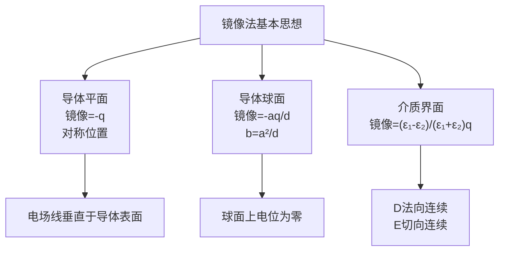

# 思考题：3-5至3-9 镜像法

## 教科书原题

> 3-5 镜像法适用于哪些情况？它有什么限制？
> 3-6 为什么平面导体的镜像电荷为-q（接地时）？
> 3-7 接地导体球外的点电荷，其镜像位置和电量如何确定？
> 3-8 不接地导体球的镜像需要满足什么额外条件？
> 3-9 介质分界面的镜像方法与导体镜像有何不同？

## 费曼4步解题法

### 第1步：明确问题结构

这5道思考题系统性地覆盖了镜像法的核心场景：平面导体（3-6）→ 球面导体（3-7, 3-8）→ 介质界面（3-9）→ 综合限制（3-5）。核心思想：**在求解区域之外放置虚电荷，使其与原电荷叠加后恰好满足边界条件**。

### 第2步：逐题详解

**3-5 镜像法的适用条件与限制**

适用：无限大导体平面、接地导体球、无限长导体圆柱、两种介质平面界面。要求边界为简单几何形状且为等位面（导体）或满足特定连续性条件。

限制：不适用于任意形状边界、多个不同曲率边界共存、非均匀介质、时变电磁场（需另用镜像天线理论）。

**3-6 平面导体为什么是-q？**

接地导体平面 $$\phi=0$$。真实电荷+q在平面上方d处。如果在平面对称位置（-d处）放镜像电荷-q，则平面上任意点距离两个电荷相等，电位 $$\phi = \frac{q}{4\pi\varepsilon R} + \frac{-q}{4\pi\varepsilon R} = 0$$——边界条件完美满足！

正负号的来源：两个等距电荷在导体平面上产生的电位必须抵消为零 → 镜像必为-q。

**3-7 接地导体球外的点电荷镜像**

点电荷q距球心d（d>a），镜像：
$$q' = -\frac{a}{d}q$$（大小缩小为a/d倍，反号）
$$b = \frac{a^2}{d}$$（镜像距球心距离，位于球内）

验证：球面上任意点，$$\phi = \frac{1}{4\pi\varepsilon_0}(\frac{q}{R} + \frac{q'}{R'}) = 0$$。

**3-8 不接地导体球的额外条件**

不接地球总电荷为零（或指定值Q）。需要：
1. 球心处额外放电荷 $$q'' = -q' = \frac{a}{d}q$$（保证球面为等位面且总电荷为零）
2. 镜像 $$q' = -aq/d$$ 仍在球内 $$b = a^2/d$$ 处

这样球面仍是等位面，但电位不为零。

**3-9 介质界面镜像 vs 导体镜像**

| | 导体界面 | 介质界面 |
|---|---------|---------|
| 镜像数量 | 1个（平面） | 2组（反射+透射） |
| 求解区 | 仅上半空间 | 上下两区域分别 |
| 边界条件 | $\phi=0$$（接地） | $D_{1n}=D_{2n}, E_{1t}=E_{2t}$ |
| 镜像强度 | 固定（-q） | 依赖于$$\varepsilon_1,\varepsilon_2$ |

### 第3步：镜像法全景对比

| 场景 | 镜像个(位)置 | 镜像大小 |
|------|------------|----------|
| 无限大接地导体平面 | 对称于平面 | $q'=-q$ |
| 接地导体球 | 球内b=a²/d | $q'=-aq/d$ |
| 不接地导体球 | 球内+球心各一个 | $q'=-aq/d$$, $$q''=aq/d$ |
| 介质平面界面 | 利用反射/透射系数 | $q'=\frac{\varepsilon_1-\varepsilon_2}{\varepsilon_1+\varepsilon_2}q$ |

### 第4步：核心公式速查表

## 常见误区

1. **镜像法对任意形状导体都适用**：仅适用于平面、球、圆柱等简单几何形状。大多数实际导体形状需用数值方法。
2. **镜像位置必须在求解区域内**：镜像必须在求解区域之外。例如导体平面问题中，镜像在导体内部（求解区域是导体上方的空间）。
3. **不接地导体的镜像和接地一样**：不接地导体需要额外条件（总电荷约束），需要附加球心电荷。

## 概念导航

- **核心**：[[镜像法 MOC]]、[[平面导体镜像]]、[[球面导体镜像]]、[[介质平面镜像]]
- **关联**：[[习题：镜像法典型题精选]]、[[分离变量法 MOC]]

## 自己理解

镜像法 = "猜解的艺术"——用唯一性定理作为担保，用物理直觉来猜测镜像的位置和大小。它之所以成立，根本在于：**镜像电荷在外区域，不改变求解区域内的电荷分布，但能在边界处产生正确的电位**。这种"以假乱真"的技巧在电磁工程中极为实用——从微波电路的镜像法分析到天线阵列的设计，到处都有镜像思想的身影。

> 📖 参见：[[§3-3 镜像法]], [[§3-5 圆柱坐标系中的分离变量法]]

## 费曼深度讲解

教科书§3-5至§3-9（镜像法及其应用）的核心思考题围绕五个主题：(1)接地导体平面前点电荷的镜像（§3-6）——为什么镜像电荷必须是−q而不是+q？(2)接地导体球前点电荷的镜像（§3-7）——镜像电荷的位置为什么是球内而不是球外？电荷量为什么需要缩放？(3)介质界面的镜像法（§3-8）——为什么需要两个等效电荷（一个表示反射、一个表示折射）？(4)直角型导体角的镜像（特殊情形，通常作为加星号内容）——多重镜像的条件是什么？(5)线电荷平行于接地导体平面的镜像——为什么镜像法与点电荷的情况完全类似？

镜像法思考题中一个常见的深层问题：镜像电荷产生的场在导体的"背面"（镜像所在侧）是否有物理意义？答案是没有——镜像电荷的场只在导体"前方"（感兴趣区域）等效于真实的感应面电荷分布产生的场。在导体背面（镜像电荷所在处），真实场为零（静电屏蔽），镜像场给出的非零值是"假"的——镜像解在非求解区域无效。这就是为什么镜像电荷通常放在感兴趣区域的"外部"——它的"副作用"不影响求解区域的正确性。

为什么接地导体球镜像电荷的位置d'=a²/d（反演位置）？这来自球面等位的几何约束——保持球面上任意点到原电荷和镜像电荷的距离比恒定d_image/d_original=常数。球面等位不仅要求距离比恒定，还要求电荷量满足特定比值（−qa/d），使球面上的电位精确为零。这个关系的几何本质是"球面反演"——球内一点(r'=a²/d)是球外一点(r=d)关于半径为a的球面的"静电反演点"。

## 更多费曼检验

1. 接地导体平面镜像中，为什么感应电荷的总量恰好是−q？能否从定理或几何证明？

2. 当一个点电荷从远处靠近接地导体球（d减小），镜像电荷q'=−qa/d的绝对值如何变化？物理上解释为什么感应效应在电荷靠近球面时更强。

