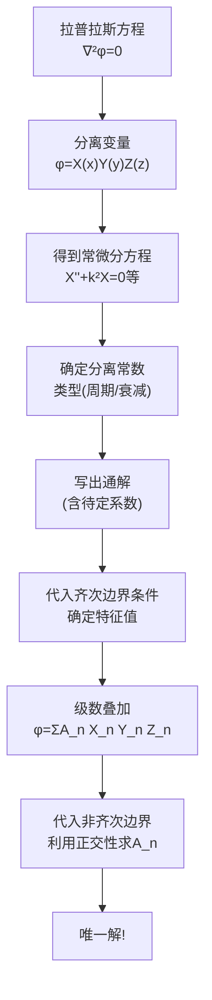
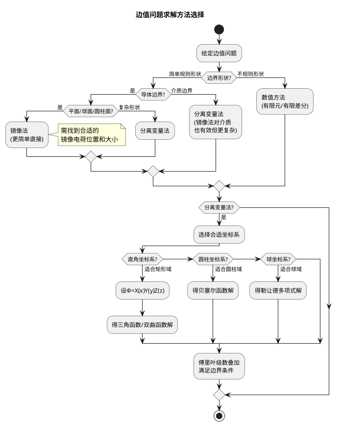

---
tags: [思考题, 电磁场, 边值问题, 分离变量法]
chapter: "第3章"
textbook_section: "§3-6"
type: concept-check
importance: ⚪
exam_frequency: ★
exam_type: 简
difficulty: advanced
created: 2026-04-28
---

# 思考题：分离变量法的核心思想
**关键词**：思考题, 预习, 概念检验, 静电场的边值问题

📌 **一句话本质**：分离变量法的核心思想——假设解=X(x)Y(y)Z(z)，将偏微分方程拆为三个常微分方程分别求解
🏷️ **重要度**：⚪ | 考试：★ | 题型：简

## 教科书原题

> 3-10 简述分离变量法的核心思想及其基本步骤。

## 费曼4步解题法

### 第1步：明确问题核心

分离变量法是求解拉普拉斯方程 $\nabla^2\phi = 0$（或泊松方程）在给定边界条件下的最系统的方法。它的核心思想简单而优美：**将多维偏微分方程分解为多个一维常微分方程，分别求解后再用叠加原理组合成满足边界条件的解**。

### 第2步：核心思想详解

**"分而治之"的策略**：

在直角坐标系中，假设电位可以分离为三个独立函数的乘积：
$$\phi(x,y,z) = X(x)Y(y)Z(z)$$

代入拉普拉斯方程 $\frac{\partial^2\phi}{\partial x^2} + \frac{\partial^2\phi}{\partial y^2} + \frac{\partial^2\phi}{\partial z^2} = 0$：

$$Y Z X'' + X Z Y'' + X Y Z'' = 0$$

除以 $XYZ$（在非零点）：
$$\frac{X''}{X} + \frac{Y''}{Y} + \frac{Z''}{Z} = 0$$

**关键洞察**：三项分别只依赖于x、y、z，而它们的和恒为零！这只有在每一项都等于常数时才可能：

$$X''/X = -k_x^2,\quad Y''/Y = -k_y^2,\quad Z''/Z = -k_z^2$$

且满足：$k_x^2 + k_y^2 + k_z^2 = 0$（分离常数之间的关系）

其中至少有一个常数是负的（对应指数解/双曲函数）。

### 第3步：三种坐标系中的求解策略

| 坐标系 | 解的形式 | 特征函数 | 常见问题 |
|--------|---------|---------|---------|
| 直角坐标 | $X \sim \{\sin kx, \cos kx\}$ 或 $\{e^{kx}, e^{-kx}\}$ | 三角函数/双曲函数 | 矩形槽、长方体 |
| 圆柱坐标 | $R \sim J_n(kr), N_n(kr)$; $\Phi \sim \{\sin n\phi, \cos n\phi\}$ | 贝塞尔函数+三角函数 | 圆柱体、圆孔 |
| 球坐标 | $R \sim r^n, r^{-(n+1)}$; $\Theta \sim P_n^m(\cos\theta)$ | 勒让德多项式 | 球体、球壳 |

直角坐标分离变量法的基本步骤：

1. 分离变量：设 $\phi = X(x)Y(y)Z(z)$，得到三个ODE
2. 确定分离常数的符号：根据边界条件是"周期型"（→三角函数）还是"衰减型"（→双曲函数）
3. 写出通解：每方向为两个独立解的线性组合
4. 代入边界条件：逐维确定常数值
5. 叠加构造：如果单个乘积解不够，使用级数叠加 $\phi = \sum_{n} A_n X_n(x)Y_n(y)Z_n(z)$

### 第4步：核心威力——傅里叶级数展开

分离变量法最强大的部分是**最后一步**：用一个无穷级数来满足剩余边界上的任意函数条件。

例如在矩形区域边界上 $\phi(x, h) = V_0$（常数），这不是单一乘积解能匹配的——必须将所有可能的模式叠加：

$$\phi(x,y) = \sum_{n=1}^{\infty} A_n \sin(\frac{n\pi x}{a})\frac{\sinh(n\pi y/a)}{\sinh(n\pi h/a)}$$

利用三角函数的正交性确定系数 $A_n$：
$$A_n = \frac{2V_0}{n\pi}[1-(-1)^n]$$（只保留奇数项）

## 常见误区

1. **拉普拉斯方程的通解就是任何一个乘积解**：单独一个乘积解只能满足很特殊的边界条件。一般需要无穷级数叠加——这正是傅里叶方法的核心。
2. **忽略分离常数之间的关系**：$k_x^2+k_y^2+k_z^2=0$ 意味着不能三个全是正实数（都取正意味着纯衰减，但拉普拉斯方程要求至少一维是振荡型）。
3. **在非正交坐标系中强行分离**：分离变量法的可行性依赖于偏微分方程在给定坐标系中是"可分离的"。只有11种坐标系允许拉普拉斯方程分离变量。
4. **把分离变量法和傅里叶变换混为一谈**：分离变量法适用于有限区域内（特征值为离散谱），傅里叶变换适用于无限或半无限区域（连续谱）。

## 概念导航

- **前置**：[[电位微分方程及其定解问题 MOC]]、[[惟一性定理]]
- **核心文件**：[[直角坐标系中的分离变量法 MOC]]、[[圆柱坐标系中的分离变量法 MOC]]、[[球坐标系中的分离变量法 MOC]]
- **关联**：[[分离变量法的分步拆分策略]]、[[镜像法 MOC]]

## 自己理解

分离变量法="把复杂的三维拼图拆成一维拼图条的排列组合，再用傅里叶级数把所有可能的组合叠加起来以适应边界"。它是最系统化、最强大的解析解法——不需要"灵光一现"（不像镜像法需要猜镜像位置），只需要按部就班地执行数学程序。但在工程实践中，数解（有限元法）已经很大程度上替代了繁杂的解析分离变量计算。

> 📖 参见：[[§3-6 球坐标系中的分离变量法]], [[§3-6 球坐标系中的分离变量法]]

## 分离变量法 vs 镜像法 选择策略

> 📖 参见：[[§3-6 球坐标系中的分离变量法]], [[§3-6 球坐标系中的分离变量法]]
