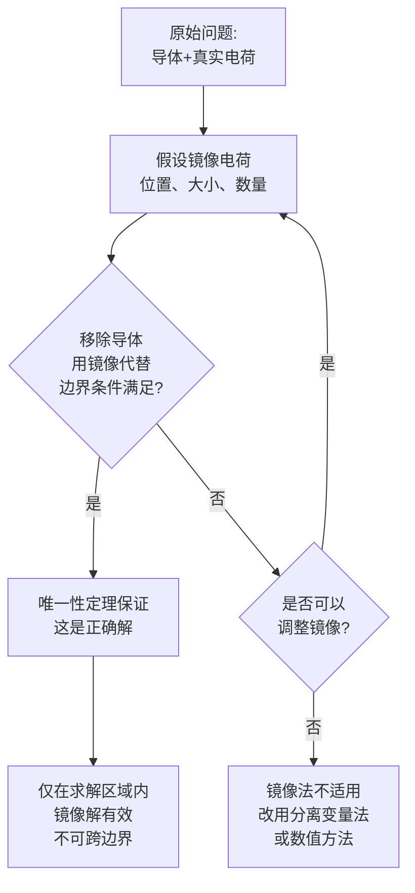

---
tags: [思考题, 电磁场, 边值问题, 镜像法, 适用条件]
chapter: "第3章"
textbook_section: "§3-3 ~ §3-5"
type: concept-check
importance: ⚪
exam_frequency: ★
exam_type: 简
difficulty: advanced
created: 2026-04-28
---

# 思考题：镜像法的适用条件
**关键词**：思考题, 预习, 概念检验, 静电场的边值问题

📌 **一句话本质**：镜像法的适用条件——导体边界规则(平面/球面)、源在边界一侧、等效区域正确划分
🏷️ **重要度**：⚪ | 考试：★ | 题型：简

## 教科书原题

> 3-5 镜像法适用于哪些情况？它有哪些限制？

## 费曼4步解题法

### 第1步：明确问题核心

镜像法虽然优雅简洁，但它不是万能的。这道题追问的是：在什么条件下镜像法有效？什么情况下它失效？理解这些边界条件是正确使用镜像法的前提——如果用在不适用的情况下，不仅得不到正确解，还可能误导物理直觉。

### 第2步：适用条件分析

**镜像法的核心假设**：

镜像法可行的前提是：**存在一组镜像电荷，它们与真实电荷叠加后，在求解区域的边界上恰好满足边界条件**。

**适用条件——四类经典场景**：

| 条件类型 | 具体场景 | 镜像要求 |
|----------|---------|---------|
| **无限大导体平面** | 接地或不接地 | 一个镜像-q（接地） |
| **接地导体球** | 点电荷在外 | 一个镜像 $$q'=-aq/d$$ |
| **无限长导体圆柱** | 线电荷在外 | 一个镜像线电荷 |
| **两种介质平面界面** | 无自由电荷 | 反射+透射等效电荷 |

**镜像法生效的数学条件**：
1. 边界是**等位面**（导体）或满足特定的连续性条件（介质界面）
2. 边界具有**简单的几何形状**：平面、球面、圆柱面
3. 镜像电荷能放在**求解区域之外**

**镜像法不适用的情况**：
1. 任意形状的导体边界（如正方体、不规则形状）
2. 边界具有复杂的非均匀介质分布
3. 具有多个不同曲率边界的问题（同时有平面和球面）
4. 导体不是完全的等位面（如有非零电阻率）
5. 时变电磁场问题（镜像法原理在时谐场中有对应——"镜像天线"——但需满足不同条件）

### 第3步：成功与失败的例子对比

**成功案例**：
- 点电荷在无限大接地导体平面上方 → 镜像-q，完美满足平面边界条件 $$\phi=0$$
- 点电荷在接地导体球外 → 镜像 $$q'=-aq/d$$ 在球内，球面确为等位面
- 无限长线电荷在介质界面上方 → 镜像法给出两个区域的解析解

**失败案例**：
- **导体立方体角上的点电荷**：平面镜像法可以处理90°角（需要3个镜像），但一般角度（如70°）不行——镜像电荷数量有限的条件要求角度是 $$\pi/n$$ 的形式
- **导体椭球附近点电荷**：椭球面不是简单的比例缩放，无法用有限个点电荷重建等位面

### 第4步：镜像法的"三步验证"

**验证清单**：
- [ ] 移除导体后，镜像+原电荷叠加在原来导体表面上产生等位吗？
- [ ] 等位值是否等于导体的电位？
- [ ] 镜像电荷是否全都在求解区域之外？
- [ ] 总电荷是否守恒（不接地导体的情况）？

## 常见误区

1. **任何平面边界都可以用镜像法**：只适用于**无限大**平面边界。有限大平面边缘附近的解不精确（边缘效应）。
2. **镜像法的解在"镜像区域"也有效**：镜像解**仅在原求解区域内有效**。"镜子后面"（原导体内部）的场不是真实物理场——那里原本没有场（导体内部E=0）。
3. **镜像电荷必须和原电荷等大反号**：仅对无限大接地导体平面如此。对球面镜像，$$|q'| \neq |q|$$，大小一般不同。

## 概念导航

- **前置**：[[镜像法 MOC]]、[[唯一性定理]]
- **核心文件**：[[平面导体镜像]]、[[球面导体镜像]]、[[介质平面镜像]]
- **关联**：[[分离变量法 MOC]]（镜像法失效时的备选方案）

## 自己理解

镜像法是"物理直觉"和"数学严格性"的完美结合——它让你绕过复杂的积分和偏微分方程，靠"照镜子"就解出精确的场分布。但前提是：(1)边界是"好形状"（平面/球/圆柱），(2)能用有限个镜像电荷"欺骗"边界条件。一旦边界形状复杂（如印刷电路板上的不规则接地平面），就要回到分离变量法或数值方法（FEM/BEM）。知道工具的适用边界，比会用工具更重要。

> 📖 参见：[[§3-3 镜像法]], [[§3-5 圆柱坐标系中的分离变量法]]

## 费曼深度讲解

镜像法的适用条件是理解该方法有效范围的必修课。三个核心条件缺一不可：(1)边界必须是简单几何形状——平面、球面或柱面（这三者恰好对应三种坐标系中的"面元"）；(2)边界面必须是等位面（导体边界）或两侧介质的分界面（在镜像法中存在对偶关系）；(3)场源仅限于点电荷、线电荷或简单的电荷分布（偶极子等）——因为镜像法的关键是"用镜像电荷的叠加凑出等位边界"，如果源分布过于复杂，镜像也难以凑。

为什么镜像法不适用于任意形状的导体边界？因为"镜像"的几何位置和电荷量必须使所有导体面上的所有点的电位恰好为常数——对于非平面/非球面边界，通常不存在简单的"镜像点"能做到这一点。除了极少数特殊情况（如两个接地平面夹角成180°/n时的多重镜像），复杂边界只能用数值方法。

镜像法的"原理边界"：(1)导体边界——镜像电荷符号相反（接地平面→−q镜像）、符号取适当值（接地球→−qa/d镜像）；(2)介质界面——两侧各有一个等效的"镜像/透射"电荷，对应的镜像系数由介电常数对比度决定（$\frac{\epsilon_1-\epsilon_2}{\epsilon_1+\epsilon_2}$和$\frac{2\epsilon_2}{\epsilon_1+\epsilon_2}$）；(3)磁介质界面——对偶原理下适用类似的镜像法（用磁荷或磁化电流替代电荷）。

## 更多费曼检验

1. 一个点电荷靠近直角型接地导体角（两个平面相交成90°角）——镜像法需要几个镜像电荷？位置如何安排？

2. 镜像法能否用于求解"多个点电荷+接地导体平面"的问题？如果能，原因是什么？（提示：叠加原理是否适用？为什么是？）

