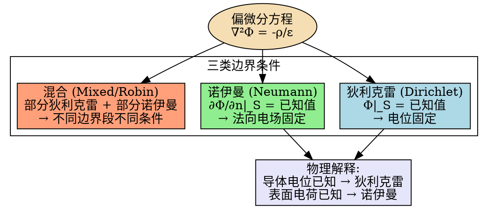

---
tags: [电磁场, 边值问题, 边界条件]
chapter: "第3章"
textbook_section: "§3-1"
textbook_page: "79"
type: core-concept
importance: 🟡
exam_frequency: ★★
exam_type: 选/填
difficulty: intermediate
level: ★
created: 2026-04-28
---

# 三类边界条件：狄利克雷、诺伊曼、混合
**关键词**：电位, V, E=-∇V, 等位面, 标量场

📌 **一句话本质**：狄利克雷边界给边界上的φ值，诺伊曼给法向导数，混合给两者的线性组合
🏷️ **重要度**：🟡 | 考试：★★ | 题型：选/填

## 🔧工程场景

EDA仿真设置——在HFSS/COMSOL中正确选择边界类型是获得正确结果的前提，新手最常犯的错

## 教科书原文

> 📖 参见：[[§3-1 电位微分方程及其定解问题]]

## 三类边界条件的关系

> 📖 参见：[[§3-1 电位微分方程及其定解问题]]
