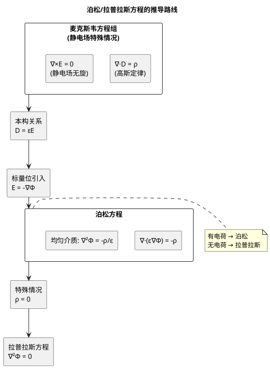

# 泊松方程与拉普拉斯方程的推导
**关键词**：电位, V, E=-∇V, 等位面, 标量场

## 教科书原文

> 📖 参见：[[§3-1 电位微分方程及其定解问题]]

## 从麦克斯韦到泊松方程的推导层次

```plantuml
@startuml
title 泊松/拉普拉斯方程的推导路线

rectangle "麦克斯韦方程组\n(静电场特殊情况)" as M {
  rectangle "∇·D = ρ\n(高斯定律)" as G
  rectangle "∇×E = 0\n(静电场无旋)" as C
}

rectangle "本构关系\nD = εE" as B

rectangle "标量位引入\nE = -∇Φ" as P

rectangle "泊松方程" as POISSON {
  rectangle "∇·(ε∇Φ) = -ρ" as P1
  rectangle "均匀介质: ∇²Φ = -ρ/ε" as P2
}

rectangle "特殊情况\nρ = 0" as S

rectangle "拉普拉斯方程\n∇²Φ = 0" as L

M --> B
B --> P
P --> POISSON
POISSON --> S
S --> L

note right of POISSON
  有电荷 → 泊松
  无电荷 → 拉普拉斯
end note

@enduml
```

> 📖 参见：[[§3-1 电位微分方程及其定解问题]]
