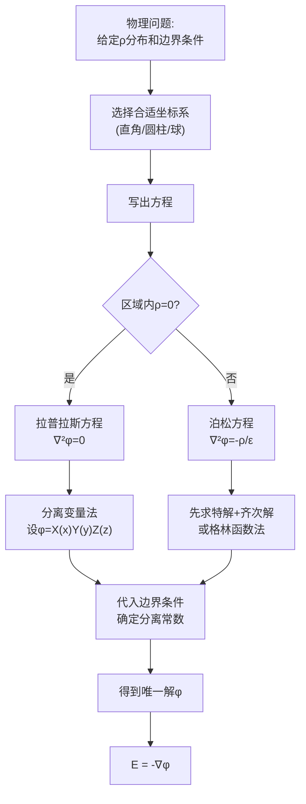

# 电位微分方程及其定解问题 MOC

## 教科书原文

> 📖 参见：[[§3-1 电位微分方程及其定解问题]], [[§3-2 电位微分方程解的惟一性]]

## 概念定义（费曼一句话）

电位微分方程的定解问题本质上是：**在给定区域的边界条件约束下，寻找一个标量函数 $$\phi(\mathbf{r})$$ 使其满足 $$\nabla^2\phi = -\rho/\varepsilon_0$$（有源）或 $$\nabla^2\phi = 0$$（无源）**。这是所有静电场求解问题的统一数学框架——镜像法、分离变量法、有限元法都是这个框架下的不同求解策略。

## 类比与直觉

**类比1：鼓面薄膜的平衡形状**。拉普拉斯方程 $$\nabla^2\phi = 0$$ 描述的电位分布，就像一张在给定边界高度下自由伸展的弹性膜（肥皂膜）——膜的内部会自动调整到"最平滑"的状态（没有任何内部"凸起"），而泊松方程 $$\nabla^2\phi = -\rho/\varepsilon_0$$ 对应膜上有压力分布（电荷）——压力向上推的地方膜凸起，向下拉的地方膜凹陷。

**类比2：拼图游戏的三种边界**。狄利克雷条件（电位值给定）就像拼图的边缘已经画好了颜色——你必须把内部拼到与边缘匹配。诺伊曼条件（电位法向导数给定）就像告诉你边缘"倾斜了多少度"而不是"多高"。混合条件则是某些边告诉高度、某些边告诉倾斜。

## 核心公式详释

**泊松方程**：
$$\boxed{\nabla^2\phi = -\frac{\rho}{\varepsilon_0}}$$

**拉普拉斯方程**：
$$\boxed{\nabla^2\phi = 0}$$

**在三种坐标系中的展开**：

直角坐标：$$\nabla^2\phi = \frac{\partial^2\phi}{\partial x^2} + \frac{\partial^2\phi}{\partial y^2} + \frac{\partial^2\phi}{\partial z^2}$$

圆柱坐标：$$\nabla^2\phi = \frac{1}{r}\frac{\partial}{\partial r}(r\frac{\partial\phi}{\partial r}) + \frac{1}{r^2}\frac{\partial^2\phi}{\partial\phi^2} + \frac{\partial^2\phi}{\partial z^2}$$

球坐标：$$\nabla^2\phi = \frac{1}{R^2}\frac{\partial}{\partial R}(R^2\frac{\partial\phi}{\partial R}) + \frac{1}{R^2\sin\theta}\frac{\partial}{\partial\theta}(\sin\theta\frac{\partial\phi}{\partial\theta}) + \frac{1}{R^2\sin^2\theta}\frac{\partial^2\phi}{\partial\varphi^2}$$

## 定解问题结构

## 常见误区

1. **拉普拉斯方程 $$\nabla^2\phi=0$$ 意味着 $$\phi=0$$**：它意味着 $$\phi$$ 是"调和函数"——没有局部极值，内部值由边界值完全决定。$$\phi = x^2 - y^2$$ 满足 $$\nabla^2\phi = 2-2 = 0$$，但显然不恒为零。
2. **忘记边界条件的类型决定了定解问题的适定性**：纯诺伊曼条件的问题中，解可以相差一个常数——需要额外条件（如总电荷约束）才能确定。
3. **混淆三种坐标系中的拉普拉斯算子**：圆柱坐标中的 $$\frac{1}{r}\frac{\partial}{\partial r}(r\frac{\partial\phi}{\partial r})$$ 不能写成 $$\frac{\partial^2\phi}{\partial r^2}$$，球坐标中更复杂。直接抄直角坐标形式必然出错。

## 费曼检验

1. 二维拉普拉斯方程 $$\frac{\partial^2\phi}{\partial x^2} + \frac{\partial^2\phi}{\partial y^2} = 0$$ 的解能否有局部极大值？用调和函数的平均值性质解释。
2. 在纯诺伊曼边界条件（给定了整条边界上的法向导数）下，为什么泊松方程只有在对边界积分满足一致性条件时才有解？这个条件在物理上对应什么？
3. 为什么在无限大均匀介质中一个点电荷的电位是 $$\phi = q/(4\pi\varepsilon r)$$，但在半无限大空间（上方为介质1，下方为介质2）中，电位分布完全不同？边界的存在如何改变了解？

## 概念导航

- **前置**：[[电位 MOC]]、[[泊松方程与拉普拉斯方程的推导]]、[[三类边界条件]]
- **后继**：[[镜像法 MOC]]、[[分离变量法 MOC]]、[[电位微分方程解的惟一性 MOC]]
- **核心文件**：[[泊松方程与拉普拉斯方程的推导]]、[[三类边界条件：狄利克雷、诺伊曼、混合]]

## 自己理解

电位微分方程的定解问题是整个静电场理论的"收官之作"——它将之前所有的物理规律（库仑定律、高斯定律、导体平衡）熔铸成一个统一的数学框架。求解步骤非常清晰：(1)选坐标→(2)写方程→(3)分离变量→(4)代入边界条件→(5)确定唯一解。唯一性定理保证了：不管用什么方法（镜像法、分离变量法、数值法），只要找到了满足方程和边界条件的解，它就是唯一正确的答案。

> 📖 参见：[[§3-1 电位微分方程及其定解问题]], [[§3-2 电位微分方程解的惟一性]]
