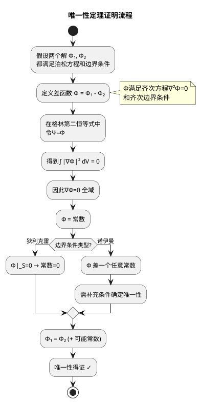

# 惟一性定理的证明思路
**关键词**：电位, V, E=-∇V, 等位面, 标量场

## 教科书原文

> 📖 参见：[[§3-2 电位微分方程解的惟一性]]

## 证明的核心：格林第二恒等式

证明思路：假设存在两个解$\Phi_1$和$\Phi_2$，定义差函数$\Phi = \Phi_1 - \Phi_2$。在格林第二恒等式中令$\Psi = \Phi$：

$$\int_V \Phi\nabla^2\Phi\,dV = \oint_S \Phi\frac{\partial\Phi}{\partial n}dS - \int_V |\nabla\Phi|^2 dV$$

左边：$\nabla^2\Phi = \nabla^2\Phi_1 - \nabla^2\Phi_2 = -\rho/\varepsilon - (-\rho/\varepsilon) = 0$

边界贡献也因齐次边界条件为零 → $\int_V |\nabla\Phi|^2 dV = 0$ → $\nabla\Phi = 0$ 全域 → $\Phi = \text{const}$（狄利克雷条件时const=0）→ $\Phi_1 = \Phi_2$。证毕。

> 📖 参见：[[§3-2 电位微分方程解的惟一性]]
