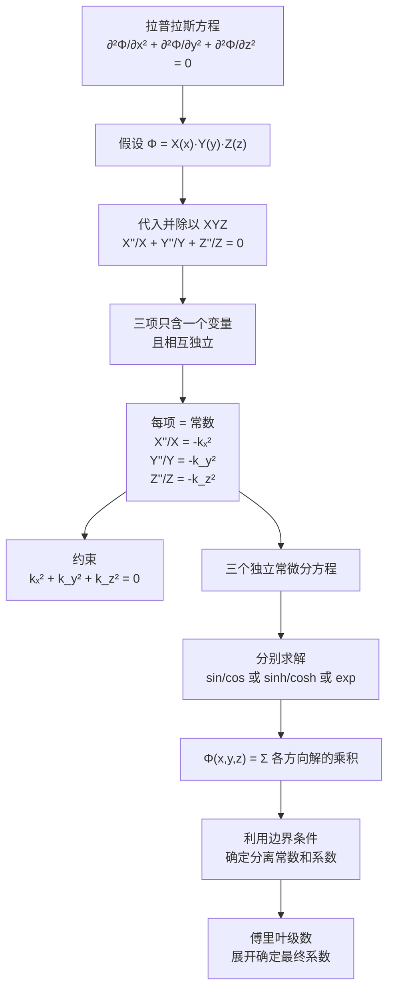

---
tags: [电磁场, 边值问题, 分离变量法, 拉普拉斯方程]
chapter: "第3章"
textbook_section: "§3-4"
textbook_page: "91"
type: core-concept
importance: 🔴
exam_frequency: ★★★
exam_type: 计
difficulty: advanced
created: 2026-04-28
---

# 分离变量法的基本思想
**关键词**：分离变量法, 拉普拉斯方程, 级数解, 边界条件


📌 **一句话本质**：分离变量法假设解=X(x)Y(y)Z(z)——把偏微分方程拆成三个常微分方程逐一求解
🏷️ **重要度**：🔴 | 考试：★★★ | 题型：计

## 🔧工程场景

矩形波导模式分析——用分离变量法求解波导横截面的场分布，得到TE和TM模式的解析表达式

## 概念定义

**分离变量法**是求解偏微分方程的一种系统化方法。其核心思想是：假设多元函数 Φ(x,y,z) 的解可以写为各自变量函数的乘积形式：

$$\Phi(x, y, z) = X(x) \cdot Y(y) \cdot Z(z)$$

将这一假设代入原偏微分方程后，原方程被**分离**为多个独立的**常微分方程**（每个只含一个变量），从而大大简化了求解过程。分离变量法对11种正交坐标系都行之有效，在直角坐标系中尤为简洁。

## 🧠类比与直觉

**拼乐高类比**：
- 拉普拉斯方程 ∇²Φ = 0 是一个复杂的偏微分方程——就像一整盒没有分类的乐高积木
- 分离变量 = 把乐高按颜色/形状**分拣** → X(x) 一堆（红色）、Y(y) 一堆（蓝色）、Z(z) 一堆（黄色）
- 每堆单独拼成一个模块 → 三个独立的常微分方程（每个都容易求解！）
- 最终拼在一起 → 通解 = 三个方向解的乘积

**音乐和弦类比**：
- 拉普拉斯方程像一个三音和弦（x, y, z 三个音同时响起相互牵扯）
- 分离变量法 = 将和弦分解为三个**独立的纯音**（每个音单独处理）
- 每个纯音有自己的频率（分离常数 kₓ, k_y, k_z），但必须满足频率关系式：kₓ² + k_y² + k_z² = 0
- 最后再将三个纯音合成回和弦（通解 = 乘积）

**行李箱打包类比**：一个大行李箱（偏微分方程）塞满了纠缠在一起的三类物品——衣服（x方向）、鞋子（y方向）、书（z方向）。分离变量法就是先把它们分类到三个独立的收纳袋中，各自理顺后再装回去。这样原来"一团乱麻"就变成了"三个有序的小包"。

## 核心公式与推导轨迹

### 第一步：乘积假设

$$\Phi(x, y, z) = X(x) \cdot Y(y) \cdot Z(z)$$

### 第二步：代入拉普拉斯方程

$$\frac{\partial^2\Phi}{\partial x^2} + \frac{\partial^2\Phi}{\partial y^2} + \frac{\partial^2\Phi}{\partial z^2} = 0$$

代入得：

$$Y Z \frac{d^2 X}{dx^2} + X Z \frac{d^2 Y}{dy^2} + X Y \frac{d^2 Z}{dz^2} = 0$$

### 第三步：两边除以 XYZ（关键步骤！）

$$\frac{1}{X}\frac{d^2 X}{dx^2} + \frac{1}{Y}\frac{d^2 Y}{dy^2} + \frac{1}{Z}\frac{d^2 Z}{dz^2} = 0$$

此时每一项只依赖于一个变量，而三个变量的取值是**独立的**。因此每一项都必须等于常数。

### 第四步：引入分离常数

$$\frac{d^2 X}{dx^2} + k_x^2 X = 0$$

$$\frac{d^2 Y}{dy^2} + k_y^2 Y = 0$$

$$\frac{d^2 Z}{dz^2} + k_z^2 Z = 0$$

其中分离常数必须满足约束：

$$k_x^2 + k_y^2 + k_z^2 = 0$$

### 第五步：常微分方程的通解

$$X(x) = A e^{-j k_x x} + B e^{j k_x x}$$

等价地：

$$X(x) = C \sin(k_x x) + D \cos(k_x x)$$

当 kₓ 为虚数（即 kₓ = jα）时：

$$X(x) = A e^{\alpha x} + B e^{-\alpha x} = C \sinh(\alpha x) + D \cosh(\alpha x)$$

### 选择正弦/余弦还是指数/双曲函数？

这取决于边界条件的形式：

| 边界条件特点 | 选择的解形式 | 原因 |
|-------------|------------|------|
| 在一个方向上两端为零 | sin / cos | 可以自然满足零边界条件 |
| 在一个方向上衰减到零 | e⁻ᵅˣ | 满足 x→∞ 时 → 0 |
| 在一个方向上有限区域 | 双曲函数 sinh/cosh | 便于处理非零边界值 |


🔖 **口诀**：设解为X乘Y乘Z，偏微分拆三常微分

## 📐推导脉络



## 完整例题：接地矩形槽

**问题**：两个平行半无限大接地导体平面（y=0 和 y=d，x>0），在 x=0 处被电位为 φ₀ 的导体平面封闭。求槽中电位分布。

**边值条件**：
- φ(0, y) = φ₀（左端面电位为 φ₀）
- φ(∞, y) = 0（远处接地）
- φ(x, 0) = 0（下导体面接地）
- φ(x, d) = 0（上导体面接地）

**求解过程**：
1. 设 φ(x,y) = X(x)·Y(y)（因 z 方向无限，退化为二维问题）
2. Y(y) 选 sin 形式以满足 y=0 和 y=d 处为零：Y(y) = sin(nπy/d)
3. k_y = nπ/d → k_x 为虚数（因 k_x² + k_y² = 0）→ X(x) = De^(-nπx/d)（选衰减项满足 x→∞ 时 φ=0）
4. 通解为无穷级数：φ(x,y) = Σ Cₙ e^(-nπx/d) sin(nπy/d)
5. 在 x=0 处：φ₀ = Σ Cₙ sin(nπy/d) → 系数 Cₙ 由傅里叶级数确定

**最终解**：

$$\varphi(x,y) = \frac{4\varphi_0}{\pi} \sum_{n=1,3,5,\cdots}^{\infty} \frac{1}{n} e^{-\frac{n\pi x}{d}} \sin\left(\frac{n\pi y}{d}\right)$$

## 💻MATLAB 可视化提示词

```
请生成完整的 MATLAB 代码，实现以下功能：

1. **矩形槽电位分布求解与可视化**
   - 参数：d = 1（槽宽），φ₀ = 10V（端面电位），取前20项级数
   - x 方向范围 [0, 3d]，y 方向范围 [0, d]
   - 网格密度 100×50

2. **计算要求**
   - 实现电位级数解：φ(x,y) = (4φ₀/π) Σ(1/n) e^(-nπx/d) sin(nπy/d)，n=1,3,5,...
   - 显示级数截断误差（对比 n=5, 10, 20 的差别）
   - 用 gradient 计算电场 E = -∇φ

3. **可视化输出**
   - 子图1：等位线图 contourf（彩色填充），叠加电场向量 quiver
   - 子图2：3D 曲面图 surf（电位随 x, y 的变化）
   - 标注边界条件位置和电位值
   - 验证边界条件：y=0 和 y=d 处 φ≈0，x=0 处 φ≈φ₀

4. **关键观察**
   - 电位沿 x 方向指数衰减
   - 电场线在 y=0 和 y=d 处垂直于导体面（满足导体表面边界条件）
   - 展示分离变量法"无穷级数"逼近实际解的收敛行为

5. **输出**
   - 图形窗口 1400×600
   - 标题："分离变量法求解接地矩形槽电位"
```

## 适用条件与限制

| 条件 | 说明 |
|------|------|
| 方程是线性的 | 拉普拉斯方程和泊松方程都满足，方程中有非线性项则不能直接用 |
| 边界与坐标面重合 | 矩形边界用直角坐标、圆柱边界用圆柱坐标、球形边界用球坐标 |
| 边界条件在坐标面上可分离 | 每条边界上的条件只能依赖于一个坐标变量 |
| 非齐次边界条件仅出现在一条边上 | 如果多条边非齐次，需要叠加原理分别处理 |

## 与镜像法的对比

| 维度 | 镜像法 | 分离变量法 |
|------|--------|----------|
| 适用边界 | 简单规则边界（平面、球面） | 与坐标面重合的任意边界 |
| 解的形式 | 闭式解析解（有限项） | 无穷级数 |
| 精度 | 精确（闭式） | 取有限项时近似，项数越多越精确 |
| 求解思路 | "猜"镜像位置和大小（需要物理直觉） | 系统化数学推导（不需要直觉） |
| 计算量 | 小 | 较大（含级数求和） |
| 典型场景 | 点电荷+导体平面/球体 | 矩形波导、接地槽、矩形谐振腔 |

## ⚠️常见误区

1. **分离常数不独立**：kₓ² + k_y² + k_z² = 0 意味着只能自由选择其中两个，第三个由约束方程确定。kₓ², k_y², k_z² 中至少有一个必然是负的（对应虚分离常数）。

2. **解的形式选择不能随意**：选 sin/cos 还是 sinh/cosh 或 exp，必须由边界条件决定。选错了会导致无法满足边界条件。

3. **单一项解通常不能完全满足边界条件**：需要用无穷级数（线性组合）才能匹配非零的边界条件。这就引入了傅里叶级数展开。

4. **边界必须是坐标面**：这是分离变量法适用性的硬条件。如果边界是斜的或不规则形状，不能用标准的分离变量法（需要用数值方法如有限元）。

5. **不是所有偏微分方程都能分离变量**：方程必须是线性的且系数在坐标面上可分离。例如 ∇²Φ + k²Φ = 0（亥姆霍兹方程）也可以分离变量，但 ∇²Φ + sin(x)Φ = 0 在直角坐标下就不能。

## ❓费曼检验

1. 为什么在接地矩形槽问题中，Y(y) 必须选 sin(nπy/d) 而不是 cos(nπy/d)？如果 y=d 处的边界条件是 ∂φ/∂y=0（诺伊曼边界条件），应该选什么形式的解？

2. 分离常数方程 kₓ² + k_y² + k_z² = 0 的物理意义是什么？为什么三个平方数之和必须为零却可能导致有效解？

## 🔗概念导航

- 前置概念：[[偏导数：把其他变量当常数的导数]]、[[电位与电场强度的梯度关系]]
- 后续概念：[[直角坐标下的通解与级数展开]]、[[傅里叶级数的正交性与展开]]
- 关联概念：[[镜像法的基本原理与适用条件]]、[[圆柱坐标系中的分离变量法 MOC]]、[[球坐标系中的分离变量法 MOC]]

> 📖 **教科书参考**：§3-4, p.91
