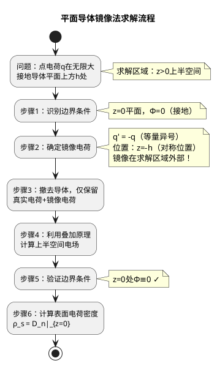

# 平面导体镜像
**关键词**：镜像法, 唯一性定理, 平面镜像, 球面镜像, 等效电荷

## 教科书原文

> 📖 参见：[[§3-3 镜像法]]

## 镜像法求解流程

```plantuml
@startuml
title 平面导体镜像法求解流程

start
:问题：点电荷q在无限大\n接地导体平面上方h处;
note right: 求解区域：z>0上半空间

:步骤1：识别边界条件;
note right: z=0平面，Φ=0（接地）

:步骤2：确定镜像电荷;
note right
  q' = -q（等量异号）
  位置：z=-h（对称位置）
  镜像在求解区域外部！
end note

:步骤3：撤去导体，仅保留\n真实电荷+镜像电荷;

:步骤4：利用叠加原理\n计算上半空间电场;

:步骤5：验证边界条件;
note right: z=0处Φ≡0 ✓

:步骤6：计算表面电荷密度\nρ_s = D_n|_{z=0};

stop

@enduml
```

> 📖 参见：[[§3-3 镜像法]]

## 更多费曼检验
1. 接地导体平面上的感应面电荷总电量是多少？用镜像法推导并验证是否为−q。
2. 如果导体平面不接地而是孤立带电（净电荷Q），镜像法如何处理？
