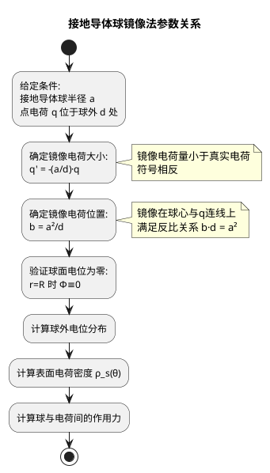

# 球面导体镜像
**关键词**：镜像法, 唯一性定理, 平面镜像, 球面镜像, 等效电荷

## 教科书原文

> 📖 参见：[[§3-3 镜像法]]

## 球面镜像参数关系

```plantuml
@startuml
title 接地导体球镜像法参数关系

start
:给定条件:
接地导体球半径 a
点电荷 q 位于球外 d 处;

:确定镜像电荷大小:
q' = -(a/d)·q;

note right
  镜像电荷量小于真实电荷
  符号相反
end note

:确定镜像电荷位置:
b = a²/d;

note right
  镜像在球心与q连线上
  满足反比关系 b·d = a²
end note

:验证球面电位为零:
r=R 时 Φ≡0;

:计算球外电位分布;
:计算表面电荷密度 ρ_s(θ);
:计算球与电荷间的作用力;

stop

@enduml
```

> 📖 参见：[[§3-3 镜像法]]
