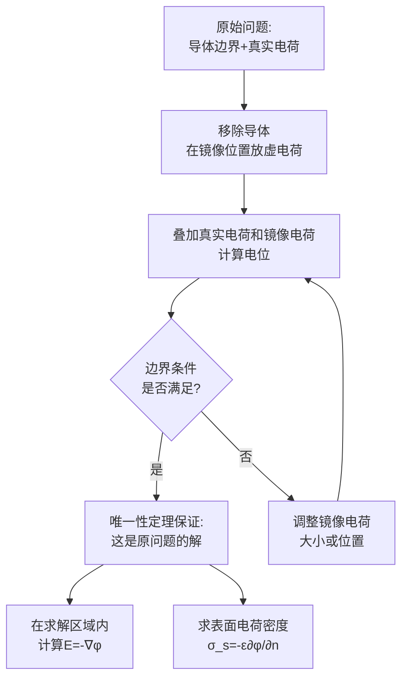

# 镜像法 MOC

## 教科书原文

> 📖 参见：[[§3-3 镜像法]], [[§3-5 圆柱坐标系中的分离变量法]]

## 概念定义（费曼一句话）

镜像法是"用镜子里的虚电荷替代边界上复杂的真实电荷分布"的方法——它在求解区域外放置一个或多个假想电荷（镜像），让这些镜像与真实电荷叠加后恰好满足边界条件，从而将复杂的边值问题化为简单的点电荷叠加问题。它的数学合法性由唯一性定理保证。

## 类比与直觉

**类比1：照镜子**。你站在平面镜前，镜子里出现一个和你一模一样的"虚像"。从光线传播的角度看，你看到镜子里的像和看到一个真实站在镜后的人完全无法区分。镜像法正是利用这个原理：在导体平面的另一边放置一个"虚电荷"（镜像），它产生的电场在平面上与真实情况的边界条件完全匹配。

**类比2：国际象棋的"马走日"**。在棋盘上计算马的攻击范围时，你不必一步步移动马，而是直接利用马的所有"镜像走法"。镜像法类似的"取巧"——你不需要去积分边界上复杂的连续电荷分布，只需要找对镜像电荷的位置和大小，然后当作自由空间中的点电荷系统直接计算电场。

## 核心公式与三种基本镜像

### 1. 平面导体镜像

一个点电荷q距无限大接地导体平面距离为d，镜像电荷为：
$$q' = -q$$
镜像位置：平面另一侧对称位置（距平面也为d）

**电位分布**（上半空间）：
$$\phi(x,y,z) = \frac{1}{4\pi\varepsilon_0}\left[\frac{q}{\sqrt{x^2+y^2+(z-d)^2}} + \frac{-q}{\sqrt{x^2+y^2+(z+d)^2}}\right]$$

**表面感应电荷密度**：
$$\sigma_s = -\varepsilon_0\frac{\partial\phi}{\partial z}\big|_{z=0} = \frac{-qd}{2\pi(x^2+y^2+d^2)^{3/2}}$$

### 2. 球面导体镜像

点电荷q距接地导体球心距离为d，导体球半径为a，镜像电荷为：
$$q' = -\frac{a}{d}q$$
$$b = \frac{a^2}{d}$$（镜像距球心距离）

### 3. 介质平面镜像

代替原始电荷的反射与透射等效：
$$q' = \frac{\varepsilon_1 - \varepsilon_2}{\varepsilon_1 + \varepsilon_2}q$$
$$q'' = \frac{2\varepsilon_2}{\varepsilon_1 + \varepsilon_2}q$$

## 推导流程



## 常见误区

1. **镜像电荷可以放在求解区域内**：镜像电荷必须放在求解区域之外（导体内部、介质另一边）。否则，它会在求解区域内引入"额外源"，改变原问题的电荷分布。
2. **镜像法只适用于静电学**：镜像法在恒定电流场和恒定磁场中也有对应方法，利用的是界面条件的对偶性（$$J_{1n}=J_{2n}$$ 类比 $$D_{1n}=D_{2n}$$）。
3. **平面导体前的镜像永远是-q**：对于接地导体平面，镜像电荷确实是-q。但如果导体不接地（电绝缘、净电荷为零），镜像法还需要额外处理总电荷约束。

## 费曼检验

1. 一个点电荷q距接地导体平面d。该电荷受到的吸引力（镜像力）为 $$F = q^2/(16\pi\varepsilon_0 d^2)$$。这个力如何用库仑定律和镜像电荷解释？力的方向和大小如何随d变化？
2. 导体球面的镜像中 $$b = a^2/d$$。当点电荷非常接近球面（$$d\to a$$）时，镜像位置b趋近于什么？镜像电荷大小趋近于什么？
3. 镜像法能否用于求解时变电磁场的反射和折射？如果可以，镜像概念对应的物理是什么？

## 概念导航

- **前置**：[[电位 MOC]]、[[唯一性定理]]
- **核心文件**：[[平面导体镜像]]、[[球面导体镜像]]、[[介质平面镜像]]
- **关联**：[[分离变量法 MOC]]（边界问题求解的两种互补方法）

## 自己理解

镜像法是最聪明的电磁学"取巧"之一。它把复杂的边界积分问题转化为简单的点电荷叠加问题，核心智慧在于：与其直接计算边界上复杂的分布电荷，不如在边界另一侧找到"对等物"（镜像），利用唯一性定理保证等价性。但必须记住——镜像只在求解区域内有效，不能跨越边界去看"镜子后面"。

> 📖 参见：[[§3-3 镜像法]], [[§3-5 圆柱坐标系中的分离变量法]]

## 可视化图表

```wavedrom
{
  "signal": [
    {"name": "真实点电荷+q (h处)", "wave": "23", "period": 4, "data": ["+q", "+q", "+q", "+q", "+q", "+q", "+q", "+q"]},
    {"name": "镜像电荷-q (对称-h处)", "wave": "23", "period": 4, "data": ["-q", "-q", "-q", "-q", "-q", "-q", "-q", "-q"]},
    {"name": "导体平面 V=0", "wave": "2", "period": 4, "data": ["V=0", "V=0", "V=0", "V=0", "V=0", "V=0", "V=0", "V=0"]},
    {"name": "导体球面镜像 q'=-qR/d₀", "wave": "x", "period": 4, "data": ["q'=镜像", "b=R²/d₀", "位置b<R", "q'≠-q", "q'=镜像", "b=R²/d₀", "位置b<R", "q'≠-q"]},
    {"name": "介质平面镜像 q''=q(ε₁-ε₂)/(ε₁+ε₂)", "wave": "x", "period": 4, "data": ["ε₁>ε₂:同号", "ε₁>ε₂:同号", "ε₁<ε₂:反号", "ε₁<ε₂:反号", "ε₁=ε₂:无像", "ε₁=ε₂:无像", "ε₁→∞:q''=q", "ε₁→∞:q''=q"]}
  ],
  "head": {
    "text": "镜像法: 三类典型问题的等效电荷分布 §3-9",
    "tick": 0
  },
  "foot": {
    "text": "核心: 用镜像电荷替代边界感应电荷 保持边界条件不变"
  }
}

```


```vega-lite
{
  "$schema": "https://vega.github.io/schema/vega-lite/v5.json",
  "description": "镜像法电位分布: 点电荷+导体平面 V=0边界条件",
  "width": 400,
  "height": 300,
  "mark": "line",
  "encoding": {
    "x": {"field": "x", "type": "quantitative", "title": "x [归一化]"},
    "y": {"field": "V", "type": "quantitative", "title": "电位 V"},
    "color": {"field": "y_pos", "type": "nominal", "scale": {
      "domain": ["y=2h 远区", "y=h 电荷高度", "y=0.5h 近区", "y=0 导体面"],
      "range": ["#3498db", "#2ecc71", "#f39c12", "#e74c3c"]
    }, "title": "y位置"}
  },
  "data": {
    "values": [
      {"x": -3, "y_pos": "y=2h 远区", "V": 0.15}, {"x": -2, "y_pos": "y=2h 远区", "V": 0.18},
      {"x": -1, "y_pos": "y=2h 远区", "V": 0.21}, {"x": 0, "y_pos": "y=2h 远区", "V": 0.24},
      {"x": 1, "y_pos": "y=2h 远区", "V": 0.21}, {"x": 2, "y_pos": "y=2h 远区", "V": 0.18},
      {"x": 3, "y_pos": "y=2h 远区", "V": 0.15},
      {"x": -3, "y_pos": "y=h 电荷高度", "V": 0.25}, {"x": -2, "y_pos": "y=h 电荷高度", "V": 0.30},
      {"x": -1, "y_pos": "y=h 电荷高度", "V": 0.45}, {"x": 0, "y_pos": "y=h 电荷高度", "V": 0.80},
      {"x": 1, "y_pos": "y=h 电荷高度", "V": 0.45}, {"x": 2, "y_pos": "y=h 电荷高度", "V": 0.30},
      {"x": 3, "y_pos": "y=h 电荷高度", "V": 0.25},
      {"x": -3, "y_pos": "y=0.5h 近区", "V": 0.35}, {"x": -2, "y_pos": "y=0.5h 近区", "V": 0.42},
      {"x": -1, "y_pos": "y=0.5h 近区", "V": 0.58}, {"x": 0, "y_pos": "y=0.5h 近区", "V": 0.95},
      {"x": 1, "y_pos": "y=0.5h 近区", "V": 0.58}, {"x": 2, "y_pos": "y=0.5h 近区", "V": 0.42},
      {"x": 3, "y_pos": "y=0.5h 近区", "V": 0.35},
      {"x": -3, "y_pos": "y=0 导体面", "V": 0.0}, {"x": -2, "y_pos": "y=0 导体面", "V": 0.0},
      {"x": -1, "y_pos": "y=0 导体面", "V": 0.0}, {"x": 0, "y_pos": "y=0 导体面", "V": 0.0},
      {"x": 1, "y_pos": "y=0 导体面", "V": 0.0}, {"x": 2, "y_pos": "y=0 导体面", "V": 0.0},
      {"x": 3, "y_pos": "y=0 导体面", "V": 0.0}
    ]
  },
  "title": "镜像法: 导体平面上点电荷的电位分布 V=0边界 §3-9"
}

```
